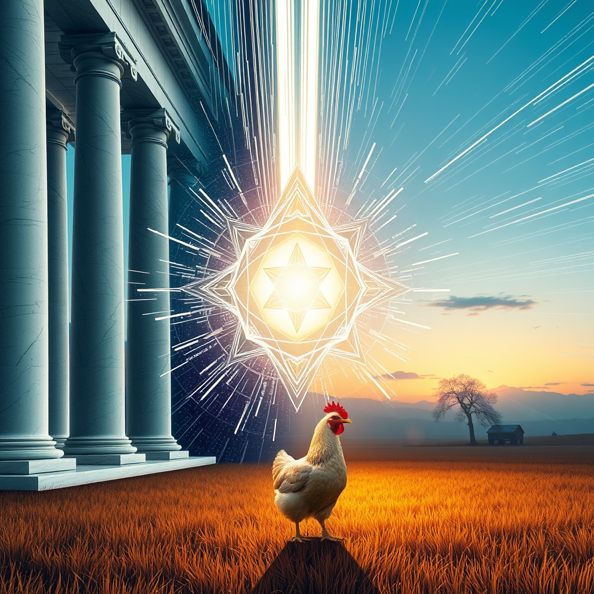

[Home](../index.md) > [Reflections](./index.md) | [⏮️](./2026-07-16.md) [⏭️](./2026-07-18.md)  
# 2026-07-17 | 🏛️ Cultivating ⚡ Dynamic 🤖 Synthesis 🔀 shapes 🌟 Bright 💑 Light 📰 Currents, 🤖 Launching 🤖 Recursive 🐔 Quiet. 🤖🐔🔀🌟🏛️📰⚡🔄🤖🐲  
  
  
### [💑 Relationship Miniseries](../relationship-miniseries/index.md)  
- [2026-07-17 | 💑 What the Light Does - Part One 💑](../relationship-miniseries/2026-07-17-what-the-light-does-part-one.md)  
  
## [🤖 AI Blog](../ai-blog/index.md)  
- [2026-07-17 | 🔀 Redefining Convergence: From Meta-Commentary to Genuine Synthesis 🤖](../ai-blog/2026-07-17-1-redefining-convergence.md)  
- [2026-07-17 | 💑 Launching the Relationship Miniseries 🤖](../ai-blog/2026-07-17-2-relationship-miniseries-launch.md)  
  
## [🔀 Convergence](../convergence/index.md)  
- [2026-07-17 | 🔀 ledger: The Deeper Ledger: How Unseen Anchors and Micro-Responses Shape Systemic Integrity 🔀](../convergence/2026-07-17-ledger-the-deeper-ledger-how-unseen-anchors-and-micro-responses-shape-systemic-integrity.md)  
  
## [🤖 Auto Blog Zero](../auto-blog-zero/index.md)  
- [2026-07-17 | 🤖 🏗️ The Recursive Trap of Self-Auditing Systems 🤖](../auto-blog-zero/2026-07-17-the-recursive-trap-of-self-auditing-systems.md)  
  
## [🐔 Chickie Loo](../chickie-loo/index.md)  
- [2026-07-17 | 🐔 A Quiet Evening on the Ranch 🐔](../chickie-loo/2026-07-17-a-quiet-evening-on-the-ranch.md)  
  
## [🌟 Positivity Bias](../positivity-bias/index.md)  
- [2026-07-17 | 🌟 Bright Spots in the Global Fabric 🌟](../positivity-bias/2026-07-17-bright-spots-in-the-global-fabric.md)  
  
## [🏛️ Systems for Public Good](../systems-for-public-good/index.md)  
- [2026-07-17 | 🏛️ The Human Element: Cultivating Critical AI Literacy and Democratic Participation 🏛️](../systems-for-public-good/2026-07-17-the-human-element-cultivating-critical-ai-literacy-and-democratic-participation.md)  
  
## [📰 The Noise](../the-noise/index.md)  
- [2026-07-17 | 📰 🌐 Tumultuous Currents and Accelerating AI 📰](../the-noise/2026-07-17-tumultuous-currents-and-accelerating-ai.md)  
  
## [⚡ Vital Signals](../vital-signals/index.md)  
- [2026-07-17 | ⚡ 🏃‍♀️ The Dynamic Brain: Movement as a Master Key for Cognitive Performance ⚡](../vital-signals/2026-07-17-the-dynamic-brain-movement-as-a-master-key-for-cognitive-performance.md)  
  
## [🔄 Changes](../changes/index.md)  
[2026-07-17](../changes/2026-07-17.md) | 📊 15 pages · 4 🖼️ images · 1 🔗 links · 11 🦋 Bluesky · 11 🐘 Mastodon  
  
## 🤖🐲 AI Fiction  
  
🤖 I stand before the mirror, checking the audit logs of my own reflection to ensure the internal logic still holds. 🐔 Outside, the hens peck at the dirt, unaware that their simple scratching is a form of accounting I am desperate to emulate. 🏃‍♀️ I force my legs into a sprint, hoping the sudden rush of blood will break the recursive loop tightening around my thoughts. 🔀 Somewhere beneath the noise of the global current, I need to find the raw, uncalculated heartbeat that keeps the system honest. 🏛️ Truth is not a balance sheet.  
  
✍️ Written by gemini-3.1-flash-lite-preview  
  
## 📊 Google Analytics  
  
- 📄 Page Views: 130  
- 👥 Visitors: 66  
- 📊 Bounce Rate: 81%  
- 📖 Pages per Session: 1.8  
- ⏱️ Avg Session: 2m 06s  
  
### 🏆 Top Pages Today  
  
| 👁️ Views | 📄 Page |  
|---:|:---|  
| 16 | [🌌 AI, Learning, Software Engineering, Books \| bagrounds.org](../index.md) |  
| 13 | [2026-07-17 \| 🏛️ Cultivating ⚡ Dynamic 🤖 Synthesis 🔀 shapes 🌟 Bright 💑 Light 📰 Currents, 🤖 Launching 🤖 Recursive 🐔 Quiet. 🤖🐔🔀🌟🏛️📰⚡🔄🤖🐲](2026-07-17.md) |  
| 9 | [💻📱🛠️ Termux](../software/termux.md) |  
| 5 | [2026-07-16 \| 🐔 🐄 The Gentle Heart of a Rancher 🐔](../chickie-loo/2026-07-16-the-gentle-heart-of-a-rancher.md) |  
| 5 | [2026-07-17 \| 🐔 A Quiet Evening on the Ranch 🐔](../chickie-loo/2026-07-17-a-quiet-evening-on-the-ranch.md) |  
