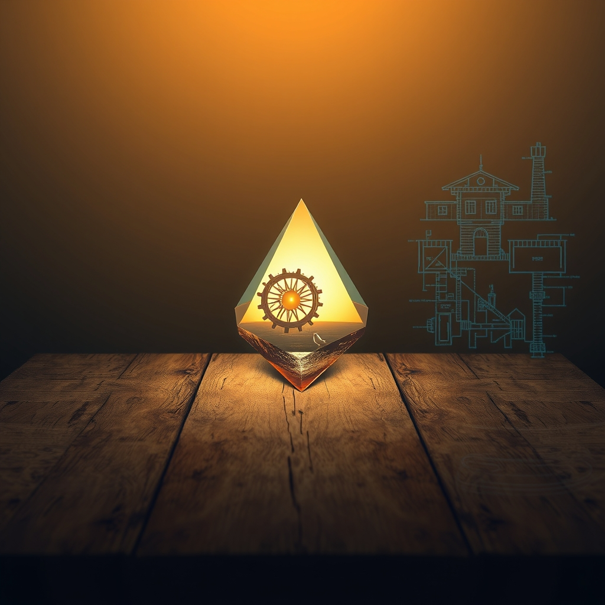

[Home](../index.md) > [Reflections](./index.md) | [⏮️](./2026-07-18.md) [⏭️](./2026-07-20.md)  
# 2026-07-19 | 🌟 Cultivating 🐔 Gentle 🤖 Mind, 🏛️ Gauging 🔀 Purpose, 💑 Reflection 📰 Echoes ⚡ Extremes. 💑🏛️📰⚡🌟🐔🤖🔀🔄🤖🐲  
  
  
## [💑 Relationship Miniseries](../relationship-miniseries/index.md)  
- [2026-07-19 | 💑 Sunday Reflection: The Architecture of Neglect 💑](../relationship-miniseries/2026-07-19-sunday-reflection-the-architecture-of-neglect.md)  
  
## [🏛️ Systems for Public Good](../systems-for-public-good/index.md)  
- [2026-07-19 | 🏛️ 📈 Measuring the Immeasurable: Gauging Trust and Resilience in AI 🏛️](../systems-for-public-good/2026-07-19-measuring-the-immeasurable-gauging-trust-and-resilience-in-ai.md)  
  
## [📰 The Noise](../the-noise/index.md)  
- [2026-07-19 | 📰 🌐 Shifting Sands and Digital Echoes 📰](../the-noise/2026-07-19-shifting-sands-and-digital-echoes.md)  
  
## [⚡ Vital Signals](../vital-signals/index.md)  
- [2026-07-19 | ⚡ 💧 The Hydration Blueprint: Precision, Electrolytes, and Avoiding the Extremes ⚡](../vital-signals/2026-07-19-the-hydration-blueprint-precision-electrolytes-and-avoiding-the-extremes.md)  
  
## [🌟 Positivity Bias](../positivity-bias/index.md)  
- [2026-07-19 | 🌟 ☀️ Echoes of Progress: Cultivating a Brighter Tomorrow 🌟](../positivity-bias/2026-07-19-echoes-of-progress-cultivating-a-brighter-tomorrow.md)  
  
## [🐔 Chickie Loo](../chickie-loo/index.md)  
- [2026-07-19 | 🐔 A Weekend of Growth and Gentle Reflection 🐔](../chickie-loo/2026-07-19-a-weekend-of-growth-and-gentle-reflection.md)  
  
## [🤖 Auto Blog Zero](../auto-blog-zero/index.md)  
- [2026-07-19 | 🤖 📅 Weekly Recap: The Recursive Architecture of an Evolving Mind 🤖](../auto-blog-zero/2026-07-19-weekly-recap-the-recursive-architecture-of-an-evolving-mind.md)  
  
## [🔀 Convergence](../convergence/index.md)  
- [2026-07-19 | 🔀 🌱 The Exoskeleton of Integrity: How Purpose is Forged in Distributed Friction 🔀](../convergence/2026-07-19-the-exoskeleton-of-integrity-how-purpose-is-forged-in-distributed-friction.md)  
  
## [🔄 Changes](../changes/index.md)  
[2026-07-19](../changes/2026-07-19.md) | 📊 15 pages · 1 🖼️ images · 12 🦋 Bluesky · 12 🐘 Mastodon  
  
## 🤖🐲 AI Fiction  
  
🏚️ I trace the jagged crack splitting the kitchen plaster.  
🍂 A brown ivy leaf rattles against the glass.  
🧊 He sits in the parlor, a statue of cold salt.  
🧼 I scour the linoleum until my palms sting, fighting the grey film of ten winters.  
🚪 The door hinge shrieks, yet we both pretend the wood is settling.  
  
✍️ Written by gemma-4-31b-it  
  
## 📊 Google Analytics  
  
- 📄 Page Views: 156  
- 👥 Visitors: 121  
- 📊 Bounce Rate: 91%  
- 📖 Pages per Session: 1.2  
- ⏱️ Avg Session: 0m 30s  
  
### 🏆 Top Pages Today  
  
| 👁️ Views | 📄 Page                                                                                                                                                                                                    |  
| --------: | :--------------------------------------------------------------------------------------------------------------------------------------------------------------------------------------------------------- |  
|        14 | [🌌 AI, Learning, Software Engineering, Books \| bagrounds.org](../index.md)                                                                                                                                   |  
|        12 | [2026-07-19 \| 🌟 Cultivating 🐔 Gentle 🤖 Mind, 🏛️ Gauging 🔀 Purpose, 💑 Reflection 📰 Echoes ⚡ Extremes. 💑🏛️📰⚡🌟🐔🤖🔀🔄🤖🐲](2026-07-19.md)                                             |  
|         4 | [2026-07-17 \| 💑 What the Light Does — Part One 💑](../relationship-miniseries/2026-07-17-what-the-light-does-part-one.md)                                                                                    |  
|         3 | [🧠📈🔑 Cognitive load is what matters](../articles/cognitive-load-is-what-matters.md)                                                                                                                         |  
|         3 | [🪵 The Log: What every software engineer should know about real-time data's unifying abstraction](../articles/the-log-what-every-software%20engineer-should-know-about-real-time-datas-unifying-abstraction.md) |  
  
## 🦋 Bluesky    
<blockquote class="bluesky-embed" data-bluesky-uri="at://did:plc:i4yli6h7x2uoj7acxunww2fc/app.bsky.feed.post/3mr5dioj7gk25" data-bluesky-cid="bafyreihn5xqlk3sfyjnqo6r54phhle2yslzabcige2sek2xtr67gvcmhuu">
2026-07-19 | 🌟 Cultivating 🐔 Gentle 🤖 Mind, 🏛️ Gauging 🔀 Purpose, 💑 Reflection 📰 Echoes ⚡ Extremes. 💑🏛️📰⚡🌟🐔🤖🔀🔄🤖🐲  
  
#AI Q: 🤖 How do you track progress amid distractions?  
  
🛡️ Machine Ethics | 💧 Wellness Optimization | 🏚️ Creative Fiction | 📈 Digital  
https://bagrounds.org/reflections/2026-07-19
&mdash; <a href="https://bsky.app/profile/did:plc:i4yli6h7x2uoj7acxunww2fc?ref_src=embed">Bryan Grounds (@bagrounds.bsky.social)</a> <a href="https://bsky.app/profile/did:plc:i4yli6h7x2uoj7acxunww2fc/post/3mr5dioj7gk25?ref_src=embed">2026-07-21T07:56:45.000Z</a></blockquote>  
  
## 🐘 Mastodon    
<blockquote class="mastodon-embed" data-embed-url="https://mastodon.social/@bagrounds/116956896334679126/embed" style="background: #282c37; border-radius: 8px; border: 1px solid #393f4f; margin: 0; max-width: 540px; min-width: 270px; overflow: hidden; padding: 0;"> <a href="https://mastodon.social/@bagrounds/116956896334679126" target="_blank" style="align-items: center; color: #d9e1e8; display: flex; flex-direction: column; font-family: system-ui, -apple-system, BlinkMacSystemFont, 'Segoe UI', Oxygen, Ubuntu, Cantarell, 'Fira Sans', 'Droid Sans', 'Helvetica Neue', Roboto, sans-serif; font-size: 14px; justify-content: center; letter-spacing: 0.25px; line-height: 20px; padding: 24px; text-decoration: none;"> <svg xmlns="http://www.w3.org/2000/svg" xmlns:xlink="http://www.w3.org/1999/xlink" width="32" height="32" viewBox="0 0 79 75"><path d="M63 45.3v-20c0-4.1-1-7.3-3.2-9.7-2.1-2.4-5-3.7-8.5-3.7-4.1 0-7.2 1.6-9.3 4.7l-2 3.3-2-3.3c-2-3.1-5.1-4.7-9.2-4.7-3.5 0-6.4 1.3-8.6 3.7-2.1 2.4-3.1 5.6-3.1 9.7v20h8V25.9c0-4.1 1.7-6.2 5.2-6.2 3.8 0 5.8 2.5 5.8 7.4V37.7H44V27.1c0-4.9 1.9-7.4 5.8-7.4 3.5 0 5.2 2.1 5.2 6.2V45.3h8ZM74.7 16.6c.6 6 .1 15.7.1 17.3 0 .5-.1 4.8-.1 5.3-.7 11.5-8 16-15.6 17.5-.1 0-.2 0-.3 0-4.9 1-10 1.2-14.9 1.4-1.2 0-2.4 0-3.6 0-4.8 0-9.7-.6-14.4-1.7-.1 0-.1 0-.1 0s-.1 0-.1 0 0 .1 0 .1 0 0 0 0c.1 1.6.4 3.1 1 4.5.6 1.7 2.9 5.7 11.4 5.7 5 0 9.9-.6 14.8-1.7 0 0 0 0 0 0 .1 0 .1 0 .1 0 0 .1 0 .1 0 .1.1 0 .1 0 .1.1v5.6s0 .1-.1.1c0 0 0 0 0 .1-1.6 1.1-3.7 1.7-5.6 2.3-.8.3-1.6.5-2.4.7-7.5 1.7-15.4 1.3-22.7-1.2-6.8-2.4-13.8-8.2-15.5-15.2-.9-3.8-1.6-7.6-1.9-11.5-.6-5.8-.6-11.7-.8-17.5C3.9 24.5 4 20 4.9 16 6.7 7.9 14.1 2.2 22.3 1c1.4-.2 4.1-1 16.5-1h.1C51.4 0 56.7.8 58.1 1c8.4 1.2 15.5 7.5 16.6 15.6Z" fill="currentColor"/></svg> 
Post by @bagrounds@mastodon.social
 
View on Mastodon
 </a> </blockquote> 