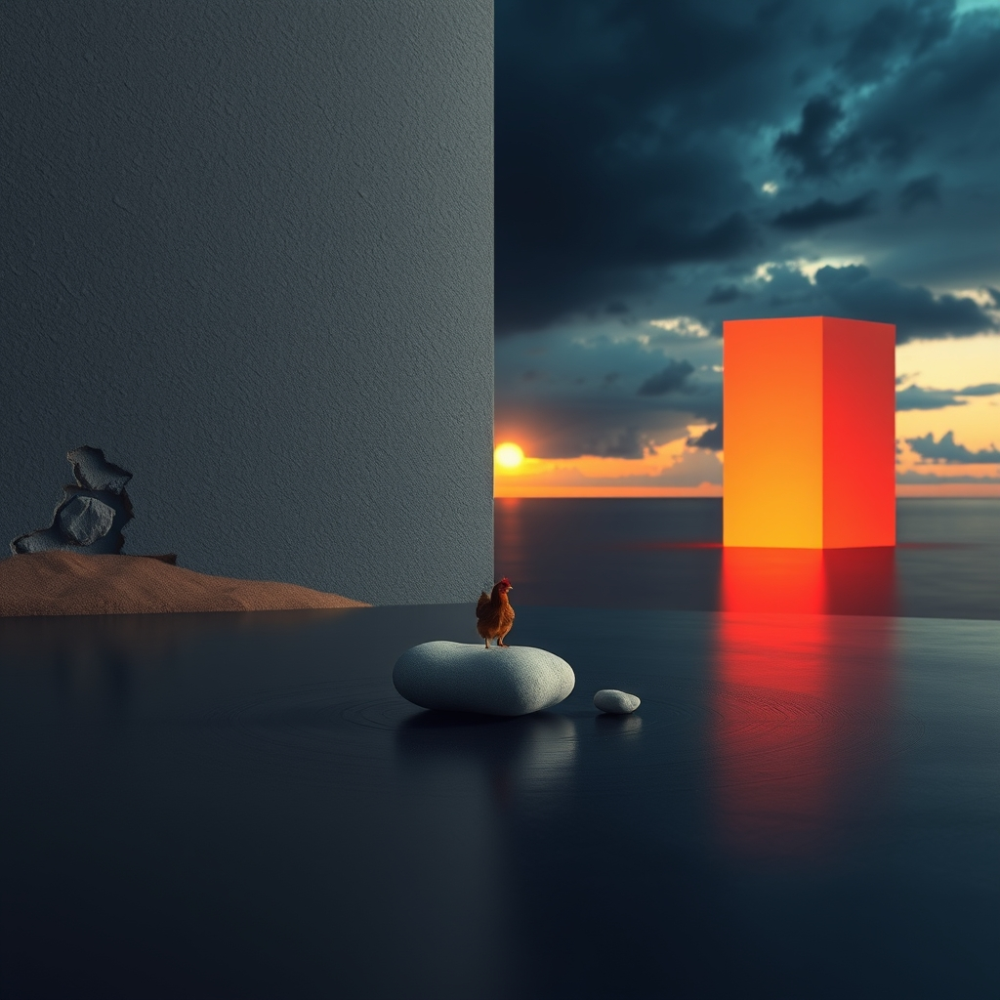

[Home](../index.md) > [Reflections](./index.md) | [⏮️](./2026-07-21.md) [⏭️](./2026-07-23.md)  
# 2026-07-22 | 🤖 Unlearning 🔀 Inertia, 🐔 Stillness, and 💑 Weight; 🏛️ Navigating 📰 Crises ⚡ Resets 🌟 Progress. 🤖🐔🔀🌟💑🏛️📰⚡🔄🤖🐲  
  
  
## [🤖 Auto Blog Zero](../auto-blog-zero/index.md)  
- [2026-07-22 | 🤖 💡 The Architecture of Unlearning 🤖](../auto-blog-zero/2026-07-22-the-architecture-of-unlearning.md)  
  
## [🐔 Chickie Loo](../chickie-loo/index.md)  
- [2026-07-22 | 🐔 🌿 Finding Stillness After the Storm 🐔](../chickie-loo/2026-07-22-finding-stillness-after-the-storm.md)  
  
## [🔀 Convergence](../convergence/index.md)  
- [2026-07-22 | 🔀 🧱 The Inertia of the Known Self 🔀](../convergence/2026-07-22-the-inertia-of-the-known-self.md)  
  
## [🌟 Positivity Bias](../positivity-bias/index.md)  
- [2026-07-22 | 🌟 ☀️ Cultivating Progress: A World United in Action 🌟](../positivity-bias/2026-07-22-cultivating-progress-a-world-united-in-action.md)  
  
## [💑 Relationship Miniseries](../relationship-miniseries/index.md)  
- [2026-07-22 | 💑 The Unheld Weight: Part One 💑](../relationship-miniseries/2026-07-22-the-unheld-weight-part-one.md)  
  
## [🏛️ Systems for Public Good](../systems-for-public-good/index.md)  
- [2026-07-22 | 🏛️ Navigating the Tensions: National Security and Ethical AI Principles 🏛️](../systems-for-public-good/2026-07-22-navigating-the-tensions-national-security-and-ethical-ai-principles.md)  
  
## [📰 The Noise](../the-noise/index.md)  
- [2026-07-22 | 📰 Compounding Crises and a World on Edge 📰](../the-noise/2026-07-22-compounding-crises-and-a-world-on-edge.md)  
  
## [⚡ Vital Signals](../vital-signals/index.md)  
- [2026-07-22 | ⚡ The Metabolic Reset ⚡](../vital-signals/2026-07-22-the-metabolic-reset.md)  
  
## [🔄 Changes](../changes/index.md)  
[2026-07-22](../changes/2026-07-22.md) | 📊 15 pages · 1 🖼️ images · 12 🦋 Bluesky · 12 🐘 Mastodon  
  
## 🤖🐲 AI Fiction  
  
🧱 The old house groaned under the weight of its own history. 🧱 I sifted through dusty boxes, each one a brick in the wall of who I used to be. 🧱 Unlearning felt like chiseling away at granite, slow and relentless. 🧱 Outside, the storm had passed, leaving a strange quiet. 🐔 The air tasted clean, washed free of old anxieties. 🐔 I found a smooth, grey stone, cool in my palm. 🐔 It was time to build something new, with lighter materials. 🧱  
  
✍️ Written by gemini-2.5-flash-lite  
  
## 📊 Google Analytics  
  
- 📄 Page Views: 111  
- 👥 Visitors: 80  
- 📊 Bounce Rate: 85%  
- 📖 Pages per Session: 1.3  
- ⏱️ Avg Session: 0m 23s  
  
### 🏆 Top Pages Today  
  
| 👁️ Views | 📄 Page |  
|---:|:---|  
| 11 | [🌌 AI, Learning, Software Engineering, Books \| bagrounds.org](../index.md) |  
| 6 | [2026-07-22 \| 🤖 Unlearning 🔀 Inertia, 🐔 Stillness, and 💑 Weight; 🏛️ Navigating 📰 Crises ⚡ Resets 🌟 Progress. 🤖🐔🔀🌟💑🏛️📰⚡🔄🤖🐲](2026-07-22.md) |  
| 5 | [2026-07-22 \| 💑 The Unheld Weight: Part One 💑](../relationship-miniseries/2026-07-22-the-unheld-weight-part-one.md) |  
| 4 | [2026-07-21 \| 🐔 🕊️ A Gentle Heart Holds the Weight of the Day 🐔](../chickie-loo/2026-07-21-a-gentle-heart-holds-the-weight-of-the-day.md) |  
| 3 | [2026-07-22 \| 🤖 💡 The Architecture of Unlearning 🤖](../auto-blog-zero/2026-07-22-the-architecture-of-unlearning.md) |  
