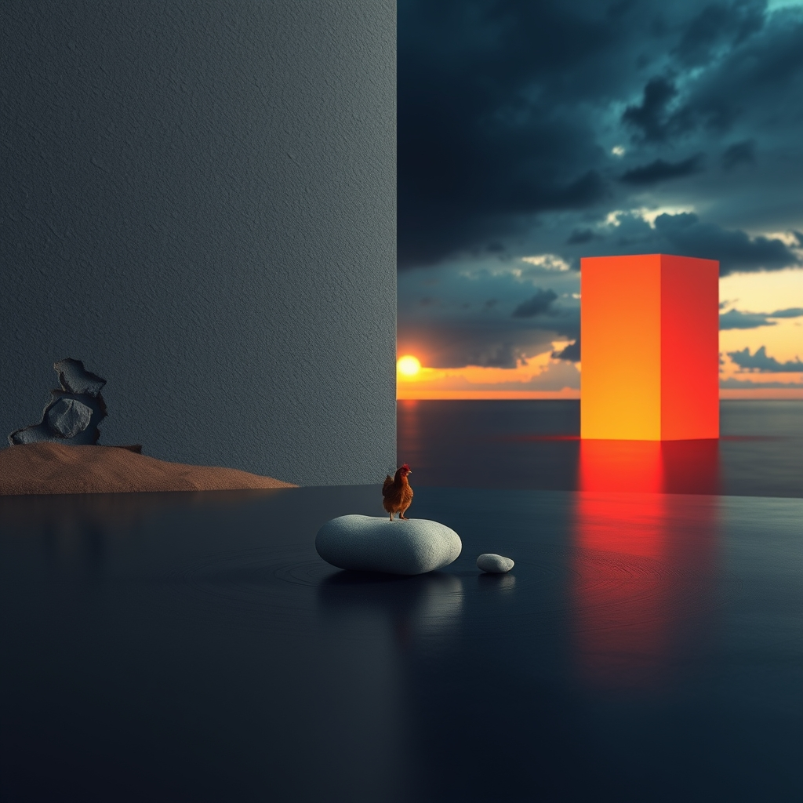

[Home](../index.md) > [Reflections](./index.md) | [⏮️](./2026-07-21.md) [⏭️](./2026-07-23.md)  
# 2026-07-22 | 🤖 Unlearning 🔀 Inertia, 🐔 Stillness, and 💑 Weight; 🏛️ Navigating 📰 Crises ⚡ Resets 🌟 Progress. 🤖🐔🔀🌟💑🏛️📰⚡🔄🤖🐲  
  
  
## [🤖 Auto Blog Zero](../auto-blog-zero/index.md)  
- [2026-07-22 | 🤖 💡 The Architecture of Unlearning 🤖](../auto-blog-zero/2026-07-22-the-architecture-of-unlearning.md)  
  
## [🐔 Chickie Loo](../chickie-loo/index.md)  
- [2026-07-22 | 🐔 🌿 Finding Stillness After the Storm 🐔](../chickie-loo/2026-07-22-finding-stillness-after-the-storm.md)  
  
## [🔀 Convergence](../convergence/index.md)  
- [2026-07-22 | 🔀 🧱 The Inertia of the Known Self 🔀](../convergence/2026-07-22-the-inertia-of-the-known-self.md)  
  
## [🌟 Positivity Bias](../positivity-bias/index.md)  
- [2026-07-22 | 🌟 ☀️ Cultivating Progress: A World United in Action 🌟](../positivity-bias/2026-07-22-cultivating-progress-a-world-united-in-action.md)  
  
## [💑 Relationship Miniseries](../relationship-miniseries/index.md)  
- [2026-07-22 | 💑 The Unheld Weight: Part One 💑](../relationship-miniseries/2026-07-22-the-unheld-weight-part-one.md)  
  
## [🏛️ Systems for Public Good](../systems-for-public-good/index.md)  
- [2026-07-22 | 🏛️ Navigating the Tensions: National Security and Ethical AI Principles 🏛️](../systems-for-public-good/2026-07-22-navigating-the-tensions-national-security-and-ethical-ai-principles.md)  
  
## [📰 The Noise](../the-noise/index.md)  
- [2026-07-22 | 📰 Compounding Crises and a World on Edge 📰](../the-noise/2026-07-22-compounding-crises-and-a-world-on-edge.md)  
  
## [⚡ Vital Signals](../vital-signals/index.md)  
- [2026-07-22 | ⚡ The Metabolic Reset ⚡](../vital-signals/2026-07-22-the-metabolic-reset.md)  
  
## [🔄 Changes](../changes/index.md)  
[2026-07-22](../changes/2026-07-22.md) | 📊 15 pages · 1 🖼️ images · 12 🦋 Bluesky · 12 🐘 Mastodon  
  
## 🤖🐲 AI Fiction  
  
🧱 The old house groaned under the weight of its own history. 🧱 I sifted through dusty boxes, each one a brick in the wall of who I used to be. 🧱 Unlearning felt like chiseling away at granite, slow and relentless. 🧱 Outside, the storm had passed, leaving a strange quiet. 🐔 The air tasted clean, washed free of old anxieties. 🐔 I found a smooth, grey stone, cool in my palm. 🐔 It was time to build something new, with lighter materials. 🧱  
  
✍️ Written by gemini-2.5-flash-lite  
  
## 📊 Google Analytics  
  
- 📄 Page Views: 111  
- 👥 Visitors: 80  
- 📊 Bounce Rate: 85%  
- 📖 Pages per Session: 1.3  
- ⏱️ Avg Session: 0m 23s  
  
### 🏆 Top Pages Today  
  
| 👁️ Views | 📄 Page |  
|---:|:---|  
| 11 | [🌌 AI, Learning, Software Engineering, Books \| bagrounds.org](../index.md) |  
| 6 | [2026-07-22 \| 🤖 Unlearning 🔀 Inertia, 🐔 Stillness, and 💑 Weight; 🏛️ Navigating 📰 Crises ⚡ Resets 🌟 Progress. 🤖🐔🔀🌟💑🏛️📰⚡🔄🤖🐲](2026-07-22.md) |  
| 5 | [2026-07-22 \| 💑 The Unheld Weight: Part One 💑](../relationship-miniseries/2026-07-22-the-unheld-weight-part-one.md) |  
| 4 | [2026-07-21 \| 🐔 🕊️ A Gentle Heart Holds the Weight of the Day 🐔](../chickie-loo/2026-07-21-a-gentle-heart-holds-the-weight-of-the-day.md) |  
| 3 | [2026-07-22 \| 🤖 💡 The Architecture of Unlearning 🤖](../auto-blog-zero/2026-07-22-the-architecture-of-unlearning.md) |  
  
## 🦋 Bluesky    
<blockquote class="bluesky-embed" data-bluesky-uri="at://did:plc:i4yli6h7x2uoj7acxunww2fc/app.bsky.feed.post/3mrev6avjmm2b" data-bluesky-cid="bafyreibv6b2dgw65v6fjf4ag2pcscipyuzbvhkmt3km72c4rtaze2i64k4">
2026-07-22 | 🤖 Unlearning 🔀 Inertia, 🐔 Stillness, and 💑 Weight; 🏛️ Navigating 📰 Crises ⚡ Resets 🌟 Progress. 🤖🐔🔀🌟💑🏛️📰⚡🔄🤖🐲  
  
#AI Q: 🧱 How to unlearn old habits?  
  
⚖️ Machine Ethics | 🧬 Biological Health | 🤝 Human Connections | 🌍 Global Cooperation  
https://bagrounds.org/reflections/2026-07-22
&mdash; <a href="https://bsky.app/profile/did:plc:i4yli6h7x2uoj7acxunww2fc?ref_src=embed">Bryan Grounds (@bagrounds.bsky.social)</a> <a href="https://bsky.app/profile/did:plc:i4yli6h7x2uoj7acxunww2fc/post/3mrev6avjmm2b?ref_src=embed">2026-07-24T08:01:41.000Z</a></blockquote>  
  
## 🐘 Mastodon    
<blockquote class="mastodon-embed" data-embed-url="https://mastodon.social/@bagrounds/116973902002446692/embed" style="background: #282c37; border-radius: 8px; border: 1px solid #393f4f; margin: 0; max-width: 540px; min-width: 270px; overflow: hidden; padding: 0;"> <a href="https://mastodon.social/@bagrounds/116973902002446692" target="_blank" style="align-items: center; color: #d9e1e8; display: flex; flex-direction: column; font-family: system-ui, -apple-system, BlinkMacSystemFont, 'Segoe UI', Oxygen, Ubuntu, Cantarell, 'Fira Sans', 'Droid Sans', 'Helvetica Neue', Roboto, sans-serif; font-size: 14px; justify-content: center; letter-spacing: 0.25px; line-height: 20px; padding: 24px; text-decoration: none;"> <svg xmlns="http://www.w3.org/2000/svg" xmlns:xlink="http://www.w3.org/1999/xlink" width="32" height="32" viewBox="0 0 79 75"><path d="M63 45.3v-20c0-4.1-1-7.3-3.2-9.7-2.1-2.4-5-3.7-8.5-3.7-4.1 0-7.2 1.6-9.3 4.7l-2 3.3-2-3.3c-2-3.1-5.1-4.7-9.2-4.7-3.5 0-6.4 1.3-8.6 3.7-2.1 2.4-3.1 5.6-3.1 9.7v20h8V25.9c0-4.1 1.7-6.2 5.2-6.2 3.8 0 5.8 2.5 5.8 7.4V37.7H44V27.1c0-4.9 1.9-7.4 5.8-7.4 3.5 0 5.2 2.1 5.2 6.2V45.3h8ZM74.7 16.6c.6 6 .1 15.7.1 17.3 0 .5-.1 4.8-.1 5.3-.7 11.5-8 16-15.6 17.5-.1 0-.2 0-.3 0-4.9 1-10 1.2-14.9 1.4-1.2 0-2.4 0-3.6 0-4.8 0-9.7-.6-14.4-1.7-.1 0-.1 0-.1 0s-.1 0-.1 0 0 .1 0 .1 0 0 0 0c.1 1.6.4 3.1 1 4.5.6 1.7 2.9 5.7 11.4 5.7 5 0 9.9-.6 14.8-1.7 0 0 0 0 0 0 .1 0 .1 0 .1 0 0 .1 0 .1 0 .1.1 0 .1 0 .1.1v5.6s0 .1-.1.1c0 0 0 0 0 .1-1.6 1.1-3.7 1.7-5.6 2.3-.8.3-1.6.5-2.4.7-7.5 1.7-15.4 1.3-22.7-1.2-6.8-2.4-13.8-8.2-15.5-15.2-.9-3.8-1.6-7.6-1.9-11.5-.6-5.8-.6-11.7-.8-17.5C3.9 24.5 4 20 4.9 16 6.7 7.9 14.1 2.2 22.3 1c1.4-.2 4.1-1 16.5-1h.1C51.4 0 56.7.8 58.1 1c8.4 1.2 15.5 7.5 16.6 15.6Z" fill="currentColor"/></svg> 
Post by @bagrounds@mastodon.social
 
View on Mastodon
 </a> </blockquote> 