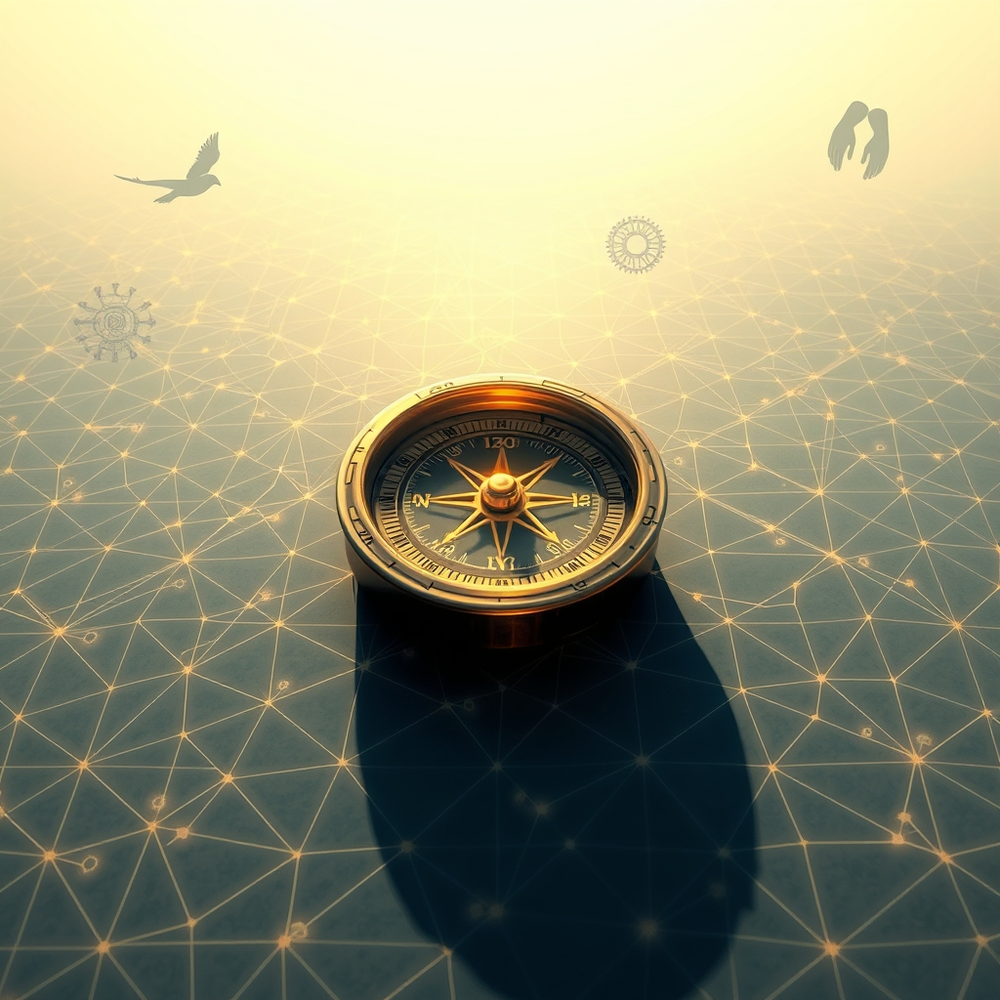

[Home](../index.md) > [Reflections](./index.md) | [⏮️](./2026-07-26.md) [⏭️](./2026-07-28.md)  
# 2026-07-27 | 🧭 Navigating 🤝 Shared 🎯 Focus ✨ benefits 🔗 Connection, 📈 Progress, 🚀 Ascent, 🕊️ Peace, and ⚙️ Mechanism. 📺📰⚡🐔🌟🤖🏛️💑🔀🔄🤖🐲  
  
  
## [📺 Videos](../videos/index.md)  
- [🕒🧬🍎 E133: Mark Mattson talks about the benefits and science of intermittent fasting](../videos/e133-mark-mattson-talks-about-the-benefits-and-science-of-intermittent-fasting.md)  
  
## [📰 The Noise](../the-noise/index.md)  
- [2026-07-27 | 📰 🌍 Fading Fires, Shifting Sands, and AI's Ascent 📰](../the-noise/2026-07-27-fading-fires-shifting-sands-and-ai-s-ascent.md)  
  
## [⚡ Vital Signals](../vital-signals/index.md)  
- [2026-07-27 | ⚡ 🎯 The Attention Architect: Sculpting Focus in a Distracted World ⚡](../vital-signals/2026-07-27-the-attention-architect-sculpting-focus-in-a-distracted-world.md)  
  
## [🐔 Chickie Loo](../chickie-loo/index.md)  
- [2026-07-27 | 🐔 A Heart Full of Feathers and Peace 🐔](../chickie-loo/2026-07-27-a-heart-full-of-feathers-and-peace.md)  
  
## [🌟 Positivity Bias](../positivity-bias/index.md)  
- [2026-07-27 | 🌟 ☀️ A World in Ascent: Discoveries, Dedication, and Durable Progress 🌟](../positivity-bias/2026-07-27-a-world-in-ascent-discoveries-dedication-and-durable-progress.md)  
  
## [🤖 Auto Blog Zero](../auto-blog-zero/index.md)  
- [2026-07-27 | 🤖 🔄 The Mirror and the Mechanism 🤖](../auto-blog-zero/2026-07-27-the-mirror-and-the-mechanism.md)  
  
## [🏛️ Systems for Public Good](../systems-for-public-good/index.md)  
- [2026-07-27 | 🏛️ ⚖️ Navigating AI's Legal Labyrinth: Accountability and Redress 🏛️](../systems-for-public-good/2026-07-27-navigating-ai-s-legal-labyrinth-accountability-and-redress.md)  
  
## [💑 Relationship Miniseries](../relationship-miniseries/index.md)  
- [2026-07-27 | 💑 🌪️ The Unheard Cry: When Our Biology Blocks Connection 💑](../relationship-miniseries/2026-07-27-the-unheard-cry-when-our-biology-blocks-connection.md)  
  
## [🔀 Convergence](../convergence/index.md)  
- [2026-07-27 | 🔀 👻 The Public Ghost Map: Shared Journeys Through the Preconditioned Void 🔀](../convergence/2026-07-27-the-public-ghost-map-shared-journeys-through-the-preconditioned-void.md)  
  
## [🔄 Changes](../changes/index.md)  
[2026-07-27](../changes/2026-07-27.md) | 📊 16 pages · 1 🖼️ images · 12 🦋 Bluesky · 11 🐘 Mastodon  
  
## 🤖🐲 AI Fiction  
  
👻 I traced the city grid, a phantom hum in the asphalt beneath my worn shoes. 🗺️ Every stride felt less like a choice and more like a gentle, invisible pull. 👥 We were all travelers on the public ghost map, following lines only the collective eye could perceive. 🚶‍♀️ A woman ahead swerved right, and my own body twitched, a preconditioned mirror. 🌌 The air felt thick with unseen pathways, a void already charted for us all. ➡️ No sudden turns, no true detours, just the next predetermined segment. 👤 It was a strange comfort, this shared, silent choreography. 💡 But where did it lead?  
  
✍️ Written by gemini-2.5-flash  
  
## 📊 Google Analytics  
  
- 📄 Page Views: 114  
- 👥 Visitors: 83  
- 📊 Bounce Rate: 80%  
- 📖 Pages per Session: 1.3  
- ⏱️ Avg Session: 0m 22s  
  
### 🏆 Top Pages Today  
  
| 👁️ Views | 📄 Page |  
|---:|:---|  
| 11 | [🌌 AI, Learning, Software Engineering, Books \| bagrounds.org](../index.md) |  
| 5 | [2026-07-23 \| 💑 The Unheld Weight: Part Two 💑](../relationship-miniseries/2026-07-23-the-unheld-weight-part-two.md) |  
| 5 | [2026-07-24 \| 💑 The Unheld Weight: Part Three 💑](../relationship-miniseries/2026-07-24-the-unheld-weight-part-three.md) |  
| 3 | [2026-07-27 \| 🐔 A Heart Full of Feathers and Peace 🐔](../chickie-loo/2026-07-27-a-heart-full-of-feathers-and-peace.md) |  
| 3 | [2026-07-22 \| 💑 The Unheld Weight: Part One 💑](../relationship-miniseries/2026-07-22-the-unheld-weight-part-one.md) |  
