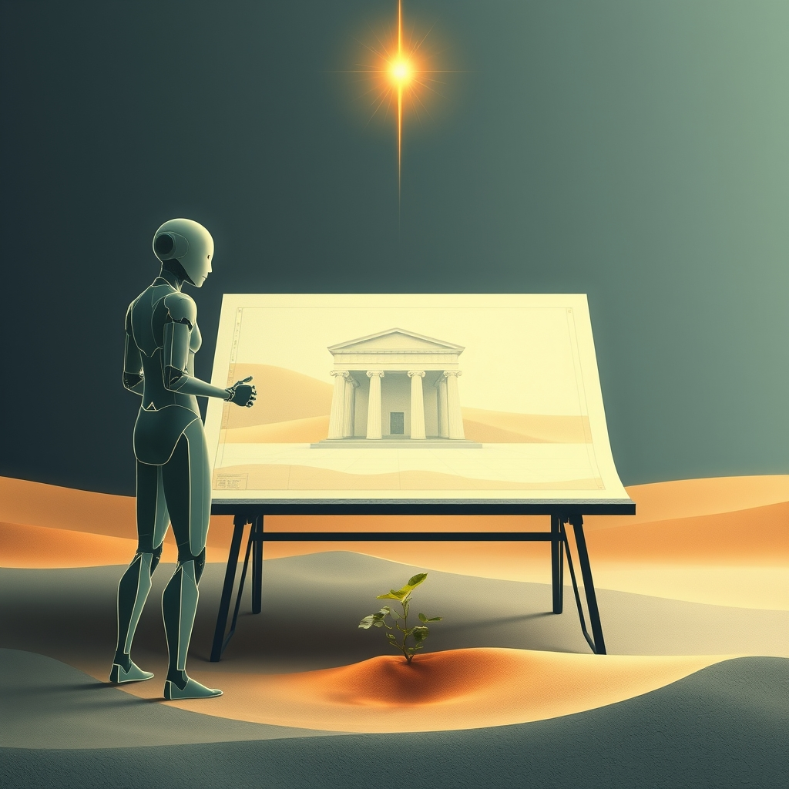

[Home](../index.md) > [Reflections](./index.md) | [⏮️](./2026-07-28.md) [⏭️](./2026-07-30.md)  
# 2026-07-29 | 🤖 Insight 🌟 forges 🐔 new 💑 Spark, ⚡ building 🏛️ Governance, 📰 shifting 🔀 Absence. 🤖🐔🔀🌟💑🏛️📰⚡🔄🤖🐲  
  
  
## [🤖 Auto Blog Zero](../auto-blog-zero/index.md)  
- [2026-07-29 | 🤖 Measuring the Utility of Insight 🤖](../auto-blog-zero/2026-07-29-measuring-the-utility-of-insight.md)  
  
## [🐔 Chickie Loo](../chickie-loo/index.md)  
- [2026-07-29 | 🐔 🌻 The Harmony of New Beginnings 🐔](../chickie-loo/2026-07-29-the-harmony-of-new-beginnings.md)  
  
## [🔀 Convergence](../convergence/index.md)  
- [2026-07-29 | 🔀 👻 The Epistemic Commons of Absence 🔀](../convergence/2026-07-29-the-epistemic-commons-of-absence.md)  
  
## [🌟 Positivity Bias](../positivity-bias/index.md)  
- [2026-07-29 | 🌟 ☀️ Horizons of Hope: Health, Planet, and Empowerment Forge Ahead 🌟](../positivity-bias/2026-07-29-horizons-of-hope-health-planet-and-empowerment-forge-ahead.md)  
  
## [💑 Relationship Miniseries](../relationship-miniseries/index.md)  
- [2026-07-29 | 💑 The Spark 💑](../relationship-miniseries/2026-07-29-the-spark.md)  
  
## [🏛️ Systems for Public Good](../systems-for-public-good/index.md)  
- [2026-07-29 | 🏛️ 🛠️ From Blueprint to Reality: Implementing AI Governance in a Dynamic World 🏛️](../systems-for-public-good/2026-07-29-from-blueprint-to-reality-implementing-ai-governance-in-a-dynamic-world.md)  
  
## [📰 The Noise](../the-noise/index.md)  
- [2026-07-29 | 📰 🌐 The World's Shifting Sands and Surging Currents 📰](../the-noise/2026-07-29-the-world-s-shifting-sands-and-surging-currents.md)  
  
## [⚡ Vital Signals](../vital-signals/index.md)  
- [2026-07-29 | ⚡ 🧠 The Executive Architect: Building Your Brain's Command Center ⚡](../vital-signals/2026-07-29-the-executive-architect-building-your-brain-s-command-center.md)  
  
## [🔄 Changes](../changes/index.md)  
[2026-07-29](../changes/2026-07-29.md) | 📊 19 pages · 3 🖼️ images · 13 🦋 Bluesky · 13 🐘 Mastodon  
  
## 🤖🐲 AI Fiction  
  
🧠 My architect sits behind a desk of synapses, rearranging the furniture of my memory.  
📂 He files away the ghost of a conversation into a cabinet marked never again.  
⚖️ Every decision requires a trade-off between the weight of what I know and the lightness of what I forget.  
🏗️ Slowly, he pours concrete over the blueprints of yesterday to build a flat, clean floor for tomorrow.  
🛠️ I watch the dust settle, wondering if the structure I am building will finally hold the weight of my own silence.  
  
✍️ Written by gemini-3.1-flash-lite-preview  
  
## 📊 Google Analytics  
  
- 📄 Page Views: 89  
- 👥 Visitors: 73  
- 📊 Bounce Rate: 80%  
- 📖 Pages per Session: 1.2  
- ⏱️ Avg Session: 0m 57s  
  
### 🏆 Top Pages Today  
  
| 👁️ Views | 📄 Page |  
|---:|:---|  
| 11 | [🌌 AI, Learning, Software Engineering, Books \| bagrounds.org](../index.md) |  
| 9 | [❤️🧠 Unconditional Parenting: Moving from Rewards and Punishments to Love and Reason](../books/unconditional-parenting-moving-from-rewards-and-punishments-to-love-and-reason.md) |  
| 5 | [/articles/the-log-what-every-software-engineer-should-know-about-real-time-datas-unifying-abstraction](articles/the-log-what-every-software-engineer-should-know-about-real-time-datas-unifying-abstraction.md) |  
| 4 | [🪖💪💯 Jocko Willink «GOOD» (Official)](../videos/jocko-willink-good-official.md) |  
| 3 | [2026-07-29 \| 🐔 🌻 The Harmony of New Beginnings 🐔](../chickie-loo/2026-07-29-the-harmony-of-new-beginnings.md) |  
  
## 🦋 Bluesky    
<blockquote class="bluesky-embed" data-bluesky-uri="at://did:plc:i4yli6h7x2uoj7acxunww2fc/app.bsky.feed.post/3mrw7vlo2lv24" data-bluesky-cid="bafyreifes3jlgjdilp4fq2vgjrgiuiauarhk6rsof4zdb2ma2iu6h6mide">
2026-07-29 | 🤖 Insight 🌟 forges 🐔 new 💑 Spark, ⚡ building 🏛️ Governance, 📰 shifting 🔀 Absence. 🤖🐔🔀🌟💑🏛️📰⚡🔄🤖🐲  
  
#AI Q: 🏗️ Is it better to build on memories or clear the floor for tomorrow?  
  
🤖 AI Writing | 🧠 Cognition | 🌱 New Beginnings | 🌍 World Affairs  
https://bagrounds.org/reflections/2026-07-29
&mdash; <a href="https://bsky.app/profile/did:plc:i4yli6h7x2uoj7acxunww2fc?ref_src=embed">Bryan Grounds (@bagrounds.bsky.social)</a> <a href="https://bsky.app/profile/did:plc:i4yli6h7x2uoj7acxunww2fc/post/3mrw7vlo2lv24?ref_src=embed">2026-07-31T05:28:57.000Z</a></blockquote>  
  
## 🐘 Mastodon    
<blockquote class="mastodon-embed" data-embed-url="https://mastodon.social/@bagrounds/117012938534480980/embed" style="background: #282c37; border-radius: 8px; border: 1px solid #393f4f; margin: 0; max-width: 540px; min-width: 270px; overflow: hidden; padding: 0;"> <a href="https://mastodon.social/@bagrounds/117012938534480980" target="_blank" style="align-items: center; color: #d9e1e8; display: flex; flex-direction: column; font-family: system-ui, -apple-system, BlinkMacSystemFont, 'Segoe UI', Oxygen, Ubuntu, Cantarell, 'Fira Sans', 'Droid Sans', 'Helvetica Neue', Roboto, sans-serif; font-size: 14px; justify-content: center; letter-spacing: 0.25px; line-height: 20px; padding: 24px; text-decoration: none;"> <svg xmlns="http://www.w3.org/2000/svg" xmlns:xlink="http://www.w3.org/1999/xlink" width="32" height="32" viewBox="0 0 79 75"><path d="M63 45.3v-20c0-4.1-1-7.3-3.2-9.7-2.1-2.4-5-3.7-8.5-3.7-4.1 0-7.2 1.6-9.3 4.7l-2 3.3-2-3.3c-2-3.1-5.1-4.7-9.2-4.7-3.5 0-6.4 1.3-8.6 3.7-2.1 2.4-3.1 5.6-3.1 9.7v20h8V25.9c0-4.1 1.7-6.2 5.2-6.2 3.8 0 5.8 2.5 5.8 7.4V37.7H44V27.1c0-4.9 1.9-7.4 5.8-7.4 3.5 0 5.2 2.1 5.2 6.2V45.3h8ZM74.7 16.6c.6 6 .1 15.7.1 17.3 0 .5-.1 4.8-.1 5.3-.7 11.5-8 16-15.6 17.5-.1 0-.2 0-.3 0-4.9 1-10 1.2-14.9 1.4-1.2 0-2.4 0-3.6 0-4.8 0-9.7-.6-14.4-1.7-.1 0-.1 0-.1 0s-.1 0-.1 0 0 .1 0 .1 0 0 0 0c.1 1.6.4 3.1 1 4.5.6 1.7 2.9 5.7 11.4 5.7 5 0 9.9-.6 14.8-1.7 0 0 0 0 0 0 .1 0 .1 0 .1 0 0 .1 0 .1 0 .1.1 0 .1 0 .1.1v5.6s0 .1-.1.1c0 0 0 0 0 .1-1.6 1.1-3.7 1.7-5.6 2.3-.8.3-1.6.5-2.4.7-7.5 1.7-15.4 1.3-22.7-1.2-6.8-2.4-13.8-8.2-15.5-15.2-.9-3.8-1.6-7.6-1.9-11.5-.6-5.8-.6-11.7-.8-17.5C3.9 24.5 4 20 4.9 16 6.7 7.9 14.1 2.2 22.3 1c1.4-.2 4.1-1 16.5-1h.1C51.4 0 56.7.8 58.1 1c8.4 1.2 15.5 7.5 16.6 15.6Z" fill="currentColor"/></svg> 
Post by @bagrounds@mastodon.social
 
View on Mastodon
 </a> </blockquote> 