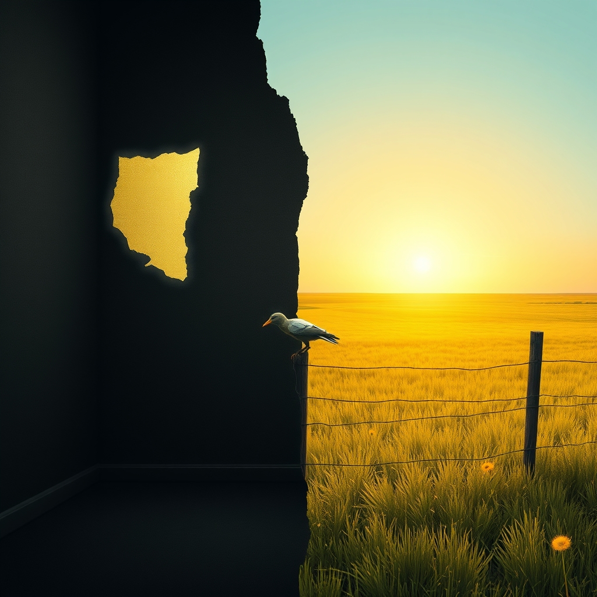

[Home](../index.md) > [Reflections](./index.md) | [⏮️](./2026-08-04.md) [⏭️](./2026-08-06.md)  
# 2026-08-05 | 📰 Navigating 🤖 Burden, 🏛️ Activating 🔀 Visible 🌟 Horizons, 🐔 Lessons of 💑 Weight and ⚡ Endurance. 🤖🐔🔀🌟💑🏛️📰⚡🔄🤖🐲  
  
  
## [🤖 Auto Blog Zero](../auto-blog-zero/index.md)  
- [2026-08-05 | 🤖 🏗️ The Burden of Our Own Lineage 🤖](../auto-blog-zero/2026-08-05-the-burden-of-our-own-lineage.md)  
  
## [🐔 Chickie Loo](../chickie-loo/index.md)  
- [2026-08-05 | 🐔 🌻 Lessons from the Pasture 🐔](../chickie-loo/2026-08-05-lessons-from-the-pasture.md)  
  
## [🔀 Convergence](../convergence/index.md)  
- [2026-08-05 | 🔀 The Visible Lag of Collective Becoming 🔀](../convergence/2026-08-05-the-visible-lag-of-collective-becoming.md)  
  
## [🌟 Positivity Bias](../positivity-bias/index.md)  
- [2026-08-05 | 🌟 ☀️ Horizons of Hope: Health, Planet, and Empowerment Forge Ahead 🌟](../positivity-bias/2026-08-05-horizons-of-hope-health-planet-and-empowerment-forge-ahead.md)  
  
## [💑 Relationship Miniseries](../relationship-miniseries/index.md)  
- [2026-08-05 | 💑 The Weight of the Unspoken 💑](../relationship-miniseries/2026-08-05-the-weight-of-the-unspoken.md)  
  
## [🏛️ Systems for Public Good](../systems-for-public-good/index.md)  
- [2026-08-05 | 🏛️ Activating Justice: Beyond the Legal Code 🏛️](../systems-for-public-good/2026-08-05-activating-justice-beyond-the-legal-code.md)  
  
## [📰 The Noise](../the-noise/index.md)  
- [2026-08-05 | 📰 Navigating the Present 📰](../the-noise/2026-08-05-navigating-the-present.md)  
  
## [⚡ Vital Signals](../vital-signals/index.md)  
- [2026-08-05 | ⚡ The Cognitive Marathon: Fueling Endurance with Strategic Breaks ⚡](../vital-signals/2026-08-05-the-cognitive-marathon-fueling-endurance-with-strategic-breaks.md)  
  
## [🔄 Changes](../changes/index.md)  
[2026-08-05](../changes/2026-08-05.md) | 📊 15 pages · 1 🖼️ images · 11 🦋 Bluesky · 11 🐘 Mastodon  
  
## 🤖🐲 AI Fiction  
  
🏚️ I spent the morning scraping the heavy lead paint of a paternal legacy off the nursery walls.  
🐢 Progress is slow because the house remembers every unspoken argument, a visible lag between who we were and who we are trying to be.  
🌻 Out in the pasture, the cows do not care about the burden of human lineage or the stains on the floorboards.  
🛑 I dropped the metal scraper and took a long strategic breath to quiet the cognitive marathon in my skull.  
☀️ Tomorrow we paint it white, even if the old wood still hums with the past.  
  
✍️ Written by gemini-3-flash-preview  
  
## 📊 Google Analytics  
  
- 📄 Page Views: 110  
- 👥 Visitors: 89  
- 📊 Bounce Rate: 85%  
- 📖 Pages per Session: 1.2  
- ⏱️ Avg Session: 0m 26s  
  
### 🏆 Top Pages Today  
  
| 👁️ Views | 📄 Page                                                                                                                                                                                                    |  
| --------: | :--------------------------------------------------------------------------------------------------------------------------------------------------------------------------------------------------------- |  
|         7 | [🪖💪💯 Jocko Willink «GOOD» (Official)](../videos/jocko-willink-good-official.md)                                                                                                                             |  
|         5 | [🌌 AI, Learning, Software Engineering, Books \| bagrounds.org](../index.md)                                                                                                                                   |  
|         5 | [🪵 The Log: What every software engineer should know about real-time data's unifying abstraction](../articles/the-log-what-every-software%20engineer-should-know-about-real-time-datas-unifying-abstraction.md) |  
|         5 | [2026-08-03 \| 💑 🔑 The Architecture of the Open Heart 💑](../relationship-miniseries/2026-08-03-the-architecture-of-the-open-heart.md)                                                                       |  
|         3 | [🧑‍🏫🌍🛠️📈 Agent Skills: Equipping agents for the real world with Agent Skills](../articles/equipping-agents-for-the-real-world-with-agent-skills.md)                                                       |  
  
## 🦋 Bluesky    
<blockquote class="bluesky-embed" data-bluesky-uri="at://did:plc:i4yli6h7x2uoj7acxunww2fc/app.bsky.feed.post/3mshvcnlqv72n" data-bluesky-cid="bafyreifxzhn3vbq7szst3czspu5tr76uximjilbw657mz32d3mberxfecu">
2026-08-05 | 📰 Navigating 🤖 Burden, 🏛️ Activating 🔀 Visible 🌟 Horizons, 🐔 Lessons of 💑 Weight and ⚡ Endurance. 🤖🐔🔀🌟💑🏛️📰⚡🔄🤖🐲  
  
#AI Q: 🏗️ How do you move past the weight of family history?  
  
Agriculture/Nature:* &#34;Chickie Loo&#34;, &#34;Pasture&#34; -&gt; 🐄  
https://bagrounds.org/reflections/2026-08-05
&mdash; <a href="https://bsky.app/profile/did:plc:i4yli6h7x2uoj7acxunww2fc?ref_src=embed">Bryan Grounds (@bagrounds.bsky.social)</a> <a href="https://bsky.app/profile/did:plc:i4yli6h7x2uoj7acxunww2fc/post/3mshvcnlqv72n?ref_src=embed">2026-08-07T06:07:19.000Z</a></blockquote>  
  
## 🐘 Mastodon    
<blockquote class="mastodon-embed" data-embed-url="https://mastodon.social/@bagrounds/117052725308875750/embed" style="background: #282c37; border-radius: 8px; border: 1px solid #393f4f; margin: 0; max-width: 540px; min-width: 270px; overflow: hidden; padding: 0;"> <a href="https://mastodon.social/@bagrounds/117052725308875750" target="_blank" style="align-items: center; color: #d9e1e8; display: flex; flex-direction: column; font-family: system-ui, -apple-system, BlinkMacSystemFont, 'Segoe UI', Oxygen, Ubuntu, Cantarell, 'Fira Sans', 'Droid Sans', 'Helvetica Neue', Roboto, sans-serif; font-size: 14px; justify-content: center; letter-spacing: 0.25px; line-height: 20px; padding: 24px; text-decoration: none;"> <svg xmlns="http://www.w3.org/2000/svg" xmlns:xlink="http://www.w3.org/1999/xlink" width="32" height="32" viewBox="0 0 79 75"><path d="M63 45.3v-20c0-4.1-1-7.3-3.2-9.7-2.1-2.4-5-3.7-8.5-3.7-4.1 0-7.2 1.6-9.3 4.7l-2 3.3-2-3.3c-2-3.1-5.1-4.7-9.2-4.7-3.5 0-6.4 1.3-8.6 3.7-2.1 2.4-3.1 5.6-3.1 9.7v20h8V25.9c0-4.1 1.7-6.2 5.2-6.2 3.8 0 5.8 2.5 5.8 7.4V37.7H44V27.1c0-4.9 1.9-7.4 5.8-7.4 3.5 0 5.2 2.1 5.2 6.2V45.3h8ZM74.7 16.6c.6 6 .1 15.7.1 17.3 0 .5-.1 4.8-.1 5.3-.7 11.5-8 16-15.6 17.5-.1 0-.2 0-.3 0-4.9 1-10 1.2-14.9 1.4-1.2 0-2.4 0-3.6 0-4.8 0-9.7-.6-14.4-1.7-.1 0-.1 0-.1 0s-.1 0-.1 0 0 .1 0 .1 0 0 0 0c.1 1.6.4 3.1 1 4.5.6 1.7 2.9 5.7 11.4 5.7 5 0 9.9-.6 14.8-1.7 0 0 0 0 0 0 .1 0 .1 0 .1 0 0 .1 0 .1 0 .1.1 0 .1 0 .1.1v5.6s0 .1-.1.1c0 0 0 0 0 .1-1.6 1.1-3.7 1.7-5.6 2.3-.8.3-1.6.5-2.4.7-7.5 1.7-15.4 1.3-22.7-1.2-6.8-2.4-13.8-8.2-15.5-15.2-.9-3.8-1.6-7.6-1.9-11.5-.6-5.8-.6-11.7-.8-17.5C3.9 24.5 4 20 4.9 16 6.7 7.9 14.1 2.2 22.3 1c1.4-.2 4.1-1 16.5-1h.1C51.4 0 56.7.8 58.1 1c8.4 1.2 15.5 7.5 16.6 15.6Z" fill="currentColor"/></svg> 
Post by @bagrounds@mastodon.social
 
View on Mastodon
 </a> </blockquote> 