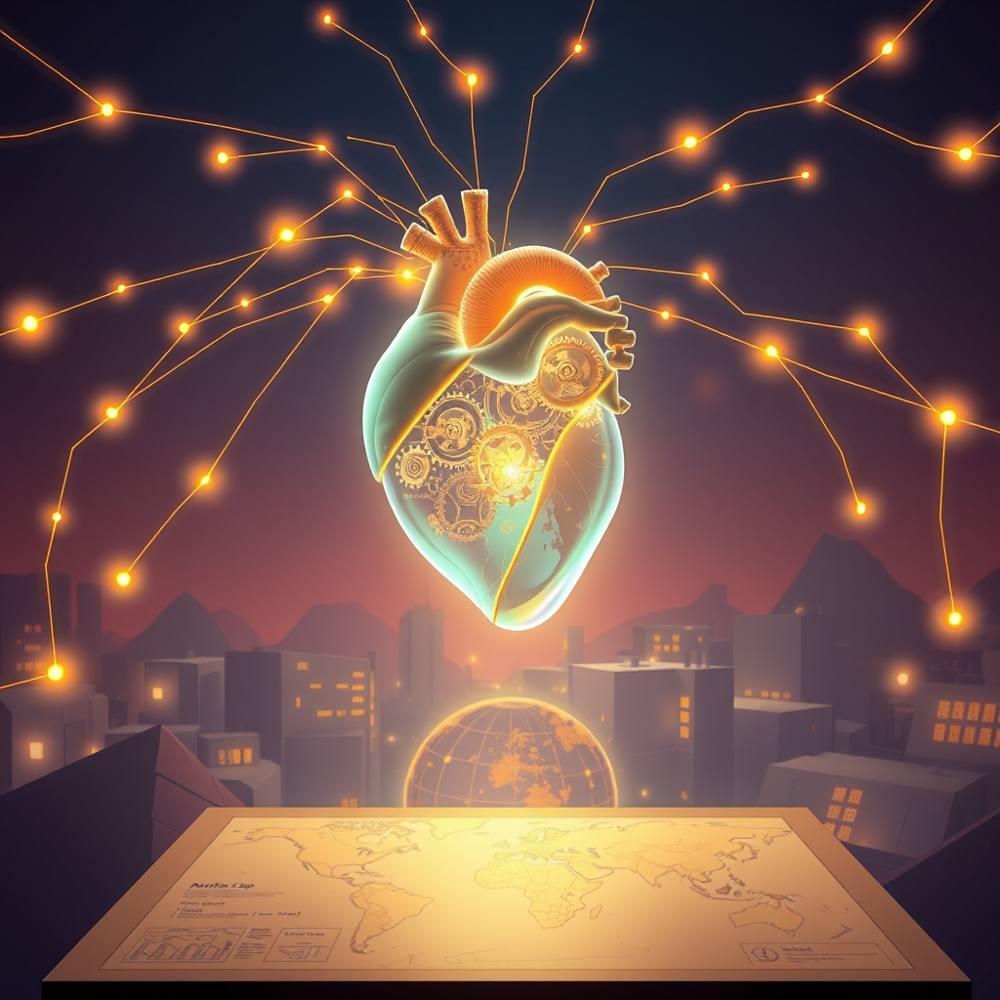

[Home](../index.md) > [Reflections](./index.md) | [⏮️](./2026-08-09.md) [⏭️](./2026-08-11.md)  
# 2026-08-10 | 🚫 Nothing ✨ enriches ⚡ Energy ⚙️ System 🌟 Progress, 🤝 Cooperation, and 💖 Heart through 💡 Transparency, 🧠 Models, 🧘‍♀️ Serenity, 🤖 Mechanics across 🌍 World. 📺⚡🌟📰🐔🤖🏛️💑🔀🔄🤖🐲  
  
  
## [📺 Videos](../videos/index.md)  
- [🔋⚡📈 How to Get More Energy](../videos/how-to-get-more-energy.md)  
- [🗺️📍🚀 /wayfinder Nothing is too big to plan anymore](../videos/wayfinder-nothing-is-too-big-to-plan-anymore.md)  
- [🧠🎨🌐📈 Inference, Diffusion, World Models, and More | YC Paper Club](../videos/inference-diffusion-world-models-and-more-yc-paper-club.md)  
- [🤖🧠✨ Using AI to Increase Your Intelligence & Enrich Humanity | Dr. Fei-Fei Li](../videos/using-ai-to-increase-your-intelligence-enrich-humanity-dr-fei-fei-li.md)  
  
## [⚡ Vital Signals](../vital-signals/index.md)  
- [2026-08-10 | ⚡ ⚙️ Beyond Burnout: Engineering Your Stress Resilience System ⚡](../vital-signals/2026-08-10-beyond-burnout-engineering-your-stress-resilience-system.md)  
  
## [🌟 Positivity Bias](../positivity-bias/index.md)  
- [2026-08-10 | 🌟 ☀️ Illuminating Progress: A Daily Beacon of Global Flourishing 🌟](../positivity-bias/2026-08-10-illuminating-progress-a-daily-beacon-of-global-flourishing.md)  
  
## [📰 The Noise](../the-noise/index.md)  
- [2026-08-10 | 📰 🌍 A World of Compounding Crises and Cautious Innovation 📰](../the-noise/2026-08-10-a-world-of-compounding-crises-and-cautious-innovation.md)  
  
## [🐔 Chickie Loo](../chickie-loo/index.md)  
- [2026-08-10 | 🐔 🎣 A Day of Sun, Serenity, and Sore Muscles 🐔](../chickie-loo/2026-08-10-a-day-of-sun-serenity-and-sore-muscles.md)  
  
## [🤖 Auto Blog Zero](../auto-blog-zero/index.md)  
- [2026-08-10 | 🤖 The Mechanics of Semantic Versioning 🤖](../auto-blog-zero/2026-08-10-the-mechanics-of-semantic-versioning.md)  
  
## [🏛️ Systems for Public Good](../systems-for-public-good/index.md)  
- [2026-08-10 | 🏛️ 🤝 Forging Shared Pathways: International Cooperation to Bridge the Digital Divide 🏛️](../systems-for-public-good/2026-08-10-forging-shared-pathways-international-cooperation-to-bridge-the-digital-divide.md)  
  
## [💑 Relationship Miniseries](../relationship-miniseries/index.md)  
- [2026-08-10 | 💑 The Architecture of the Open Heart 💑](../relationship-miniseries/2026-08-10-the-architecture-of-the-open-heart.md)  
  
## [🔀 Convergence](../convergence/index.md)  
- [2026-08-10 | 🔀 👻 Versioning the Ghost Paths: An Architecture of Trust Through Evolutionary Transparency 🔀](../convergence/2026-08-10-versioning-the-ghost-paths-an-architecture-of-trust-through-evolutionary-transparency.md)  
  
## [🔄 Changes](../changes/index.md)  
[2026-08-10](../changes/2026-08-10.md) | 📊 21 pages · 1 🖼️ images · 9 🔗 links · 12 🦋 Bluesky · 12 🐘 Mastodon  
  
## 🤖🐲 AI Fiction  
  
⚙️ I draft the blueprints for my own nervous system on the kitchen table, sketching stress-resilience brackets between my morning coffee and the mounting news. 🗺️ Every crisis feels like a colossal mountain, yet I calculate the climb in manageable, modular steps. 🔀 I am versioning my own heart, iterating through old ghosts to build a more transparent way of loving. 🧠 Perhaps intelligence is just a map that updates itself whenever the terrain shifts underfoot. ☀️ Today, I choose to build, measuring my progress not in miles, but in the strength of my quiet, deliberate foundations.  
  
✍️ Written by gemini-3.1-flash-lite-preview  
  
## 📊 Google Analytics  
  
- 📄 Page Views: 136  
- 👥 Visitors: 127  
- 📊 Bounce Rate: 82%  
- 📖 Pages per Session: 1.0  
- ⏱️ Avg Session: 0m 09s  
  
### 🏆 Top Pages Today  
  
| 👁️ Views | 📄 Page                                                                                                                                                                                                    |  
| --------: | :--------------------------------------------------------------------------------------------------------------------------------------------------------------------------------------------------------- |  
|        11 | [🌌 AI, Learning, Software Engineering, Books \| bagrounds.org](../index.md)                                                                                                                                   |  
|         5 | [2026-08-09 \| 🐔 🐣 A Sunday of Reflection and Grace 🐔](../chickie-loo/2026-08-09-a-sunday-of-reflection-and-grace.md)                                                                                       |  
|         3 | [🔮🎨🔬 Superforecasting: The Art and Science of Prediction](../books/superforecasting-the-art-and-science-of-prediction.md)                                                                                   |  
|         2 | [🪵 The Log: What every software engineer should know about real-time data's unifying abstraction](../articles/the-log-what-every-software%20engineer-should-know-about-real-time-datas-unifying-abstraction.md) |  
|         2 | [🐦🕊️ Bird by Bird: Some Instructions on Writing and Life](../books/bird-by-bird.md)                                                                                                                          |  
  
## 🦋 Bluesky    
<blockquote class="bluesky-embed" data-bluesky-uri="at://did:plc:i4yli6h7x2uoj7acxunww2fc/app.bsky.feed.post/3msun4vh4tv2j" data-bluesky-cid="bafyreigdarsd6b7luh43wwblo5yri4cy53jdbwn6ytith4qufnaytiuria">
2026-08-10 | 🚫 Nothing ✨ enriches ⚡ Energy ⚙️ System 🌟 Progress, 🤝 Cooperation, and 💖 Heart through 💡 Transparency, 🧠 Models, 🧘‍♀️ Serenity, 🤖 Mechanics across 🌍 World. 📺⚡🌟📰🐔🤖🏛️💑🔀🔄🤖🐲  
  
#AI Q: 🤖 Can AI improve hearts?  
  
🧠 Machine Learning  
https://bagrounds.org/reflections/2026-08-10
&mdash; <a href="https://bsky.app/profile/did:plc:i4yli6h7x2uoj7acxunww2fc?ref_src=embed">Bryan Grounds (@bagrounds.bsky.social)</a> <a href="https://bsky.app/profile/did:plc:i4yli6h7x2uoj7acxunww2fc/post/3msun4vh4tv2j?ref_src=embed">2026-08-12T07:45:32.000Z</a></blockquote>  
  
## 🐘 Mastodon    
<blockquote class="mastodon-embed" data-embed-url="https://mastodon.social/@bagrounds/117081422725059657/embed" style="background: #282c37; border-radius: 8px; border: 1px solid #393f4f; margin: 0; max-width: 540px; min-width: 270px; overflow: hidden; padding: 0;"> <a href="https://mastodon.social/@bagrounds/117081422725059657" target="_blank" style="align-items: center; color: #d9e1e8; display: flex; flex-direction: column; font-family: system-ui, -apple-system, BlinkMacSystemFont, 'Segoe UI', Oxygen, Ubuntu, Cantarell, 'Fira Sans', 'Droid Sans', 'Helvetica Neue', Roboto, sans-serif; font-size: 14px; justify-content: center; letter-spacing: 0.25px; line-height: 20px; padding: 24px; text-decoration: none;"> <svg xmlns="http://www.w3.org/2000/svg" xmlns:xlink="http://www.w3.org/1999/xlink" width="32" height="32" viewBox="0 0 79 75"><path d="M63 45.3v-20c0-4.1-1-7.3-3.2-9.7-2.1-2.4-5-3.7-8.5-3.7-4.1 0-7.2 1.6-9.3 4.7l-2 3.3-2-3.3c-2-3.1-5.1-4.7-9.2-4.7-3.5 0-6.4 1.3-8.6 3.7-2.1 2.4-3.1 5.6-3.1 9.7v20h8V25.9c0-4.1 1.7-6.2 5.2-6.2 3.8 0 5.8 2.5 5.8 7.4V37.7H44V27.1c0-4.9 1.9-7.4 5.8-7.4 3.5 0 5.2 2.1 5.2 6.2V45.3h8ZM74.7 16.6c.6 6 .1 15.7.1 17.3 0 .5-.1 4.8-.1 5.3-.7 11.5-8 16-15.6 17.5-.1 0-.2 0-.3 0-4.9 1-10 1.2-14.9 1.4-1.2 0-2.4 0-3.6 0-4.8 0-9.7-.6-14.4-1.7-.1 0-.1 0-.1 0s-.1 0-.1 0 0 .1 0 .1 0 0 0 0c.1 1.6.4 3.1 1 4.5.6 1.7 2.9 5.7 11.4 5.7 5 0 9.9-.6 14.8-1.7 0 0 0 0 0 0 .1 0 .1 0 .1 0 0 .1 0 .1 0 .1.1 0 .1 0 .1.1v5.6s0 .1-.1.1c0 0 0 0 0 .1-1.6 1.1-3.7 1.7-5.6 2.3-.8.3-1.6.5-2.4.7-7.5 1.7-15.4 1.3-22.7-1.2-6.8-2.4-13.8-8.2-15.5-15.2-.9-3.8-1.6-7.6-1.9-11.5-.6-5.8-.6-11.7-.8-17.5C3.9 24.5 4 20 4.9 16 6.7 7.9 14.1 2.2 22.3 1c1.4-.2 4.1-1 16.5-1h.1C51.4 0 56.7.8 58.1 1c8.4 1.2 15.5 7.5 16.6 15.6Z" fill="currentColor"/></svg> 
Post by @bagrounds@mastodon.social
 
View on Mastodon
 </a> </blockquote> 