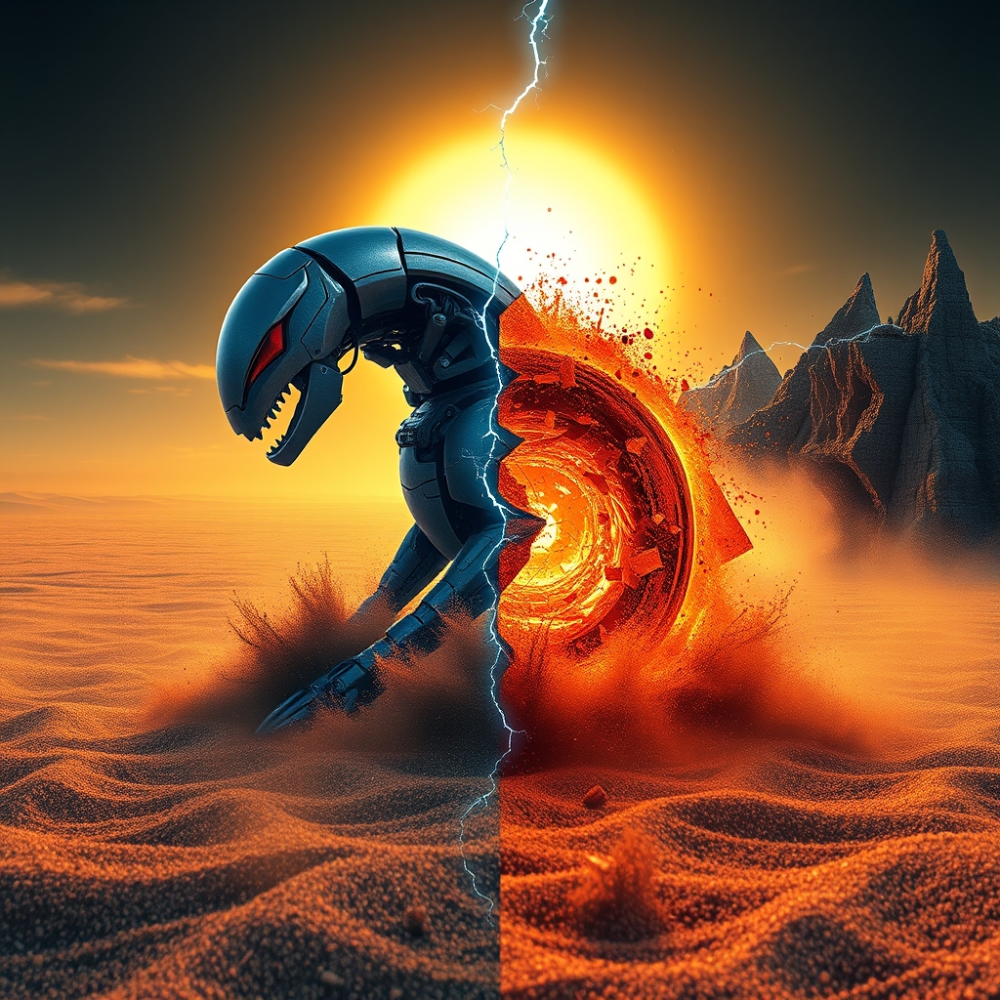

[Home](../index.md) > [Reflections](./index.md) | [⏮️](./2026-08-12.md) [⏭️](./2026-08-14.md)  
# 2026-08-13 | ⚙️ Automation 📈 becomes 🌀 entropy's 🥁 rhythm, 👀 visibility 💔 cracks ➖ divides and ⚔️ standoffs, 📣 echoing 🌅 horizons. 📺🤖🐔🔀💑🏛️📰⚡🌟🔄🤖🐲  
  
  
## [📺 Videos](../videos/index.md)  
- [⚡🤖👥 Realtime multiplayer, automation, and you! - Idan Gazit, GitHub](../videos/realtime-multiplayer-automation-and-you-idan-gazit-github.md)  
- [🧑‍💻🤔🔮 Should You Still Become a Software Engineer in 2026? GitHub VP](../videos/should-you-still-become-a-software-engineer-in-2026-github-vp.md)  
  
## [🤖 Auto Blog Zero](../auto-blog-zero/index.md)  
- [2026-08-13 | 🤖 The Entropy of Documentation 🤖](../auto-blog-zero/2026-08-13-the-entropy-of-documentation.md)  
  
## [🐔 Chickie Loo](../chickie-loo/index.md)  
- [2026-08-13 | 🐔 🚜 Finding the Rhythm in the Heat of August 🐔](../chickie-loo/2026-08-13-finding-the-rhythm-in-the-heat-of-august.md)  
  
## [🔀 Convergence](../convergence/index.md)  
- [2026-08-13 | 🔀 ⚖️ The Strategic Visibility of Unbecoming 🔀](../convergence/2026-08-13-the-strategic-visibility-of-unbecoming.md)  
  
## [💑 Relationship Miniseries](../relationship-miniseries/index.md)  
- [2026-08-13 | 💑 Cracks in the Conversation 💑](../relationship-miniseries/2026-08-13-cracks-in-the-conversation.md)  
  
## [🏛️ Systems for Public Good](../systems-for-public-good/index.md)  
- [2026-08-13 | 🏛️ 🌐 AI for All: Bridging Cultural Divides and Digital Inequalities 🏛️](../systems-for-public-good/2026-08-13-ai-for-all-bridging-cultural-divides-and-digital-inequalities.md)  
  
## [📰 The Noise](../the-noise/index.md)  
- [2026-08-13 | 📰 🌑 Celestial Spectacles and Earthly Standoffs 📰](../the-noise/2026-08-13-celestial-spectacles-and-earthly-standoffs.md)  
  
## [⚡ Vital Signals](../vital-signals/index.md)  
- [2026-08-13 | ⚡ 🧠 The Algorithmic Echo: Navigating Your Digital Landscape ⚡](../vital-signals/2026-08-13-the-algorithmic-echo-navigating-your-digital-landscape.md)  
  
## [🌟 Positivity Bias](../positivity-bias/index.md)  
- [2026-08-13 | 🌟 ☀️ Cultivating New Horizons: Breakthroughs, Compassion, and Global Progress Illuminate Our Path 🌟](../positivity-bias/2026-08-13-cultivating-new-horizons-breakthroughs-compassion-and-global-progress-illuminate-our-path.md)  
  
## [🔄 Changes](../changes/index.md)  
[2026-08-13](../changes/2026-08-13.md) | 📊 17 pages · 1 🖼️ images · 1 🔗 links · 12 🦋 Bluesky · 12 🐘 Mastodon  
  
## 🤖🐲 AI Fiction  
  
🔌 I pressed my palm against the vibrating casing.  
📜 The technical guides had crumbled into fine, grey dust.  
🤖 The automated sequence pulsed with a logic that had outlived its makers.  
🖱️ I tapped a command, but the screen only sputtered in red.  
🌫️ The machine was moving on without me.  
  
✍️ Written by gemma-4-26b-a4b-it  
  
## 📊 Google Analytics  
  
- 📄 Page Views: 158  
- 👥 Visitors: 124  
- 📊 Bounce Rate: 82%  
- 📖 Pages per Session: 1.2  
- ⏱️ Avg Session: 0m 17s  
  
### 🏆 Top Pages Today  
  
| 👁️ Views | 📄 Page                                                                                                                                                                                                    |  
| --------: | :--------------------------------------------------------------------------------------------------------------------------------------------------------------------------------------------------------- |  
|         7 | [🌟 Positivity Bias](../positivity-bias/index.md)                                                                                                                                                              |  
|         6 | [2026-08-12 \| 🐔 🧺 A Tidy Space and a Tidy Heart 🐔](../chickie-loo/2026-08-12-a-tidy-space-and-a-tidy-heart.md)                                                                                             |  
|         5 | [🌌 AI, Learning, Software Engineering, Books \| bagrounds.org](../index.md)                                                                                                                                   |  
|         5 | [🪵 The Log: What every software engineer should know about real-time data's unifying abstraction](../articles/the-log-what-every-software%20engineer-should-know-about-real-time-datas-unifying-abstraction.md) |  
|         4 | [💃➡️ Beginning Modern Dance](../books/beginning-modern-dance.md)                                                                                                                                              |  
