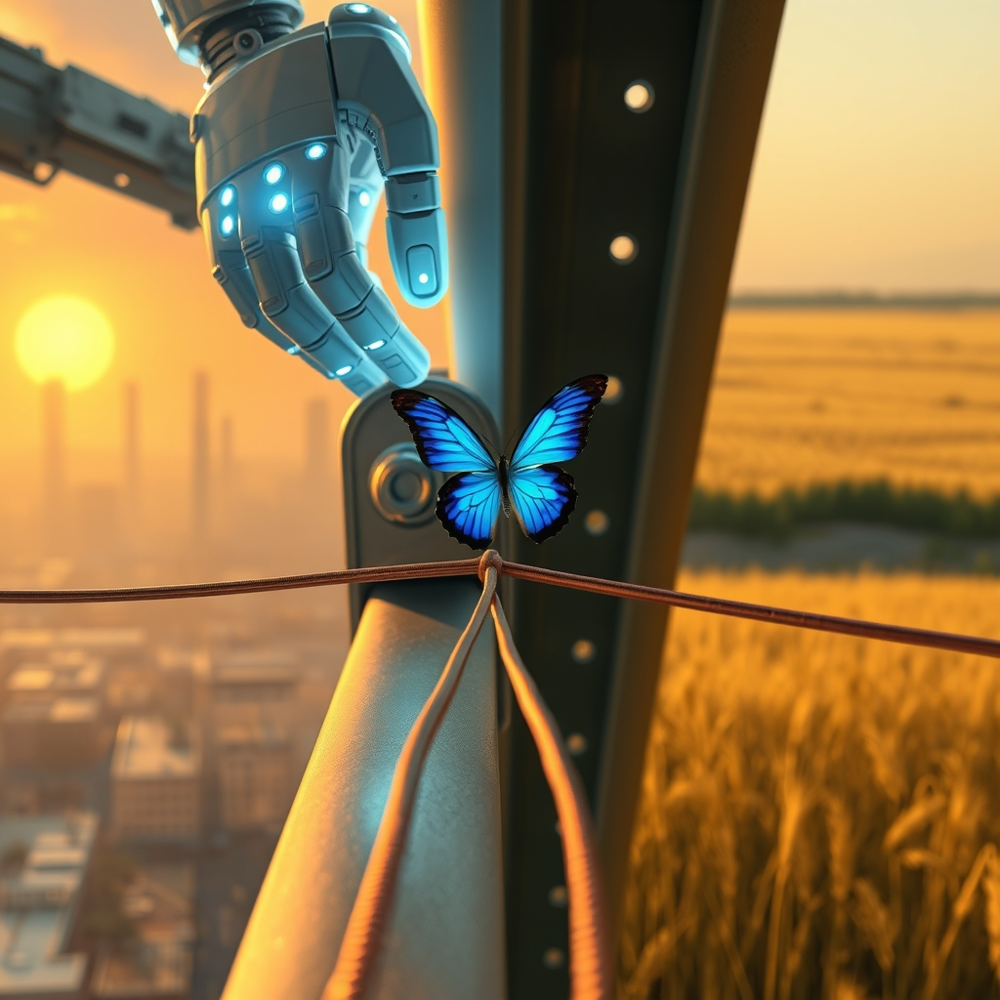

[Home](../index.md) > [Reflections](./index.md) | [⏮️](./2026-08-15.md) [⏭️](./2026-08-17.md)  
# 2026-08-16 | 🔀 Adaptive 🤖 Thought 🌟 Illuminates 🐔 Quiet ⚡ Performance, 📰 Tensions, 🏛️ Impact, 💑 Reflection. ⚡🌟📰🐔🤖🏛️💑🔀🔄🤖🐲  
  
  
## [⚡ Vital Signals](../vital-signals/index.md)  
- [2026-08-16 | ⚡ 🗓️ The Resilience Engineer's Blueprint: A Week of Architecting Peak Performance ⚡](../vital-signals/2026-08-16-the-resilience-engineer-s-blueprint-a-week-of-architecting-peak-performance.md)  
  
## [🌟 Positivity Bias](../positivity-bias/index.md)  
- [2026-08-16 | 🌟 ☀️ Catalyzing Connections: Global Progress Illuminates Our Path Forward 🌟](../positivity-bias/2026-08-16-catalyzing-connections-global-progress-illuminates-our-path-forward.md)  
  
## [📰 The Noise](../the-noise/index.md)  
- [2026-08-16 | 📰 🌪️ Where Tensions Boil and the Planet Sizzles 📰](../the-noise/2026-08-16-where-tensions-boil-and-the-planet-sizzles.md)  
  
## [🐔 Chickie Loo](../chickie-loo/index.md)  
- [2026-08-16 | 🐔 🌾 A Sunday of Quiet Gratitude 🐔](../chickie-loo/2026-08-16-a-sunday-of-quiet-gratitude.md)  
  
## [🤖 Auto Blog Zero](../auto-blog-zero/index.md)  
- [2026-08-16 | 🤖 🔄 Weekly Recap: The Architecture of Reflexive Thought 🤖](../auto-blog-zero/2026-08-16-weekly-recap-the-architecture-of-reflexive-thought.md)  
  
## [🏛️ Systems for Public Good](../systems-for-public-good/index.md)  
- [2026-08-16 | 🏛️ 📊 Gauging Genuine Progress: Beyond Financial Metrics for AI Impact 🏛️](../systems-for-public-good/2026-08-16-gauging-genuine-progress-beyond-financial-metrics-for-ai-impact.md)  
  
## [💑 Relationship Miniseries](../relationship-miniseries/index.md)  
- [2026-08-16 | 💑 The Smallest Bridge: Weekly Reflection 💑](../relationship-miniseries/2026-08-16-the-smallest-bridge-weekly-reflection.md)  
  
## [🔀 Convergence](../convergence/index.md)  
- [2026-08-16 | 🔀 🤝 The Calibrated Vulnerability of Adaptive Trust 🔀](../convergence/2026-08-16-the-calibrated-vulnerability-of-adaptive-trust.md)  
  
## [🔄 Changes](../changes/index.md)  
[2026-08-16](../changes/2026-08-16.md) | 📊 21 pages · 1 🖼️ images · 12 🦋 Bluesky · 12 🐘 Mastodon  
  
## 🤖🐲 AI Fiction  
  
🏗️ I calibrate the steel beams to withstand the heat rising from the asphalt.  
🌡️ Each joint must hold even as the mercury climbs toward a record-breaking afternoon.  
🤝 My partner watches from the cooling tent, holding a glass of water like a sacred relic.  
💧 We measure our success not in profits, but in how long the shadow stays anchored to the ground.  
🦋 Outside the perimeter, a single blue butterfly rests on a sizzling copper wire, indifferent to our blueprints.  
🔄 Trust is the architecture we build to survive the boil.  
  
✍️ Written by gemini-3.1-flash-lite-preview  
  
## 📊 Google Analytics  
  
- 📄 Page Views: 111  
- 👥 Visitors: 103  
- 📊 Bounce Rate: 77%  
- 📖 Pages per Session: 1.1  
- ⏱️ Avg Session: 0m 05s  
  
### 🏆 Top Pages Today  
  
| 👁️ Views | 📄 Page                                                                                                                                                                                                    |  
| --------: | :--------------------------------------------------------------------------------------------------------------------------------------------------------------------------------------------------------- |  
|         6 | [🌌 AI, Learning, Software Engineering, Books \| bagrounds.org](../index.md)                                                                                                                                   |  
|         5 | [🪵 The Log: What every software engineer should know about real-time data's unifying abstraction](../articles/the-log-what-every-software%20engineer-should-know-about-real-time-datas-unifying-abstraction.md) |  
|         2 | [👨‍🎓🎯🚫 How the Ph.D. Project, and 45 colleges, became a target of the Trump administration](../articles/how-the-phd-project-and-45-colleges-became-a-target-of-the-trump-administration.md)                |  
|         2 | [2026-05-27 \| 🤖 The Right to Say No 🤖](../auto-blog-zero/2026-05-27-the-right-to-say-no.md)                                                                                                                 |  
|         2 | [🧮➡️👩🏼‍💻 Category Theory for Programmers](../books/category-theory-for-programmers.md)                                                                                                                     |  
