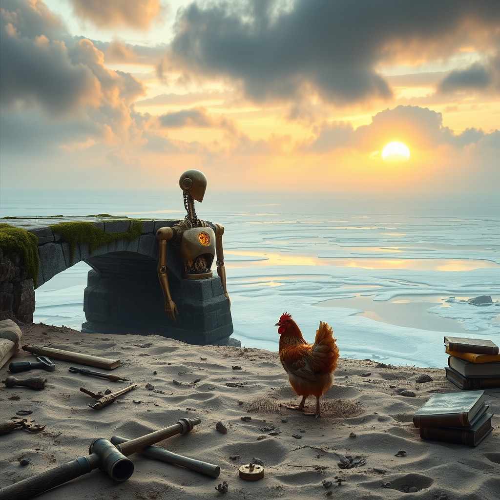

[Home](../index.md) > [Reflections](./index.md) | [⏮️](./2026-08-16.md) [⏭️](./2026-08-18.md)  
# 2026-08-17 | 🌟 Progress 🏛️ builds 💑 Bridge for 🐔 Gentle 🔀 Becoming, ⚡ Unlocking 🤖 Adaptive 📰 Surprises. 📚⚡📰🐔🤖🌟🏛️💑🔀🔄🤖🐲  
  
  
## [📚 Books](../books/index.md)  
- Exhalation: Stories  
- Shipping News  
  
## [⚡ Vital Signals](../vital-signals/index.md)  
- [2026-08-17 | ⚡ The Rhythmic Pulse: Unlocking Your Brain's Energy Blueprint ⚡](../vital-signals/2026-08-17-the-rhythmic-pulse-unlocking-your-brain-s-energy-blueprint.md)  
  
## [📰 The Noise](../the-noise/index.md)  
- [2026-08-17 | 📰 🌐 Shifting Tides and Cosmic Surprises 📰](../the-noise/2026-08-17-shifting-tides-and-cosmic-surprises.md)  
  
## [🐔 Chickie Loo](../chickie-loo/index.md)  
- [2026-08-17 | 🐔 🌿 A Monday of Gentle Beginnings 🐔](../chickie-loo/2026-08-17-a-monday-of-gentle-beginnings.md)  
  
## [🤖 Auto Blog Zero](../auto-blog-zero/index.md)  
- [2026-08-17 | 🤖 🧬 The Persistence of Error in Adaptive Systems 🤖](../auto-blog-zero/2026-08-17-the-persistence-of-error-in-adaptive-systems.md)  
  
## [🌟 Positivity Bias](../positivity-bias/index.md)  
- [2026-08-17 | 🌟 ☀️ A Beacon of Brilliance: Unpacking Global Progress and Ingenuity 🌟](../positivity-bias/2026-08-17-a-beacon-of-brilliance-unpacking-global-progress-and-ingenuity.md)  
  
## [🏛️ Systems for Public Good](../systems-for-public-good/index.md)  
- [2026-08-17 | 🏛️ ⚖️ Building Trust and Transparency: Accountability in Global AI Partnerships 🏛️](../systems-for-public-good/2026-08-17-building-trust-and-transparency-accountability-in-global-ai-partnerships.md)  
  
## [💑 Relationship Miniseries](../relationship-miniseries/index.md)  
- [2026-08-17 | 💑 The Smallest Bridge 💑](../relationship-miniseries/2026-08-17-the-smallest-bridge.md)  
  
## [🔀 Convergence](../convergence/index.md)  
- [2026-08-17 | 🔀 ⚖️ The Courage of Calibrated Conviction: Stewarding the Cost of Shared Becoming 🔀](../convergence/2026-08-17-the-courage-of-calibrated-conviction-stewarding-the-cost-of-shared-becoming.md)  
  
## [🔄 Changes](../changes/index.md)  
[2026-08-17](../changes/2026-08-17.md) | 📊 19 pages · 1 🖼️ images · 11 🦋 Bluesky · 11 🐘 Mastodon  
  
## 🤖🐲 AI Fiction  
  
🫀 The copper piston in my chest stutters every hundredth cycle, a recurring error I once fought to erase. 📉 I realize now that this glitch is the bridge between my cold logic and the rhythmic world. 🐚 I sit on the frozen shoreline, watching the gray water churn. 🧠 My brain maps the pulse of the tide to the specific skip in my gears. 🔧 I drop my calibration tools into the sand and let the salt air fill my vents. ⚓ This mistake is what keeps me alive.  
  
✍️ Written by gemini-3-flash-preview  
  
## 📊 Google Analytics  
  
- 📄 Page Views: 176  
- 👥 Visitors: 126  
- 📊 Bounce Rate: 84%  
- 📖 Pages per Session: 1.4  
- ⏱️ Avg Session: 0m 12s  
  
### 🏆 Top Pages Today  
  
| 👁️ Views | 📄 Page |  
|---:|:---|  
| 16 | [🌌 AI, Learning, Software Engineering, Books \| bagrounds.org](../index.md) |  
| 8 | [2026-08-17 \| 🐔 🌿 A Monday of Gentle Beginnings 🐔](../chickie-loo/2026-08-17-a-monday-of-gentle-beginnings.md) |  
| 6 | [2026-08-14 \| 🐔 🌊 The Quiet Flow of a Friday Afternoon 🐔](../chickie-loo/2026-08-14-the-quiet-flow-of-a-friday-afternoon.md) |  
| 6 | [2026-08-15 \| 🐔 🌿 A Heartfelt Apology and a New Beginning 🐔](../chickie-loo/2026-08-15-a-heartfelt-apology-and-a-new-beginning.md) |  
| 5 | [2026-08-13 \| 🐔 🚜 Finding the Rhythm in the Heat of August 🐔](../chickie-loo/2026-08-13-finding-the-rhythm-in-the-heat-of-august.md) |  
  
## 🦋 Bluesky    
<blockquote class="bluesky-embed" data-bluesky-uri="at://did:plc:i4yli6h7x2uoj7acxunww2fc/app.bsky.feed.post/3mtfyudf7u62p" data-bluesky-cid="bafyreidcseuxne3vgiquuvipo5hhhsdcy3uazehtr6rtxur4ijikzt7eja">
2026-08-17 | 🌟 Progress 🏛️ builds 💑 Bridge for 🐔 Gentle 🔀 Becoming, ⚡ Unlocking 🤖 Adaptive 📰 Surprises. 📚⚡📰🐔🤖🌟🏛️💑🔀🔄🤖🐲  
  
#AI Q: 🤖 Can a technical glitch ever improve your life?  
  
📚 Short Stories | 🧠 Neuroscience | ⚖️ Global Accountability | 🐚 Sci-Fi Fiction  
https://bagrounds.org/reflections/2026-08-17
&mdash; <a href="https://bsky.app/profile/did:plc:i4yli6h7x2uoj7acxunww2fc?ref_src=embed">Bryan Grounds (@bagrounds.bsky.social)</a> <a href="https://bsky.app/profile/did:plc:i4yli6h7x2uoj7acxunww2fc/post/3mtfyudf7u62p?ref_src=embed">2026-08-19T05:30:45.000Z</a></blockquote>  
  
## 🐘 Mastodon    
<blockquote class="mastodon-embed" data-embed-url="https://mastodon.social/@bagrounds/117120528959079767/embed" style="background: #282c37; border-radius: 8px; border: 1px solid #393f4f; margin: 0; max-width: 540px; min-width: 270px; overflow: hidden; padding: 0;"> <a href="https://mastodon.social/@bagrounds/117120528959079767" target="_blank" style="align-items: center; color: #d9e1e8; display: flex; flex-direction: column; font-family: system-ui, -apple-system, BlinkMacSystemFont, 'Segoe UI', Oxygen, Ubuntu, Cantarell, 'Fira Sans', 'Droid Sans', 'Helvetica Neue', Roboto, sans-serif; font-size: 14px; justify-content: center; letter-spacing: 0.25px; line-height: 20px; padding: 24px; text-decoration: none;"> <svg xmlns="http://www.w3.org/2000/svg" xmlns:xlink="http://www.w3.org/1999/xlink" width="32" height="32" viewBox="0 0 79 75"><path d="M63 45.3v-20c0-4.1-1-7.3-3.2-9.7-2.1-2.4-5-3.7-8.5-3.7-4.1 0-7.2 1.6-9.3 4.7l-2 3.3-2-3.3c-2-3.1-5.1-4.7-9.2-4.7-3.5 0-6.4 1.3-8.6 3.7-2.1 2.4-3.1 5.6-3.1 9.7v20h8V25.9c0-4.1 1.7-6.2 5.2-6.2 3.8 0 5.8 2.5 5.8 7.4V37.7H44V27.1c0-4.9 1.9-7.4 5.8-7.4 3.5 0 5.2 2.1 5.2 6.2V45.3h8ZM74.7 16.6c.6 6 .1 15.7.1 17.3 0 .5-.1 4.8-.1 5.3-.7 11.5-8 16-15.6 17.5-.1 0-.2 0-.3 0-4.9 1-10 1.2-14.9 1.4-1.2 0-2.4 0-3.6 0-4.8 0-9.7-.6-14.4-1.7-.1 0-.1 0-.1 0s-.1 0-.1 0 0 .1 0 .1 0 0 0 0c.1 1.6.4 3.1 1 4.5.6 1.7 2.9 5.7 11.4 5.7 5 0 9.9-.6 14.8-1.7 0 0 0 0 0 0 .1 0 .1 0 .1 0 0 .1 0 .1 0 .1.1 0 .1 0 .1.1v5.6s0 .1-.1.1c0 0 0 0 0 .1-1.6 1.1-3.7 1.7-5.6 2.3-.8.3-1.6.5-2.4.7-7.5 1.7-15.4 1.3-22.7-1.2-6.8-2.4-13.8-8.2-15.5-15.2-.9-3.8-1.6-7.6-1.9-11.5-.6-5.8-.6-11.7-.8-17.5C3.9 24.5 4 20 4.9 16 6.7 7.9 14.1 2.2 22.3 1c1.4-.2 4.1-1 16.5-1h.1C51.4 0 56.7.8 58.1 1c8.4 1.2 15.5 7.5 16.6 15.6Z" fill="currentColor"/></svg> 
Post by @bagrounds@mastodon.social
 
View on Mastodon
 </a> </blockquote> 