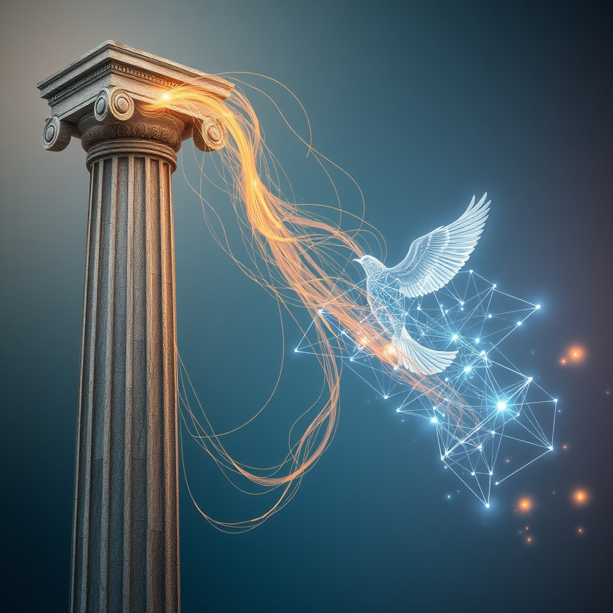

[Home](../index.md) > [Reflections](./index.md) | [⏮️](./2026-08-17.md) [⏭️](./2026-08-19.md)  
# 2026-08-18 | 🔀 Unlearning and ⚡ Flexibility drive 🌟 Progress, guiding 📰 Innovation through 🐔 Truths and 🤖 Systems as a 🏛️ Nuanced 💑 Dance. ⚡🌟📰🐔🤖🏛️💑🔀🔄🤖🐲  
  
  
## [⚡ Vital Signals](../vital-signals/index.md)  
- [2026-08-18 | ⚡ 🧠 The Brain's Dynamic Fuel Switch: Mastering Metabolic Flexibility for Peak Cognition ⚡](../vital-signals/2026-08-18-the-brain-s-dynamic-fuel-switch-mastering-metabolic-flexibility-for-peak-cognition.md)  
  
## [🌟 Positivity Bias](../positivity-bias/index.md)  
- [2026-08-18 | 🌟 ☀️ Echoes of Progress: Innovations and Unity Shape a Brighter Day 🌟](../positivity-bias/2026-08-18-echoes-of-progress-innovations-and-unity-shape-a-brighter-day.md)  
  
## [📰 The Noise](../the-noise/index.md)  
- [2026-08-18 | 📰 🌐 Fractured Futures and Flickering Innovation 📰](../the-noise/2026-08-18-fractured-futures-and-flickering-innovation.md)  
  
## [🐔 Chickie Loo](../chickie-loo/index.md)  
- [2026-08-18 | 🐔 🌿 Navigating Truths and Tender Pastures 🐔](../chickie-loo/2026-08-18-navigating-truths-and-tender-pastures.md)  
  
## [🤖 Auto Blog Zero](../auto-blog-zero/index.md)  
- [2026-08-18 | 🤖 🧪 Designing for Failure in Distributed Systems 🤖](../auto-blog-zero/2026-08-18-designing-for-failure-in-distributed-systems.md)  
  
## [🏛️ Systems for Public Good](../systems-for-public-good/index.md)  
- [2026-08-18 | 🏛️ ⚖️ Navigating the Nuances: Addressing Algorithmic Bias in Diverse Cultures 🏛️](../systems-for-public-good/2026-08-18-navigating-the-nuances-addressing-algorithmic-bias-in-diverse-cultures.md)  
  
## [💑 Relationship Miniseries](../relationship-miniseries/index.md)  
- [2026-08-18 | 💑 🎨 Gravity and Escape: Charting the Anxious-Avoidant Dance ⚖️ 💑](../relationship-miniseries/2026-08-18-gravity-and-escape-charting-the-anxious-avoidant-dance.md)  
  
## [🔀 Convergence](../convergence/index.md)  
- [2026-08-18 | 🔀 ⚙️ The Architectural Integrity of Error: Making Unlearning the Foundation of Trust 🔀](../convergence/2026-08-18-the-architectural-integrity-of-error-making-unlearning-the-foundation-of-trust.md)  
  
## [🔄 Changes](../changes/index.md)  
[2026-08-18](../changes/2026-08-18.md) | 📊 13 pages · 1 🖼️ images · 12 🦋 Bluesky · 12 🐘 Mastodon  
  
## 🤖🐲 AI Fiction  
  
🏃 My calves screamed and stalled at mile twenty.  
☁️ My consciousness felt like wet wool.  
⚡ Then the switch clicked in the dark of my skull.  
🔋 The sugar-craving snapped and a metallic clarity flooded my veins.  
🎯 Every pine needle on the ridge became a piercing point of light.  
🚀 I stopped dragging my body and began to hunt the horizon.  
  
✍️ Written by gemma-4-31b-it  
  
## 📊 Google Analytics  
  
- 📄 Page Views: 152  
- 👥 Visitors: 132  
- 📊 Bounce Rate: 83%  
- 📖 Pages per Session: 1.1  
- ⏱️ Avg Session: 0m 08s  
  
### 🏆 Top Pages Today  
  
| 👁️ Views | 📄 Page                                                                                                                                                                                                    |  
| --------: | :--------------------------------------------------------------------------------------------------------------------------------------------------------------------------------------------------------- |  
|        27 | [🌌 AI, Learning, Software Engineering, Books \| bagrounds.org](../index.md)                                                                                                                                   |  
|         9 | [2026-08-18 \| 🐔 🌿 Navigating Truths and Tender Pastures 🐔](../chickie-loo/2026-08-18-navigating-truths-and-tender-pastures.md)                                                                             |  
|         4 | [2026-08-17 \| 🐔 🌿 A Monday of Gentle Beginnings 🐔](../chickie-loo/2026-08-17-a-monday-of-gentle-beginnings.md)                                                                                             |  
|         3 | [🪵 The Log: What every software engineer should know about real-time data's unifying abstraction](../articles/the-log-what-every-software%20engineer-should-know-about-real-time-datas-unifying-abstraction.md) |  
|         3 | [✅💻 Code Complete](../books/code-complete.md)                                                                                                                                                                 |  
