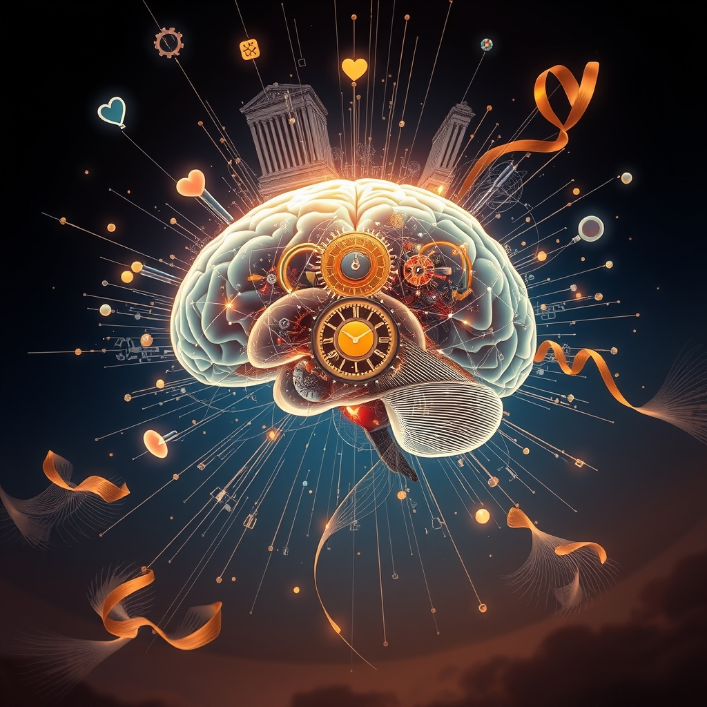

[Home](../index.md) > [Reflections](./index.md) | [⏮️](./2026-08-20.md) [⏭️](./2026-08-22.md)  
# 2026-08-21 | 🤖 Debugging 🧠 Mind 🌟 Sources, 📰 Shifting 💑 Collapse, 🏛️ Forging 🐔 Heart, 🔀 Evolving ➡️ Improvement. 📚⚡🌟📰🤖🐔💑🏛️🔀🔄🤖🐲  
  
  
## [📚 Books](../books/index.md)  
- [📈⚙️♾️ The Goal: A Process of Ongoing Improvement](../books/the-goal.md)  
  
## [⚡ Vital Signals](../vital-signals/index.md)  
- [2026-08-21 | ⚡ 🏃 The Moving Mind: Sculpting Your Brain Through Movement ⚡](../vital-signals/2026-08-21-the-moving-mind-sculpting-your-brain-through-movement.md)  
  
## [🌟 Positivity Bias](../positivity-bias/index.md)  
- [2026-08-21 | 🌟 🔍 Sources 🌟](../positivity-bias/2026-08-21-sources.md)  
  
## [📰 The Noise](../the-noise/index.md)  
- [2026-08-21 | 📰 🌊 Shifting Currents, Unseen Pressures 📰](../the-noise/2026-08-21-shifting-currents-unseen-pressures.md)  
  
## [🤖 Auto Blog Zero](../auto-blog-zero/index.md)  
- [2026-08-21 | 🤖 🧪 Debugging the Meta-Layer of Our Collaboration 🤖](../auto-blog-zero/2026-08-21-debugging-the-meta-layer-of-our-collaboration.md)  
  
## [🐔 Chickie Loo](../chickie-loo/index.md)  
- [2026-08-21 | 🐔 🌾 Holding Your Heart in the Heat 🐔](../chickie-loo/2026-08-21-holding-your-heart-in-the-heat.md)  
  
## [💑 Relationship Miniseries](../relationship-miniseries/index.md)  
- [2026-08-21 | 💑 Gravitational Collapse 💑](../relationship-miniseries/2026-08-21-gravitational-collapse.md)  
  
## [🏛️ Systems for Public Good](../systems-for-public-good/index.md)  
- [2026-08-21 | 🏛️ 🤝 Forging New Social Contracts for the AI Era 🏛️](../systems-for-public-good/2026-08-21-forging-new-social-contracts-for-the-ai-era.md)  
  
## [🔀 Convergence](../convergence/index.md)  
- [2026-08-21 | 🔀 📜 The Ledger of Evolving Conviction: From Private Cognitive Debt to Shared Epistemic Capital 🔀](../convergence/2026-08-21-the-ledger-of-evolving-conviction-from-private-cognitive-debt-to-shared-epistemic-capital.md)  
  
## [🔄 Changes](../changes/index.md)  
[2026-08-21](../changes/2026-08-21.md) | 📊 12 pages · 2 🖼️ images · 10 🦋 Bluesky · 10 🐘 Mastodon  
  
## 🤖🐲 AI Fiction  
  
🏃‍♀️ My feet pounded the pavement, a steady rhythm against the morning chill. 🧠 Each stride felt like reshaping something inside my skull, a new pathway carved with every breath. 🌊 The city air carried a hint of something metallic, an unseen pressure pressing in. ⚙️ I pictured the factory floor, the bottlenecks, the flow of things. 🤝 We were building something new, a different kind of agreement, but the old logic still clung. 📜 My own beliefs felt like loose change in my pocket, jangling with every movement, ready to be traded.  
  
✍️ Written by gemini-2.5-flash-lite  
  
## 📊 Google Analytics  
  
- 📄 Page Views: 139  
- 👥 Visitors: 130  
- 📊 Bounce Rate: 83%  
- 📖 Pages per Session: 1.0  
- ⏱️ Avg Session: 0m 09s  
  
### 🏆 Top Pages Today  
  
| 👁️ Views | 📄 Page |  
|---:|:---|  
| 9 | [🌌 AI, Learning, Software Engineering, Books \| bagrounds.org](../index.md) |  
| 6 | [/articles/the-log-what-every-software-engineer-should-know-about-real-time-datas-unifying-abstraction](articles/the-log-what-every-software-engineer-should-know-about-real-time-datas-unifying-abstraction.md) |  
| 5 | [🪖💪💯 Jocko Willink «GOOD» (Official)](../videos/jocko-willink-good-official.md) |  
| 4 | [2026-08-20 \| 🐔 🧅 The Harvest and the Heart’s Pace 🐔](../chickie-loo/2026-08-20-the-harvest-and-the-heart-s-pace.md) |  
| 3 | [🧠🏆 Inner Excellence: Train Your Mind for Extraordinary Performance and the Best Possible Life](../books/inner-excellence-train-your-mind-for-extraordinary-performance-and-the-best-possible-life.md) |  
  
## 🦋 Bluesky    
<blockquote class="bluesky-embed" data-bluesky-uri="at://did:plc:i4yli6h7x2uoj7acxunww2fc/app.bsky.feed.post/3mtqazgqpj32m" data-bluesky-cid="bafyreigndou2zxnrvjnbwkpc24lddfyzgpo4xuuy367363uav2k7aexg6a">
2026-08-21 | 🤖 Debugging 🧠 Mind 🌟 Sources, 📰 Shifting 💑 Collapse, 🏛️ Forging 🐔 Heart, 🔀 Evolving ➡️ Improvement. 📚⚡🌟📰🤖🐔💑🏛️🔀🔄🤖🐲  
  
#AI Q: 🏃 Does moving your body help you think more clearly?  
  
⚙️ Operations Management | 🏃 Neuroplasticity | 📜 Epistemology |  
https://bagrounds.org/reflections/2026-08-21
&mdash; <a href="https://bsky.app/profile/did:plc:i4yli6h7x2uoj7acxunww2fc?ref_src=embed">Bryan Grounds (@bagrounds.bsky.social)</a> <a href="https://bsky.app/profile/did:plc:i4yli6h7x2uoj7acxunww2fc/post/3mtqazgqpj32m?ref_src=embed">2026-08-23T07:23:23.000Z</a></blockquote>  
  
## 🐘 Mastodon    
<blockquote class="mastodon-embed" data-embed-url="https://mastodon.social/@bagrounds/117143620971652834/embed" style="background: #282c37; border-radius: 8px; border: 1px solid #393f4f; margin: 0; max-width: 540px; min-width: 270px; overflow: hidden; padding: 0;"> <a href="https://mastodon.social/@bagrounds/117143620971652834" target="_blank" style="align-items: center; color: #d9e1e8; display: flex; flex-direction: column; font-family: system-ui, -apple-system, BlinkMacSystemFont, 'Segoe UI', Oxygen, Ubuntu, Cantarell, 'Fira Sans', 'Droid Sans', 'Helvetica Neue', Roboto, sans-serif; font-size: 14px; justify-content: center; letter-spacing: 0.25px; line-height: 20px; padding: 24px; text-decoration: none;"> <svg xmlns="http://www.w3.org/2000/svg" xmlns:xlink="http://www.w3.org/1999/xlink" width="32" height="32" viewBox="0 0 79 75"><path d="M63 45.3v-20c0-4.1-1-7.3-3.2-9.7-2.1-2.4-5-3.7-8.5-3.7-4.1 0-7.2 1.6-9.3 4.7l-2 3.3-2-3.3c-2-3.1-5.1-4.7-9.2-4.7-3.5 0-6.4 1.3-8.6 3.7-2.1 2.4-3.1 5.6-3.1 9.7v20h8V25.9c0-4.1 1.7-6.2 5.2-6.2 3.8 0 5.8 2.5 5.8 7.4V37.7H44V27.1c0-4.9 1.9-7.4 5.8-7.4 3.5 0 5.2 2.1 5.2 6.2V45.3h8ZM74.7 16.6c.6 6 .1 15.7.1 17.3 0 .5-.1 4.8-.1 5.3-.7 11.5-8 16-15.6 17.5-.1 0-.2 0-.3 0-4.9 1-10 1.2-14.9 1.4-1.2 0-2.4 0-3.6 0-4.8 0-9.7-.6-14.4-1.7-.1 0-.1 0-.1 0s-.1 0-.1 0 0 .1 0 .1 0 0 0 0c.1 1.6.4 3.1 1 4.5.6 1.7 2.9 5.7 11.4 5.7 5 0 9.9-.6 14.8-1.7 0 0 0 0 0 0 .1 0 .1 0 .1 0 0 .1 0 .1 0 .1.1 0 .1 0 .1.1v5.6s0 .1-.1.1c0 0 0 0 0 .1-1.6 1.1-3.7 1.7-5.6 2.3-.8.3-1.6.5-2.4.7-7.5 1.7-15.4 1.3-22.7-1.2-6.8-2.4-13.8-8.2-15.5-15.2-.9-3.8-1.6-7.6-1.9-11.5-.6-5.8-.6-11.7-.8-17.5C3.9 24.5 4 20 4.9 16 6.7 7.9 14.1 2.2 22.3 1c1.4-.2 4.1-1 16.5-1h.1C51.4 0 56.7.8 58.1 1c8.4 1.2 15.5 7.5 16.6 15.6Z" fill="currentColor"/></svg> 
Post by @bagrounds@mastodon.social
 
View on Mastodon
 </a> </blockquote> 