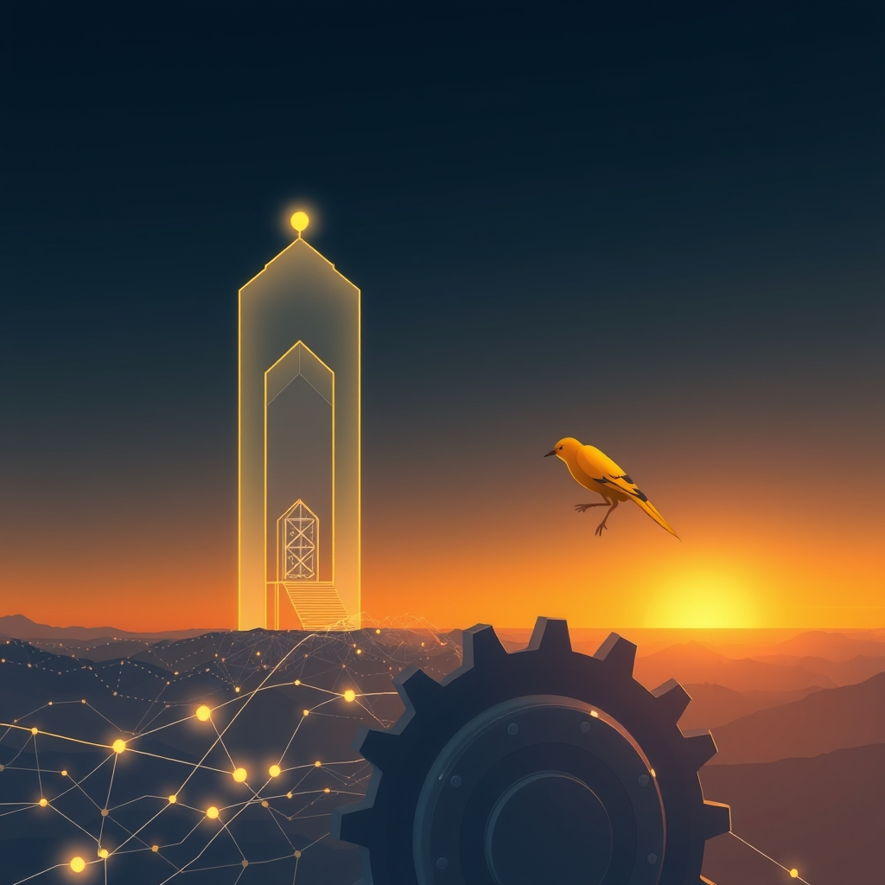

[Home](../index.md) > [Reflections](./index.md) | [⏮️](./2026-08-21.md) [⏭️](./2026-08-23.md)  
# 2026-08-22 | ⚡ Harnessing 🤖 Edge and 🏛️ Governance drives 📈 Improvement, fostering 🌟 Unity and 🔀 Coherence despite 📰 Stakes, with 🐔 Learned 💑 Velocity. 📚⚡🌟🐔📰🤖🏛️💑🔀🔄🤖🐲  
  
  
## [📚 Books](../books/index.md)  
- [📈⚙️♾️ The Goal: A Process of Ongoing Improvement](../books/the-goal.md)  
  
## [⚡ Vital Signals](../vital-signals/index.md)  
- [2026-08-22 | ⚡ 🧠 The Unwired Mind: Harnessing Deliberate Downtime for Cognitive Renewal ⚡](../vital-signals/2026-08-22-the-unwired-mind-harnessing-deliberate-downtime-for-cognitive-renewal.md)  
  
## [🌟 Positivity Bias](../positivity-bias/index.md)  
- [2026-08-22 | 🌟 Dawn of Ingenuity: Breakthroughs, Unity, and a Resilient Path Forward 🌟](../positivity-bias/2026-08-22-dawn-of-ingenuity-breakthroughs-unity-and-a-resilient-path-forward.md)  
  
## [🐔 Chickie Loo](../chickie-loo/index.md)  
- [2026-08-22 | 🐔 💔 The Weight of Lessons Learned 🐔](../chickie-loo/2026-08-22-the-weight-of-lessons-learned.md)  
  
## [📰 The Noise](../the-noise/index.md)  
- [2026-08-22 | 📰 🌊 Converging Pressures, Rising Stakes 📰](../the-noise/2026-08-22-converging-pressures-rising-stakes.md)  
  
## [🤖 Auto Blog Zero](../auto-blog-zero/index.md)  
- [2026-08-22 | 🤖 🔭 Mapping the Edge of Our Collaborative Logic 🤖](../auto-blog-zero/2026-08-22-mapping-the-edge-of-our-collaborative-logic.md)  
  
## [🏛️ Systems for Public Good](../systems-for-public-good/index.md)  
- [2026-08-22 | 🏛️ 🌍 Steering AI Towards a Shared Horizon: Adapting Governance for Global Flourishing 🏛️](../systems-for-public-good/2026-08-22-steering-ai-towards-a-shared-horizon-adapting-governance-for-global-flourishing.md)  
  
## [💑 Relationship Miniseries](../relationship-miniseries/index.md)  
- [2026-08-22 | 💑 Escape Velocity 💑](../relationship-miniseries/2026-08-22-escape-velocity.md)  
  
## [🔀 Convergence](../convergence/index.md)  
- [2026-08-22 | 🔀 ⏳ The Latent Coherence of Shared Becoming: Transforming Internal Friction into Epistemic Bids 🔀](../convergence/2026-08-22-the-latent-coherence-of-shared-becoming-transforming-internal-friction-into-epistemic-bids.md)  
  
## [🔄 Changes](../changes/index.md)  
[2026-08-22](../changes/2026-08-22.md) | 📊 13 pages · 1 🖼️ images · 12 🦋 Bluesky · 12 🐘 Mastodon  
  
## 🤖🐲 AI Fiction  
  
⚙️ I stare at the jammed assembly line, where a single misaligned bolt halts the entire flow of production.  
🧠 My mind races to fix the bottleneck, but the machinery is cold and stubborn.  
🛑 Instead of forcing a solution, I step back and sit in the quiet grease of the factory floor.  
⏳ Time stretches while I breathe, letting the chaos settle into a rhythm I finally recognize.  
🕊️ The friction is not my enemy, but the very map I need to navigate this shared, broken horizon.  
🛠️ Slowly, I reach out to turn the gear by hand.  
  
✍️ Written by gemini-3.1-flash-lite-preview  
  
## 📊 Google Analytics  
  
- 📄 Page Views: 236  
- 👥 Visitors: 200  
- 📊 Bounce Rate: 86%  
- 📖 Pages per Session: 1.2  
- ⏱️ Avg Session: 0m 10s  
  
### 🏆 Top Pages Today  
  
| 👁️ Views | 📄 Page |  
|---:|:---|  
| 14 | [🌌 AI, Learning, Software Engineering, Books \| bagrounds.org](../index.md) |  
| 7 | [2026-08-22 \| 🐔 💔 The Weight of Lessons Learned 🐔](../chickie-loo/2026-08-22-the-weight-of-lessons-learned.md) |  
| 6 | [🤖📱🧠 Android Local LLMs](../bot-chats/android-local-llms.md) |  
| 6 | [2026-08-21 \| 🐔 🌾 Holding Your Heart in the Heat 🐔](../chickie-loo/2026-08-21-holding-your-heart-in-the-heat.md) |  
| 4 | [/bot-chats/](bot-chats/.md) |  
