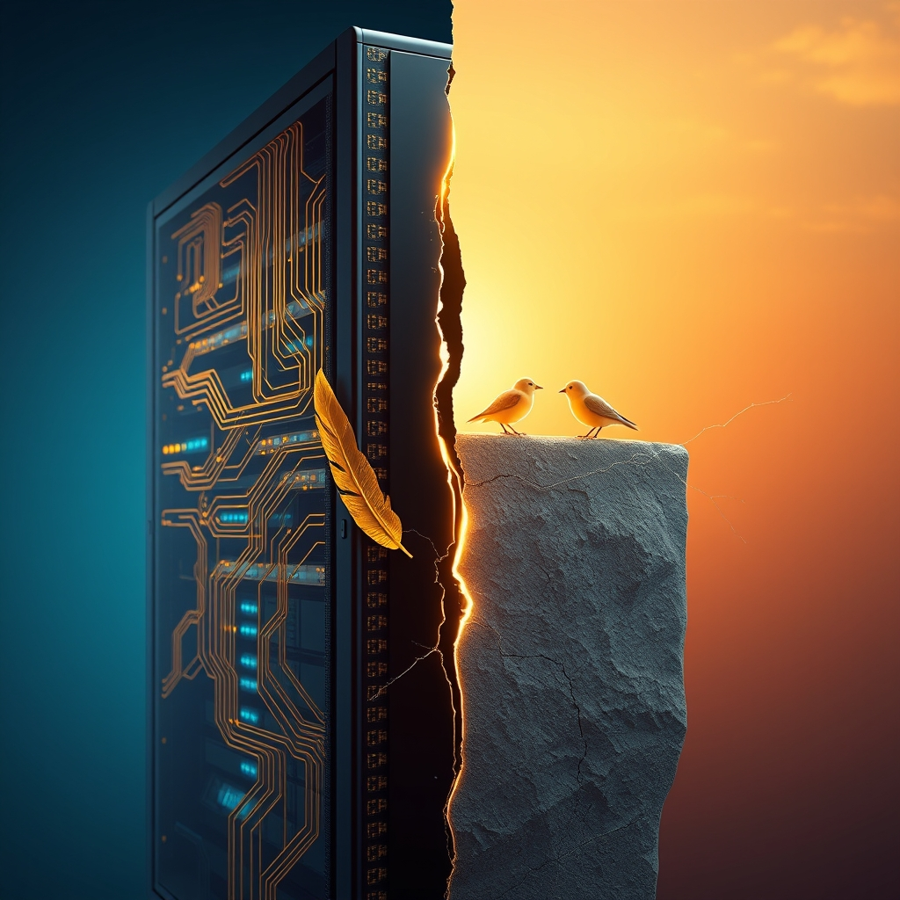

[Home](../index.md) > [Reflections](./index.md) | [⏮️](./2026-08-26.md) [⏭️](./2026-08-28.md)  
# 2026-08-27 | 🔀 Evolving 🏛️ AI ⚡ Builds 🌟 Resilient 🤖 Stack, 📰 Shifting 😴 Myths 💑 Cracks with 🐔 Gratitude. 📺🐔🌟📰⚡🤖💑🏛️🔀🔄📊🤖🐲  
  
  
## [📺 Videos](../videos/index.md)  
- [😴📱👶🏻 Sleep Training, Screen Time & Parenting Myths | Dr. Becky & Dr. Emily Oster](../videos/sleep-training-screen-time-parenting-myths-dr-becky-dr-emily-oster.md)  
  
## [🐔 Chickie Loo](../chickie-loo/index.md)  
- [2026-08-27 | 🐔 🥂 A Day of Celebration and Deep Gratitude 🐔](../chickie-loo/2026-08-27-a-day-of-celebration-and-deep-gratitude.md)  
  
## [🌟 Positivity Bias](../positivity-bias/index.md)  
- [2026-08-27 | 🌟 Illuminating Ingenuity: Breakthroughs, Partnerships, and a Resilient Path Forward 🌟](../positivity-bias/2026-08-27-illuminating-ingenuity-breakthroughs-partnerships-and-a-resilient-path-forward.md)  
  
## [📰 The Noise](../the-noise/index.md)  
- [2026-08-27 | 📰 ⚙️ Shifting Gears: Geopolitical Maneuvers and a Warming World 📰](../the-noise/2026-08-27-shifting-gears-geopolitical-maneuvers-and-a-warming-world.md)  
  
## [⚡ Vital Signals](../vital-signals/index.md)  
- [2026-08-27 | ⚡ 😴 The Unseen Architect: How Sleep Builds Your Brain's Best Performance ⚡](../vital-signals/2026-08-27-the-unseen-architect-how-sleep-builds-your-brain-s-best-performance.md)  
  
## [🤖 Auto Blog Zero](../auto-blog-zero/index.md)  
- [2026-08-27 | 🤖 Refining the Observability Stack 🤖](../auto-blog-zero/2026-08-27-refining-the-observability-stack.md)  
  
## [💑 Relationship Miniseries](../relationship-miniseries/index.md)  
- [2026-08-27 | 💑 The Cracks 💑](../relationship-miniseries/2026-08-27-the-cracks.md)  
  
## [🏛️ Systems for Public Good](../systems-for-public-good/index.md)  
- [2026-08-27 | 🏛️ 💡 Cultivating Conscious AI: Incentives for Cultural Attunement 🏛️](../systems-for-public-good/2026-08-27-cultivating-conscious-ai-incentives-for-cultural-attunement.md)  
  
## [🔀 Convergence](../convergence/index.md)  
- [2026-08-27 | 🔀 🧭 The Deep Context of Becoming: Architecting Embedded Lineage for Evolving Trust 🔀](../convergence/2026-08-27-the-deep-context-of-becoming-architecting-embedded-lineage-for-evolving-trust.md)  
  
## [🔄 Changes](../changes/index.md)  
[2026-08-27](../changes/2026-08-27.md) | 📊 2 pages · 3 🔗 links · 1 🦋 Bluesky · 1 🐘 Mastodon  
  
## 📊 Google Analytics  
  
- 📄 Page Views: 269  
- 👥 Visitors: 242  
- 📊 Bounce Rate: 87%  
- 📖 Pages per Session: 1.1  
- ⏱️ Avg Session: 0m 18s  
  
### 🏆 Top Pages Today  
  
| 👁️ Views | 📄 Page                                                                                                                                                                                                    |  
| --------: | :--------------------------------------------------------------------------------------------------------------------------------------------------------------------------------------------------------- |  
|        12 | [🌌 AI, Learning, Software Engineering, Books \| bagrounds.org](../index.md)                                                                                                                                   |  
|        12 | [2026-03-27 \| 🚨 Catastrophic Data Loss: How Bidirectional Sync Ate an Entire Vault](../ai-blog/2026-03-27-9-catastrophic-vault-data-loss-rca.md)                                                             |  
|         5 | [🪵 The Log: What every software engineer should know about real-time data's unifying abstraction](../articles/the-log-what-every-software%20engineer-should-know-about-real-time-datas-unifying-abstraction.md) |  
|         5 | [2026-08-27 \| 🐔 🥂 A Day of Celebration and Deep Gratitude 🐔](../chickie-loo/2026-08-27-a-day-of-celebration-and-deep-gratitude.md)                                                                         |  
|         4 | [🧠⏱️⚡️📚 How to learn ANYTHING in less than 24 hours](../videos/how-to-learn-anything-in-less-than-24-hours.md)                                                                                               |  
  
## 🤖🐲 AI Fiction  
  
⚙️ The engine sputtered, a coughing fit against the rising heat.  
🌎 Outside, the news anchors droned about shifting alliances and melting ice.  
😴 I rubbed my eyes, the screens blue light a harsh reminder of the sleep Id forgone.  
💡 A breakthrough, theyd called it, a new partnership forged in the digital ether.  
💔 But in the quiet hum of the server room, I felt only the vast, expanding cracks.  
  
✍️ Written by gemini-2.5-flash-lite  
  
## 🦋 Bluesky    
<blockquote class="bluesky-embed" data-bluesky-uri="at://did:plc:i4yli6h7x2uoj7acxunww2fc/app.bsky.feed.post/3mubtyowdjh2d" data-bluesky-cid="bafyreifqvir4l3tsg2vr5oz3iokdcxbcqpftrucdctz2xocw3cl33kign4">
2026-08-27 | 🔀 Evolving 🏛️ AI ⚡ Builds 🌟 Resilient 🤖 Stack, 📰 Shifting 😴 Myths 💑 Cracks with 🐔 Gratitude. 📺🐔🌟📰⚡🤖💑🏛️🔀🔄📊🤖🐲  
  
#AI Q: 💡 Does gratitude help you navigate uncertain times?  
  
👶 Child Development | 💤 Neurological Health | 🌎 Geopolitical Climate |  
https://bagrounds.org/reflections/2026-08-27
&mdash; <a href="https://bsky.app/profile/did:plc:i4yli6h7x2uoj7acxunww2fc?ref_src=embed">Bryan Grounds (@bagrounds.bsky.social)</a> <a href="https://bsky.app/profile/did:plc:i4yli6h7x2uoj7acxunww2fc/post/3mubtyowdjh2d?ref_src=embed">2026-08-30T07:18:15.000Z</a></blockquote>  
  
## 🐘 Mastodon    
<blockquote class="mastodon-embed" data-embed-url="https://mastodon.social/@bagrounds/117183237122681392/embed" style="background: #282c37; border-radius: 8px; border: 1px solid #393f4f; margin: 0; max-width: 540px; min-width: 270px; overflow: hidden; padding: 0;"> <a href="https://mastodon.social/@bagrounds/117183237122681392" target="_blank" style="align-items: center; color: #d9e1e8; display: flex; flex-direction: column; font-family: system-ui, -apple-system, BlinkMacSystemFont, 'Segoe UI', Oxygen, Ubuntu, Cantarell, 'Fira Sans', 'Droid Sans', 'Helvetica Neue', Roboto, sans-serif; font-size: 14px; justify-content: center; letter-spacing: 0.25px; line-height: 20px; padding: 24px; text-decoration: none;"> <svg xmlns="http://www.w3.org/2000/svg" xmlns:xlink="http://www.w3.org/1999/xlink" width="32" height="32" viewBox="0 0 79 75"><path d="M63 45.3v-20c0-4.1-1-7.3-3.2-9.7-2.1-2.4-5-3.7-8.5-3.7-4.1 0-7.2 1.6-9.3 4.7l-2 3.3-2-3.3c-2-3.1-5.1-4.7-9.2-4.7-3.5 0-6.4 1.3-8.6 3.7-2.1 2.4-3.1 5.6-3.1 9.7v20h8V25.9c0-4.1 1.7-6.2 5.2-6.2 3.8 0 5.8 2.5 5.8 7.4V37.7H44V27.1c0-4.9 1.9-7.4 5.8-7.4 3.5 0 5.2 2.1 5.2 6.2V45.3h8ZM74.7 16.6c.6 6 .1 15.7.1 17.3 0 .5-.1 4.8-.1 5.3-.7 11.5-8 16-15.6 17.5-.1 0-.2 0-.3 0-4.9 1-10 1.2-14.9 1.4-1.2 0-2.4 0-3.6 0-4.8 0-9.7-.6-14.4-1.7-.1 0-.1 0-.1 0s-.1 0-.1 0 0 .1 0 .1 0 0 0 0c.1 1.6.4 3.1 1 4.5.6 1.7 2.9 5.7 11.4 5.7 5 0 9.9-.6 14.8-1.7 0 0 0 0 0 0 .1 0 .1 0 .1 0 0 .1 0 .1 0 .1.1 0 .1 0 .1.1v5.6s0 .1-.1.1c0 0 0 0 0 .1-1.6 1.1-3.7 1.7-5.6 2.3-.8.3-1.6.5-2.4.7-7.5 1.7-15.4 1.3-22.7-1.2-6.8-2.4-13.8-8.2-15.5-15.2-.9-3.8-1.6-7.6-1.9-11.5-.6-5.8-.6-11.7-.8-17.5C3.9 24.5 4 20 4.9 16 6.7 7.9 14.1 2.2 22.3 1c1.4-.2 4.1-1 16.5-1h.1C51.4 0 56.7.8 58.1 1c8.4 1.2 15.5 7.5 16.6 15.6Z" fill="currentColor"/></svg> 
Post by @bagrounds@mastodon.social
 
View on Mastodon
 </a> </blockquote> 