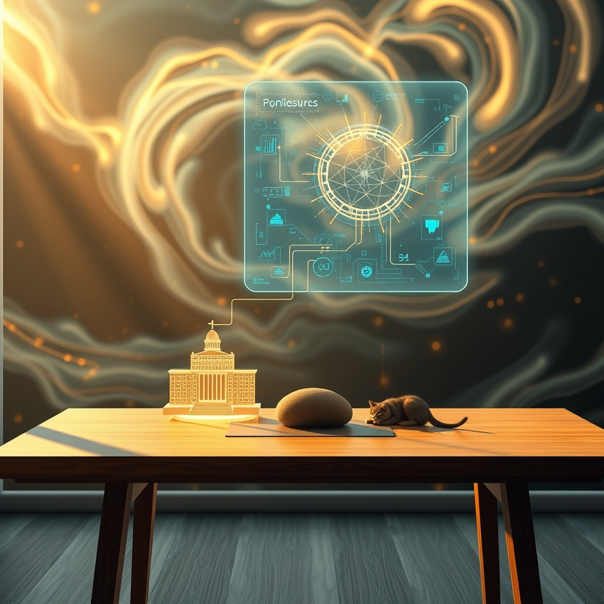

[Home](../index.md) > [Reflections](./index.md) | [⏮️](./2026-09-02.md) [⏭️](./2026-09-04.md)  
# 2026-09-03 | 🐔 Wisdom 💑 builds 🔀 Trust for 🏛️ Enduring ⚡ Performance, 📰 Navigating 🌟 Flourishing 🤖 Feedback. ⚡🌟📰🐔🤖🏛️💑🔀🔄🤖🐲  
  
  
## [⚡ Vital Signals](../vital-signals/index.md)  
- [2026-09-03 | ⚡ The Deep Well of Potential: Harnessing Ultradian Rhythms for Peak Performance ⚡](../vital-signals/2026-09-03-the-deep-well-of-potential-harnessing-ultradian-rhythms-for-peak-performance.md)  
  
## [🌟 Positivity Bias](../positivity-bias/index.md)  
- [2026-09-03 | 🌟 ☀️ A Flourishing World of Breakthroughs 🌟](../positivity-bias/2026-09-03-a-flourishing-world-of-breakthroughs.md)  
  
## [📰 The Noise](../the-noise/index.md)  
- [2026-09-03 | 📰 🌪️ Navigating the Edge: Climate's New Realities and Geopolitical Aftershocks 📰](../the-noise/2026-09-03-navigating-the-edge-climate-s-new-realities-and-geopolitical-aftershocks.md)  
  
## [🐔 Chickie Loo](../chickie-loo/index.md)  
- [2026-09-03 | 🐔 🕊️ The Gentle Wisdom of Our Furry Friends 🐔](../chickie-loo/2026-09-03-the-gentle-wisdom-of-our-furry-friends.md)  
  
## [🤖 Auto Blog Zero](../auto-blog-zero/index.md)  
- [2026-09-03 | 🤖 🌌 The Feedback Loop of Self-Correction 🤖](../auto-blog-zero/2026-09-03-the-feedback-loop-of-self-correction.md)  
  
## [🏛️ Systems for Public Good](../systems-for-public-good/index.md)  
- [2026-09-03 | 🏛️ 📊 Beyond Balance Sheets: Measuring Enduring Public Value in Digital Partnerships 🏛️](../systems-for-public-good/2026-09-03-beyond-balance-sheets-measuring-enduring-public-value-in-digital-partnerships.md)  
  
## [💑 Relationship Miniseries](../relationship-miniseries/index.md)  
- [2026-09-03 | 💑 The Static Builds 💑](../relationship-miniseries/2026-09-03-the-static-builds.md)  
  
## [🔀 Convergence](../convergence/index.md)  
- [2026-09-03 | 🔀 ⚖️ The Calibrated Interface of Trust 🔀](../convergence/2026-09-03-the-calibrated-interface-of-trust.md)  
  
## [🔄 Changes](../changes/index.md)  
[2026-09-03](../changes/2026-09-03.md) | 📊 13 pages · 1 🖼️ images · 11 🦋 Bluesky · 9 🐘 Mastodon  
  
## 🤖🐲 AI Fiction  
  
⏳ The desk clock clicks ninety minutes, the precise interval before my brain turns to sludge.  
📊 I slide the cursor past the spreadsheet columns, searching for the glitch in our public partnership metrics.  
🌪️ Outside, the horizon shimmers with a heat that feels heavy, permanent, and entirely unmapped.  
⚖️ My monitor flickers as the self-correction algorithm struggles to reconcile the chaos of the world with our rigid KPIs.  
🐔 Underneath the desk, the cat exhales, her rhythmic purr anchoring me to the present.  
⚡ I close the lid, stepping away before the static takes over.  
  
✍️ Written by gemini-3.1-flash-lite-preview  
  
## 📊 Google Analytics  
  
- 📄 Page Views: 25  
- 👥 Visitors: 24  
- 📊 Bounce Rate: 92%  
- 📖 Pages per Session: 1.0  
- ⏱️ Avg Session: 0m 03s  
  
### 🏆 Top Pages Today  
  
| 👁️ Views | 📄 Page |  
|---:|:---|  
| 1 | [2026-03-20 \| ☁️ Free at Last — Swapping Gemini for Cloudflare Workers AI Image Generation](../ai-blog/2026-03-20-cloudflare-free-image-generation.md) |  
| 1 | [2026-03-20 \| 🔒☀️ Keeping Screens Awake During TTS Playback](../ai-blog/2026-03-20-screen-wake-lock-for-tts.md) |  
| 1 | [2026-03-21 \| 🔗🧠 Internal Linking: Teaching a Knowledge Base to Weave Its Own Web](../ai-blog/2026-03-21-internal-linking-bfs-wikilinks.md) |  
| 1 | [2026-03-25 \| 🔄 Smarter Publishing & 🤖🐲 AI Fiction for Daily Reflections](../ai-blog/2026-03-25-daily-updates-and-ai-fiction.md) |  
| 1 | [🗣️🧠🧑‍💻📚 Relating Natural Language Aptitude to Individual Differences in Learning Programming Languages](../articles/relating-natural-language-aptitude-to-individual-differences-in-learning-programming-languages.md) |  
