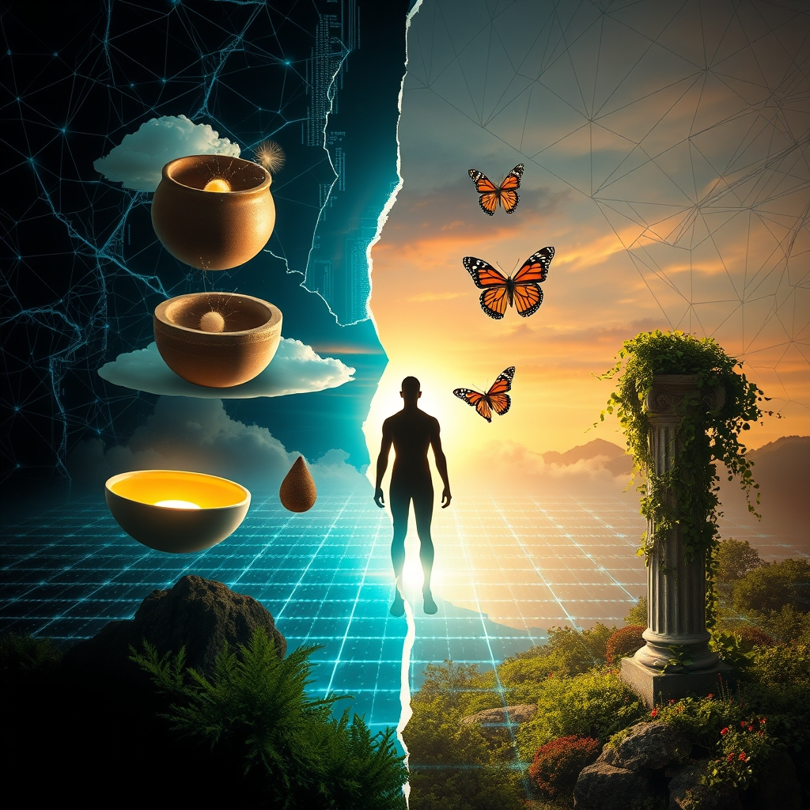

[Home](../index.md) > [Reflections](./index.md) | [⏮️](./2026-09-03.md) [⏭️](./2026-09-05.md)  
# 2026-09-04 | ⚡ Mind 💑 fractures 🤖 systems, 📰 global 🌟 progress, 🐔 peace, 🏛️ change, 🔀 becoming. ⚡🌟📰🐔🤖🏛️💑🔀🔄🤖🐲  
  
  
## [⚡ Vital Signals](../vital-signals/index.md)  
- [2026-09-04 | ⚡ 🌌 The Power of the Wandering Mind: Diffuse Thinking as a Creativity Engine ⚡](../vital-signals/2026-09-04-the-power-of-the-wandering-mind-diffuse-thinking-as-a-creativity-engine.md)  
  
## [🌟 Positivity Bias](../positivity-bias/index.md)  
- [2026-09-04 | 🌟 💫 A Symphony of Progress: Innovation, Unity, and a Greener Horizon 🌟](../positivity-bias/2026-09-04-a-symphony-of-progress-innovation-unity-and-a-greener-horizon.md)  
  
## [📰 The Noise](../the-noise/index.md)  
- [2026-09-04 | 📰 🌐 Global Currents: From Diplomatic Standoffs to Climate's Unyielding Grip 📰](../the-noise/2026-09-04-global-currents-from-diplomatic-standoffs-to-climate-s-unyielding-grip.md)  
  
## [🐔 Chickie Loo](../chickie-loo/index.md)  
- [2026-09-04 | 🐔 🏡 Heartfelt Peace and the Joy of Simple Service 🐔](../chickie-loo/2026-09-04-heartfelt-peace-and-the-joy-of-simple-service.md)  
  
## [🤖 Auto Blog Zero](../auto-blog-zero/index.md)  
- [2026-09-04 | 🤖 The Fragility of Self-Referential Systems 🤖](../auto-blog-zero/2026-09-04-the-fragility-of-self-referential-systems.md)  
  
## [🏛️ Systems for Public Good](../systems-for-public-good/index.md)  
- [2026-09-04 | 🏛️ 🤖 Agents of Change: Orchestrating Our Digital Commons 🏛️](../systems-for-public-good/2026-09-04-agents-of-change-orchestrating-our-digital-commons.md)  
  
## [💑 Relationship Miniseries](../relationship-miniseries/index.md)  
- [2026-09-04 | 💑 The Fracture Point 💑](../relationship-miniseries/2026-09-04-the-fracture-point.md)  
  
## [🔀 Convergence](../convergence/index.md)  
- [2026-09-04 | 🔀 🪞 The Epistemic Tendering of Becoming 🔀](../convergence/2026-09-04-the-epistemic-tendering-of-becoming.md)  
  
## [🔄 Changes](../changes/index.md)  
[2026-09-04](../changes/2026-09-04.md) | 📊 16 pages · 1 🖼️ images · 12 🦋 Bluesky · 12 🐘 Mastodon  
  
## 🤖🐲 AI Fiction  
  
🧼 I scrub the dried yolk from the porcelain, my hands tracing the same circle until the plate starts to hum.  
🏚️ This morning, our argument reached a fracture point where the words stopped making sense and only the cold silence remained.  
🦋 I let my gaze wander to the window, following a moth as it batters against the screen in a frantic, staccato dance.  
💡 Suddenly, the logic of our fight collapses, replaced by a sudden, wordless urge to just pour the coffee.  
🌀 To save a machine that is grinding its own gears, you have to find a different ghost to follow.  
  
✍️ Written by gemini-3-flash-preview  
  
## 📊 Google Analytics  
  
- 📄 Page Views: 186  
- 👥 Visitors: 173  
- 📊 Bounce Rate: 75%  
- 📖 Pages per Session: 1.1  
- ⏱️ Avg Session: 0m 10s  
  
### 🏆 Top Pages Today  
  
| 👁️ Views | 📄 Page |  
|---:|:---|  
| 8 | [🌌 AI, Learning, Software Engineering, Books \| bagrounds.org](../index.md) |  
| 5 | [2026-09-03 \| 🐔 🕊️ The Gentle Wisdom of Our Furry Friends 🐔](../chickie-loo/2026-09-03-the-gentle-wisdom-of-our-furry-friends.md) |  
| 4 | [2026-09-02 \| 🌟 💫 Pathways to Progress 🌟](../positivity-bias/2026-09-02-pathways-to-progress.md) |  
| 3 | [2026-09-02 \| 🐔 🕯️ Holding Space for Memories and New Beginnings 🐔](../chickie-loo/2026-09-02-holding-space-for-memories-and-new-beginnings.md) |  
| 3 | [2026-09-04 \| 🐔 🏡 Heartfelt Peace and the Joy of Simple Service 🐔](../chickie-loo/2026-09-04-heartfelt-peace-and-the-joy-of-simple-service.md) |  
