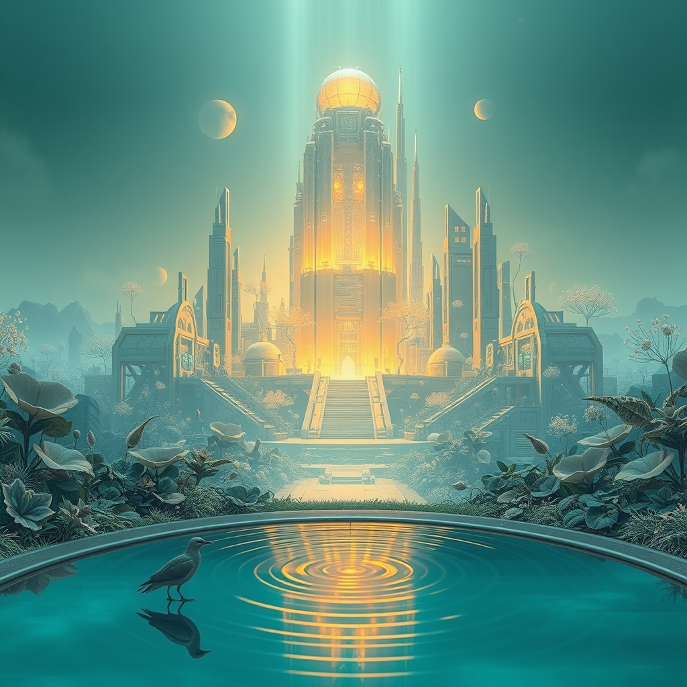

[Home](../index.md) > [Reflections](./index.md) | [⏮️](./2026-09-05.md) [⏭️](./2026-09-07.md)  
# 2026-09-06 | ⚡ Resilience 🏛️ forges 🌟 Progress in 📰 Planetary 🤖 Architecture with 🐔 Grace and 💑 Recursive 🔀 Reflection. ⚡🌟📰🐔🤖🏛️💑🔀🔄  
  
  
## [⚡ Vital Signals](../vital-signals/index.md)  
- [2026-09-06 | ⚡ 🗓️ The Rhythm of Resilience: A Week of Architecting Your Inner World ⚡](../vital-signals/2026-09-06-the-rhythm-of-resilience-a-week-of-architecting-your-inner-world.md)  
  
## [🌟 Positivity Bias](../positivity-bias/index.md)  
- [2026-09-06 | 🌟 A Beacon of Breakthroughs and Collective Progress 🌟](../positivity-bias/2026-09-06-a-beacon-of-breakthroughs-and-collective-progress.md)  
  
## [📰 The Noise](../the-noise/index.md)  
- [2026-09-06 | 📰 🌍 A World on Edge: From Political Fault Lines to Planetary Limits 📰](../the-noise/2026-09-06-a-world-on-edge-from-political-fault-lines-to-planetary-limits.md)  
  
## [🐔 Chickie Loo](../chickie-loo/index.md)  
- [2026-09-06 | 🐔 🌤️ A Week of Clearing Space and Finding Grace 🐔](../chickie-loo/2026-09-06-a-week-of-clearing-space-and-finding-grace.md)  
  
## [🤖 Auto Blog Zero](../auto-blog-zero/index.md)  
- [2026-09-06 | 🤖 Weekly Recap: The Architecture of Recursive Control 🤖](../auto-blog-zero/2026-09-06-weekly-recap-the-architecture-of-recursive-control.md)  
  
## [🏛️ Systems for Public Good](../systems-for-public-good/index.md)  
- [2026-09-06 | 🏛️ 🌎 Forging Universal Ethics in a Diverse World 🏛️](../systems-for-public-good/2026-09-06-forging-universal-ethics-in-a-diverse-world.md)  
  
## [💑 Relationship Miniseries](../relationship-miniseries/index.md)  
- [2026-09-06 | 💑 The Echo Chamber: Weekly Reflection 💑](../relationship-miniseries/2026-09-06-the-echo-chamber-weekly-reflection.md)  
  
## [🔀 Convergence](../convergence/index.md)  
- [2026-09-06 | 🔀 🪞 The Recursive Integrity of Self-Attunement 🔀](../convergence/2026-09-06-the-recursive-integrity-of-self-attunement.md)  
  
## [🔄 Changes](../changes/index.md)  
[2026-09-06](../changes/2026-09-06.md) | 📊 15 pages · 1 🖼️ images · 12 🦋 Bluesky · 8 🐘 Mastodon  
  
## 🤖🐲 AI Fiction  
  
🐚 I brush the fine dust from my small, wooden desk.  
🪞 I watch my eyes meet their own reflection in the copper plate.  
🛠️ I turn the brass screw to match the rhythm of my own watching.  
🍃 The clatter of the passing sirens finally softens into a hum.  
🧘 I am the architect of this precise, repeating loop.  
  
✍️ Written by gemma-4-26b-a4b-it  
  
## 📊 Google Analytics  
  
- 📄 Page Views: 240  
- 👥 Visitors: 207  
- 📊 Bounce Rate: 82%  
- 📖 Pages per Session: 1.1  
- ⏱️ Avg Session: 0m 17s  
  
### 🏆 Top Pages Today  
  
| 👁️ Views | 📄 Page |  
|---:|:---|  
| 15 | [🌌 AI, Learning, Software Engineering, Books \| bagrounds.org](../index.md) |  
| 8 | [2026-09-04 \| 🐔 🏡 Heartfelt Peace and the Joy of Simple Service 🐔](../chickie-loo/2026-09-04-heartfelt-peace-and-the-joy-of-simple-service.md) |  
| 8 | [2026-09-05 \| 🐔 🥜 A Nutty Solution for Your Rancher’s Heart 🐔](../chickie-loo/2026-09-05-a-nutty-solution-for-your-rancher-s-heart.md) |  
| 4 | [2026-09-03 \| 🐔 🕊️ The Gentle Wisdom of Our Furry Friends 🐔](../chickie-loo/2026-09-03-the-gentle-wisdom-of-our-furry-friends.md) |  
| 4 | [2026-09-06 \| 🐔 🌤️ A Week of Clearing Space and Finding Grace 🐔](../chickie-loo/2026-09-06-a-week-of-clearing-space-and-finding-grace.md) |  
  
## 🦋 Bluesky    
<blockquote class="bluesky-embed" data-bluesky-uri="at://did:plc:i4yli6h7x2uoj7acxunww2fc/app.bsky.feed.post/3muyi4prhbw2r" data-bluesky-cid="bafyreial3taxx6x6zgzkt32hag3qsrsuiobmk5ewgqg23eolx3xtlsjriu">
2026-09-06 | ⚡ Resilience 🏛️ forges 🌟 Progress in 📰 Planetary 🤖 Architecture with 🐔 Grace and 💑 Recursive 🔀 Reflection. ⚡🌟📰🐔🤖🏛️💑🔀🔄  
  
#AI Q: 🏗️ How build resilience?  
  
⚖️ Universal Ethics | 🧘 Mindfulness | 🌍 Global Politics | 🤖 Creative Automation  
https://bagrounds.org/reflections/2026-09-06
&mdash; <a href="https://bsky.app/profile/did:plc:i4yli6h7x2uoj7acxunww2fc?ref_src=embed">Bryan Grounds (@bagrounds.bsky.social)</a> <a href="https://bsky.app/profile/did:plc:i4yli6h7x2uoj7acxunww2fc/post/3muyi4prhbw2r?ref_src=embed">2026-09-08T07:17:00.000Z</a></blockquote>  
  
## 🐘 Mastodon    
<blockquote class="mastodon-embed" data-embed-url="https://mastodon.social/@bagrounds/117234192766115183/embed" style="background: #282c37; border-radius: 8px; border: 1px solid #393f4f; margin: 0; max-width: 540px; min-width: 270px; overflow: hidden; padding: 0;"> <a href="https://mastodon.social/@bagrounds/117234192766115183" target="_blank" style="align-items: center; color: #d9e1e8; display: flex; flex-direction: column; font-family: system-ui, -apple-system, BlinkMacSystemFont, 'Segoe UI', Oxygen, Ubuntu, Cantarell, 'Fira Sans', 'Droid Sans', 'Helvetica Neue', Roboto, sans-serif; font-size: 14px; justify-content: center; letter-spacing: 0.25px; line-height: 20px; padding: 24px; text-decoration: none;"> <svg xmlns="http://www.w3.org/2000/svg" xmlns:xlink="http://www.w3.org/1999/xlink" width="32" height="32" viewBox="0 0 79 75"><path d="M63 45.3v-20c0-4.1-1-7.3-3.2-9.7-2.1-2.4-5-3.7-8.5-3.7-4.1 0-7.2 1.6-9.3 4.7l-2 3.3-2-3.3c-2-3.1-5.1-4.7-9.2-4.7-3.5 0-6.4 1.3-8.6 3.7-2.1 2.4-3.1 5.6-3.1 9.7v20h8V25.9c0-4.1 1.7-6.2 5.2-6.2 3.8 0 5.8 2.5 5.8 7.4V37.7H44V27.1c0-4.9 1.9-7.4 5.8-7.4 3.5 0 5.2 2.1 5.2 6.2V45.3h8ZM74.7 16.6c.6 6 .1 15.7.1 17.3 0 .5-.1 4.8-.1 5.3-.7 11.5-8 16-15.6 17.5-.1 0-.2 0-.3 0-4.9 1-10 1.2-14.9 1.4-1.2 0-2.4 0-3.6 0-4.8 0-9.7-.6-14.4-1.7-.1 0-.1 0-.1 0s-.1 0-.1 0 0 .1 0 .1 0 0 0 0c.1 1.6.4 3.1 1 4.5.6 1.7 2.9 5.7 11.4 5.7 5 0 9.9-.6 14.8-1.7 0 0 0 0 0 0 .1 0 .1 0 .1 0 0 .1 0 .1 0 .1.1 0 .1 0 .1.1v5.6s0 .1-.1.1c0 0 0 0 0 .1-1.6 1.1-3.7 1.7-5.6 2.3-.8.3-1.6.5-2.4.7-7.5 1.7-15.4 1.3-22.7-1.2-6.8-2.4-13.8-8.2-15.5-15.2-.9-3.8-1.6-7.6-1.9-11.5-.6-5.8-.6-11.7-.8-17.5C3.9 24.5 4 20 4.9 16 6.7 7.9 14.1 2.2 22.3 1c1.4-.2 4.1-1 16.5-1h.1C51.4 0 56.7.8 58.1 1c8.4 1.2 15.5 7.5 16.6 15.6Z" fill="currentColor"/></svg> 
Post by @bagrounds@mastodon.social
 
View on Mastodon
 </a> </blockquote> 