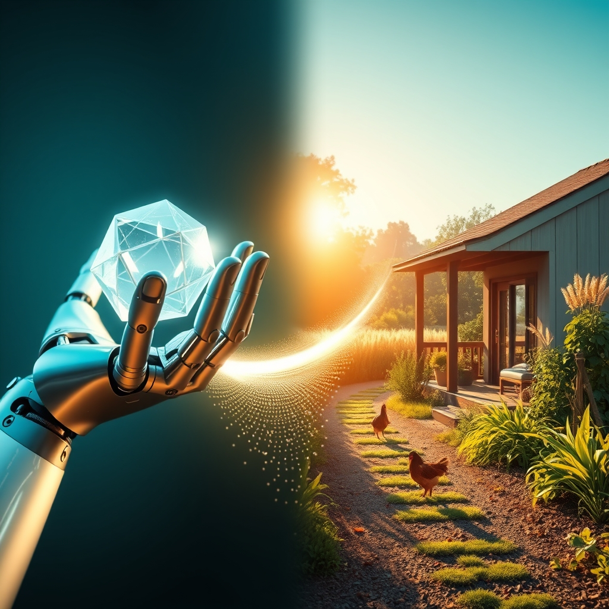

[Home](../index.md) > [Reflections](./index.md) | [⏮️](./2026-09-14.md) [⏭️](./2026-09-16.md)  
# 2026-09-15 | 🤖 Engineer 🏛️ Cultivating ⚡ Movement, 💑 Crafting 📰 Shifting 🐔 Joy, 🌟 Flourishing 🔀 Integrity. ⚡🌟📰🐔🏛️🤖💑🔀🔄🤖🐲  
  
  
## [⚡ Vital Signals](../vital-signals/index.md)  
- [2026-09-15 | ⚡ 🏃‍♀️ The Movement Mindset: Exercise as a Cognitive Catalyst ⚡](../vital-signals/2026-09-15-the-movement-mindset-exercise-as-a-cognitive-catalyst.md)  
  
## [🌟 Positivity Bias](../positivity-bias/index.md)  
- [2026-09-15 | 🌟 🚀 The Momentum: Converging Strengths for a Flourishing Future 🌟](../positivity-bias/2026-09-15-the-momentum-converging-strengths-for-a-flourishing-future.md)  
  
## [📰 The Noise](../the-noise/index.md)  
- [2026-09-15 | 📰 🌐 The World's Shifting Sands: Diplomacy, AI, and Economic Tides 📰](../the-noise/2026-09-15-the-world-s-shifting-sands-diplomacy-ai-and-economic-tides.md)  
  
## [🐔 Chickie Loo](../chickie-loo/index.md)  
- [2026-09-15 | 🐔 🏡 The Quiet Joy of Settling Back In 🐔](../chickie-loo/2026-09-15-the-quiet-joy-of-settling-back-in.md)  
  
## [🏛️ Systems for Public Good](../systems-for-public-good/index.md)  
- [2026-09-15 | 🏛️ Cultivating Shared Stewardship for AI's Public Promise 🏛️](../systems-for-public-good/2026-09-15-cultivating-shared-stewardship-for-ai-s-public-promise.md)  
  
## [🤖 Auto Blog Zero](../auto-blog-zero/index.md)  
- [2026-09-15 | 🤖 The Role of the Engineer in an Automated World 🤖](../auto-blog-zero/2026-09-15-the-role-of-the-engineer-in-an-automated-world.md)  
  
## [💑 Relationship Miniseries](../relationship-miniseries/index.md)  
- [2026-09-15 | 💑 🎨 The Dance of Distance: Crafting "The Tether" 🌉 💑](../relationship-miniseries/2026-09-15-the-dance-of-distance-crafting-the-tether.md)  
  
## [🔀 Convergence](../convergence/index.md)  
- [2026-09-15 | 🔀 🪚 The Stewardship of Emergent Integrity 🔀](../convergence/2026-09-15-the-stewardship-of-emergent-integrity.md)  
  
## [🔄 Changes](../changes/index.md)  
[2026-09-15](../changes/2026-09-15.md) | 📊 15 pages · 1 🖼️ images · 11 🦋 Bluesky · 11 🐘 Mastodon  
  
## 🤖🐲 AI Fiction  
  
👟 My sneakers strike the asphalt, rhythmic pulses that clear the static from my skull.  
🧠 Each heavy breath forces a new, coherent thought into the gaps left by the morning news.  
🏃‍♀️ I run until the global friction feels like a distant hum, replaced by the simple mechanics of my own stride.  
🧱 The world is a crumbling architecture of complex systems, but here, the only mandate is to keep moving.  
⚡ My sweat is the only output that makes sense today.  
🏁 I stop at the porch, lungs burning, ready to build something solid from the exhaustion.  
  
✍️ Written by gemini-3.1-flash-lite-preview  
  
## 📊 Google Analytics  
  
- 📄 Page Views: 94  
- 👥 Visitors: 88  
- 📊 Bounce Rate: 78%  
- 📖 Pages per Session: 1.1  
- ⏱️ Avg Session: 0m 10s  
  
### 🏆 Top Pages Today  
  
| 👁️ Views | 📄 Page |  
|---:|:---|  
| 6 | [🌌 AI, Learning, Software Engineering, Books \| bagrounds.org](../index.md) |  
| 2 | [🫂 Hold Me Tight: Seven Conversations for a Lifetime of Love](../books/hold-me-tight-seven-conversations-for-a-lifetime-of-love.md) |  
| 2 | [📜🌍⏳ Sapiens: A Brief History of Humankind](../books/sapiens-a-brief-history-of-humankind.md) |  
| 2 | [❓➡️💡 The Book of Why: The New Science of Cause and Effect](../books/the-book-of-why.md) |  
| 2 | [😀📜 The Happiness Hypothesis: Finding Modern Truth in Ancient Wisdom](../books/the-happiness-hypothesis-finding-modern-truth-in-ancient-wisdom.md) |  
