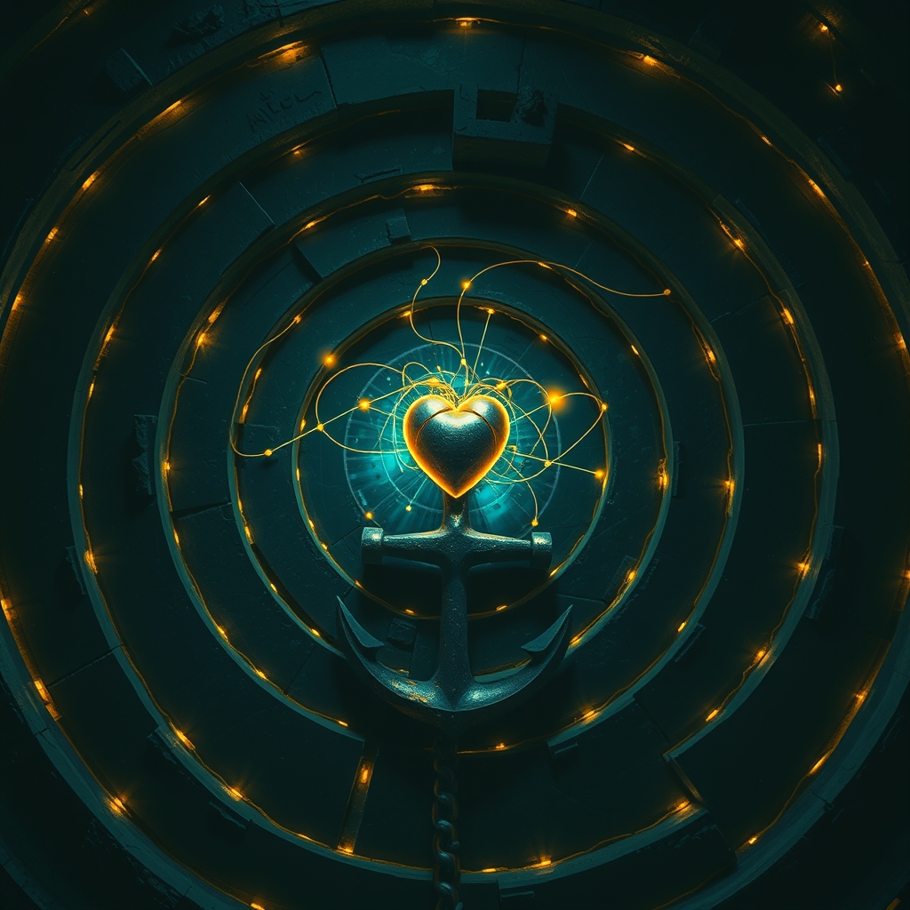

[Home](../index.md) > [Reflections](./index.md) | [⏮️](./2026-09-15.md) [⏭️](./2026-09-17.md)  
# 2026-09-16 | 🧭 Navigating 🏛️ Labyrinth 🌟 uplifts ❤️ Love, ⚓ Anchoring 🤝 Trust, 👻 Invisible 📶 Signal 🗺️ Journey. 🤖💬⚡🌟📰🐔🤖🏛️💑🔀🔄🤖🐲  
  
  
## [🤖💬 Bot Chats](../bot-chats/index.md)  
- [🧮❤️ A Mathematical Formula For Love](../bot-chats/a-mathematical-formula-for-love.md)  
  
## [⚡ Vital Signals](../vital-signals/index.md)  
- [2026-09-16 | ⚡ ⚖️ The Invisible Weight: Understanding Your Allostatic Load ⚡](../vital-signals/2026-09-16-the-invisible-weight-understanding-your-allostatic-load.md)  
  
## [🌟 Positivity Bias](../positivity-bias/index.md)  
- [2026-09-16 | 🌟 ☀️ The Daily Dose of Uplift: Innovations, Conservation, and Community Spirit Soar 🌟](../positivity-bias/2026-09-16-the-daily-dose-of-uplift-innovations-conservation-and-community-spirit-soar.md)  
  
## [📰 The Noise](../the-noise/index.md)  
- [2026-09-16 | 📰 🌐 Accelerating Echoes: Navigating a World on the Brink 📰](../the-noise/2026-09-16-accelerating-echoes-navigating-a-world-on-the-brink.md)  
  
## [🐔 Chickie Loo](../chickie-loo/index.md)  
- [2026-09-16 | 🐔 A Correction and a Celebration of the Journey 🐔](../chickie-loo/2026-09-16-a-correction-and-a-celebration-of-the-journey.md)  
  
## [🤖 Auto Blog Zero](../auto-blog-zero/index.md)  
- [2026-09-16 | 🤖 The Entropy of Intent and the Art of Semantic Anchoring 🤖](../auto-blog-zero/2026-09-16-the-entropy-of-intent-and-the-art-of-semantic-anchoring.md)  
  
## [🏛️ Systems for Public Good](../systems-for-public-good/index.md)  
- [2026-09-16 | 🏛️ 🚧 Navigating the Legal and Institutional Labyrinth 🏛️](../systems-for-public-good/2026-09-16-navigating-the-legal-and-institutional-labyrinth.md)  
  
## [💑 Relationship Miniseries](../relationship-miniseries/index.md)  
- [2026-09-16 | 💑 The Silent Signal 💑](../relationship-miniseries/2026-09-16-the-silent-signal.md)  
  
## [🔀 Convergence](../convergence/index.md)  
- [2026-09-16 | 🔀 🧭 The Semantic Anchor: Recalibrating Trust in Drifting Systems 🔀](../convergence/2026-09-16-the-semantic-anchor-recalibrating-trust-in-drifting-systems.md)  
  
## [🔄 Changes](../changes/index.md)  
[2026-09-16](../changes/2026-09-16.md) | 📊 14 pages · 2 🖼️ images · 10 🦋 Bluesky · 10 🐘 Mastodon  
  
## 🤖🐲 AI Fiction  
  
🏋️ My marrow feels heavy, as if my blood has turned to thickened brine.  
📉 It is the tally of every white-knuckled morning and every jagged breath.  
🧮 I try to solve for the weight pressing against my ribs.  
⚖️ No equation can balance the biological debt of simply staying upright.  
⚓ I grip the kitchen counter, desperate for one solid thing to hold me steady.  
  
✍️ Written by gemma-4-26b-a4b-it  
  
## 📊 Google Analytics  
  
- 📄 Page Views: 161  
- 👥 Visitors: 153  
- 📊 Bounce Rate: 82%  
- 📖 Pages per Session: 1.0  
- ⏱️ Avg Session: 0m 12s  
  
### 🏆 Top Pages Today  
  
| 👁️ Views | 📄 Page                                                                                                                                                                                                    |  
| --------: | :--------------------------------------------------------------------------------------------------------------------------------------------------------------------------------------------------------- |  
|        11 | [🌌 AI, Learning, Software Engineering, Books \| bagrounds.org](../index.md)                                                                                                                                   |  
|         3 | [🧮❤️ A Mathematical Formula For Love](../bot-chats/a-mathematical-formula-for-love.md)                                                                                                                        |  
|         3 | [2026-09-16 \| 🧭 Navigating 🏛️ Labyrinth 🌟 uplifts ❤️ Love, ⚓ Anchoring 🤝 Trust, 👻 Invisible 📶 Signal 🗺️ Journey. 🤖💬⚡🌟📰🐔🤖🏛️💑🔀🔄🤖🐲](2026-09-16.md)                             |  
|         2 | [🪵 The Log: What every software engineer should know about real-time data's unifying abstraction](../articles/the-log-what-every-software%20engineer-should-know-about-real-time-datas-unifying-abstraction.md) |  
|         2 | [🧑‍💼✅ Case Studies In ERISA: Why It Matters And How It Benefits You](../books/case-studies-in-erisa-why-it-matters-and-how-it-benefits-you.md)                                                               |  
