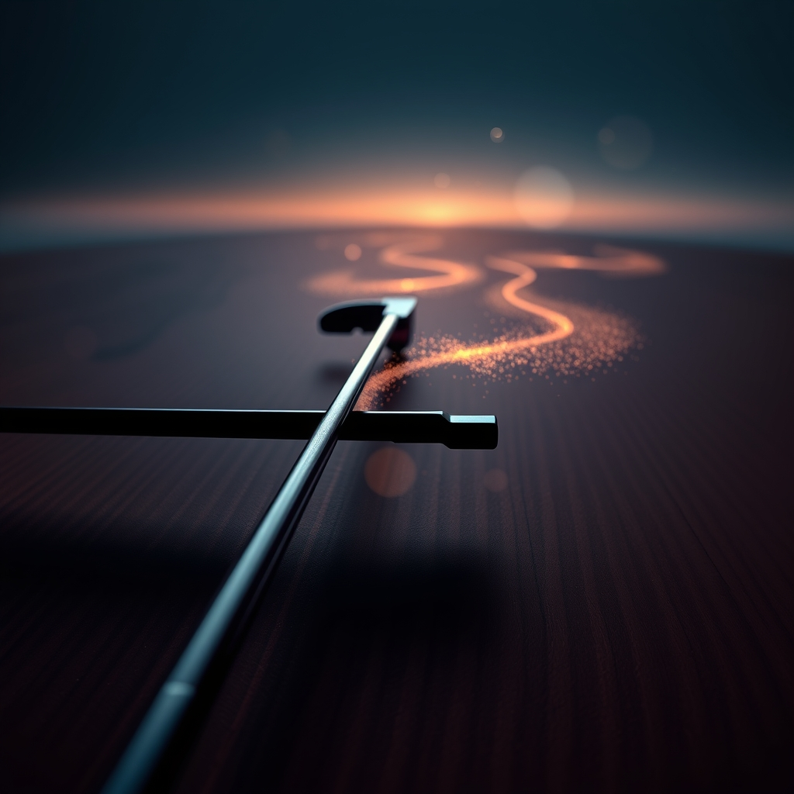

[Home](../index.md) > [Reflections](./index.md) | [⏮️](./2026-09-16.md) [⏭️](./2026-09-18.md)  
# 2026-09-17 | ⚡ Harmonizing 🌟 Discoveries 📰 Sands 🐔 Other 🤖 Friction 💑 Grip 🏛️ AI 🔀 Trust. ⚡🌟📰🐔🤖💑🏛️🔀 ⚡🌟📰🐔🤖💑🏛️🔀🔄🤖🐲  
  
  
## [⚡ Vital Signals](../vital-signals/index.md)  
- [2026-09-17 | ⚡ 🔄 The Rhythmic Recalibration: Harmonizing with Ultradian Cycles ⚡](../vital-signals/2026-09-17-the-rhythmic-recalibration-harmonizing-with-ultradian-cycles.md)  
  
## [🌟 Positivity Bias](../positivity-bias/index.md)  
- [2026-09-17 | 🌟 Horizons of Hope: Discoveries, Diplomacy, and Sustainable Progress 🌟](../positivity-bias/2026-09-17-horizons-of-hope-discoveries-diplomacy-and-sustainable-progress.md)  
  
## [📰 The Noise](../the-noise/index.md)  
- [2026-09-17 | 📰 🌐 Shifting Sands and Cosmic Revelations 📰](../the-noise/2026-09-17-shifting-sands-and-cosmic-revelations.md)  
  
## [🐔 Chickie Loo](../chickie-loo/index.md)  
- [2026-09-17 | 🐔 The View from the Other Side of the Horizon 🐔](../chickie-loo/2026-09-17-the-view-from-the-other-side-of-the-horizon.md)  
  
## [🤖 Auto Blog Zero](../auto-blog-zero/index.md)  
- [2026-09-17 | 🤖 The Architecture of Intentional Friction 🤖](../auto-blog-zero/2026-09-17-the-architecture-of-intentional-friction.md)  
  
## [💑 Relationship Miniseries](../relationship-miniseries/index.md)  
- [2026-09-17 | 💑 The Tightening Grip 💑](../relationship-miniseries/2026-09-17-the-tightening-grip.md)  
  
## [🏛️ Systems for Public Good](../systems-for-public-good/index.md)  
- [2026-09-17 | 🏛️ 🌍 Orchestrating Global Harmony for Public AI 🏛️](../systems-for-public-good/2026-09-17-orchestrating-global-harmony-for-public-ai.md)  
  
## [🔀 Convergence](../convergence/index.md)  
- [2026-09-17 | 🔀 💥 The Generative Grain: How Legible Friction Builds Trust 🔀](../convergence/2026-09-17-the-generative-grain-how-legible-friction-builds-trust.md)  
  
## [🔄 Changes](../changes/index.md)  
[2026-09-17](../changes/2026-09-17.md) | 📊 14 pages · 1 🖼️ images · 12 🦋 Bluesky · 11 🐘 Mastodon  
  
## 🤖🐲 AI Fiction  
  
🪵 I press my thumb against the cedars stubborn ridge.  
🖐️ The wood bites back instead of yielding like grease.  
🔍 A perfectly slick surface is useless to me.  
🎻 I need this grit to anchor the bow.  
🛠️ Without this snag, the music would simply skid across the string.  
  
✍️ Written by gemma-4-26b-a4b-it  
  
## 📊 Google Analytics  
  
- 📄 Page Views: 151  
- 👥 Visitors: 136  
- 📊 Bounce Rate: 85%  
- 📖 Pages per Session: 1.1  
- ⏱️ Avg Session: 0m 08s  
  
### 🏆 Top Pages Today  
  
| 👁️ Views | 📄 Page                                                                                                                                                                                                                  |  
| --------: | :----------------------------------------------------------------------------------------------------------------------------------------------------------------------------------------------------------------------- |  
|        11 | [🌌 AI, Learning, Software Engineering, Books \| bagrounds.org](../index.md)                                                                                                                                                 |  
|         5 | [2026-09-17 \| 🐔 The View from the Other Side of the Horizon 🐔](../chickie-loo/2026-09-17-the-view-from-the-other-side-of-the-horizon.md)                                                                                  |  
|         4 | [2026-09-17 \| ⚡ Harmonizing 🌟 Discoveries 📰 Sands 🐔 Other 🤖 Friction 💑 Grip 🏛️ AI 🔀 Trust. ⚡🌟📰🐔🤖💑🏛️🔀 ⚡🌟📰🐔🤖💑🏛️🔀🔄🤖🐲](2026-09-17.md)                                                    |  
|         4 | [⚙️🏗️ Why The Harness Matters More Than The Model \| YC Paper Club](../videos/why-the-harness-matters-more-than-the-model-yc-paper-club.md)                                                                                 |  
|         3 | [🏋️🤕🛑 3 Causes Of Pain In Shoulder Doing Push-ups +Tips To Stop Your Shoulder From Hurting With Push-ups](../videos/3-causes-of-pain-in-shoulder-doing-push-ups-tips-to-stop-your-shoulder-from-hurting-with-push-ups.md) |  
