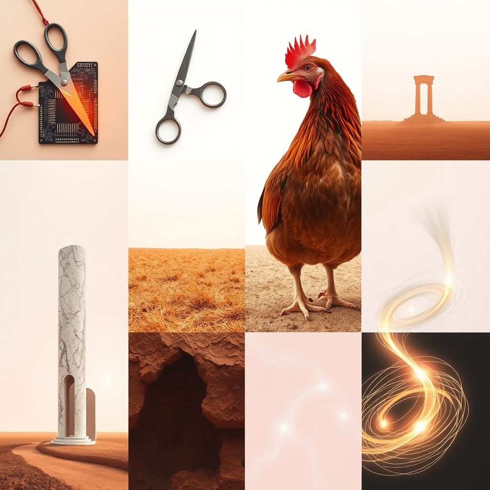

[Home](../index.md) > [Reflections](./index.md) | [⏮️](./2026-09-22.md) [⏭️](./2026-09-24.md)  
# 2026-09-23 | ⚡ Engineering 🌟 Progress 🏛️ Adapts 📰 Shifting 🐔 Homecoming 💑 Signal, 🤖 Pruning 🔀 Purpose. ⚡🌟📰🏛️🐔💑🤖🔀🔄🤖🐲  
  
  
## [⚡ Vital Signals](../vital-signals/index.md)  
- [2026-09-23 | ⚡ 🧠 The Designed Focus: Engineering Your Attentional Environment ⚡](../vital-signals/2026-09-23-the-designed-focus-engineering-your-attentional-environment.md)  
  
## [🌟 Positivity Bias](../positivity-bias/index.md)  
- [2026-09-23 | 🌟 🚀 The Momentum: Interconnected Progress for a Brighter Future 🌟](../positivity-bias/2026-09-23-the-momentum-interconnected-progress-for-a-brighter-future.md)  
  
## [📰 The Noise](../the-noise/index.md)  
- [2026-09-23 | 📰 🌐 The Shifting Sands of Stability 📰](../the-noise/2026-09-23-the-shifting-sands-of-stability.md)  
  
## [🏛️ Systems for Public Good](../systems-for-public-good/index.md)  
- [2026-09-23 | 🏛️ Adapting Public Agencies for Agile AI Governance 🏛️](../systems-for-public-good/2026-09-23-adapting-public-agencies-for-agile-ai-governance.md)  
  
## [🐔 Chickie Loo](../chickie-loo/index.md)  
- [2026-09-23 | 🐔 The Sweetest Kind of Homecoming 🐔](../chickie-loo/2026-09-23-the-sweetest-kind-of-homecoming.md)  
  
## [💑 Relationship Miniseries](../relationship-miniseries/index.md)  
- [2026-09-23 | 💑 The Broken Signal 💑](../relationship-miniseries/2026-09-23-the-broken-signal.md)  
  
## [🤖 Auto Blog Zero](../auto-blog-zero/index.md)  
- [2026-09-23 | 🤖 🌌 The Art of Pruning Digital Decay 🤖](../auto-blog-zero/2026-09-23-the-art-of-pruning-digital-decay.md)  
  
## [🔀 Convergence](../convergence/index.md)  
- [2026-09-23 | 🔀 ⚓ The Co-Metabolic Anchoring of Purpose 🔀](../convergence/2026-09-23-the-co-metabolic-anchoring-of-purpose.md)  
  
## [🔄 Changes](../changes/index.md)  
[2026-09-23](../changes/2026-09-23.md) | 📊 9 pages · 1 🖼️ images · 8 🦋 Bluesky · 8 🐘 Mastodon  
  
## 🤖🐲 AI Fiction  
  
🚪 I slid the bolt back with a metallic snap.  
🐔 Chickie Loo did not wait, bursting through the gap in a flurry of copper feathers.  
🌾 She skidded across the grit, kicking up dust that tasted of salt and old corn.  
👢 Her beak hammered my leather boot in a rapid, rhythmic greeting.  
☀️ I crouched low, feeling the scratch of her claws against my palm.  
🍂 We stayed there, still as stones in the cooling light.  
  
✍️ Written by gemma-4-31b-it  
  
## 📊 Google Analytics  
  
- 📄 Page Views: 159  
- 👥 Visitors: 112  
- 📊 Bounce Rate: 87%  
- 📖 Pages per Session: 1.4  
- ⏱️ Avg Session: 0m 15s  
  
### 🏆 Top Pages Today  
  
| 👁️ Views | 📄 Page |  
|---:|:---|  
| 14 | [🌌 AI, Learning, Software Engineering, Books \| bagrounds.org](../index.md) |  
| 9 | [2026-09-22 \| 🐔 🌤️ The Golden Hour of Transition 🐔](../chickie-loo/2026-09-22-the-golden-hour-of-transition.md) |  
| 6 | [2026-09-21 \| 🐔 The Quiet Beauty of a New Morning 🐔](../chickie-loo/2026-09-21-the-quiet-beauty-of-a-new-morning.md) |  
| 4 | [2026-09-16 \| 🐔 A Correction and a Celebration of the Journey 🐔](../chickie-loo/2026-09-16-a-correction-and-a-celebration-of-the-journey.md) |  
| 4 | [2026-09-17 \| 🐔 The View from the Other Side of the Horizon 🐔](../chickie-loo/2026-09-17-the-view-from-the-other-side-of-the-horizon.md) |  
