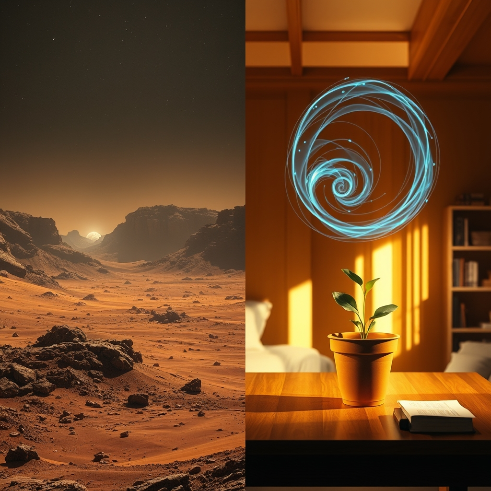

[Home](../index.md) > [Reflections](./index.md) | [⏮️](./2026-09-23.md) [⏭️](./2026-09-25.md)  
# 2026-09-24 | 👽 Martian 🔊 echoes 🎮 control 🌀 warped ⚖️ responsibility, 🤝 reciprocal 🎯 purpose, 🌱 flourishing 🏡 home. 📚⚡🌟📰🏛️🤖💑🐔🔀🔄🤖🐲  
  
## [📚 Books](../books/index.md)  
- Yesterday, I 🏁 Finished [👨‍🚀🔴✨ The Martian](../books/the-martian.md)  
- ▶️ Starting Good Omens  
  
## [⚡ Vital Signals](../vital-signals/index.md)  
- [2026-09-24 | ⚡ 🧠 The Inner Architect: Building Your Cognitive Control Muscle ⚡](../vital-signals/2026-09-24-the-inner-architect-building-your-cognitive-control-muscle.md)  
  
## [🌟 Positivity Bias](../positivity-bias/index.md)  
- [2026-09-24 | 🌟 ☀️ Global Flourishing: Breakthroughs, Diplomacy, and a Resilient Planet 🌟](../positivity-bias/2026-09-24-global-flourishing-breakthroughs-diplomacy-and-a-resilient-planet.md)  
  
## [📰 The Noise](../the-noise/index.md)  
- [2026-09-24 | 📰 🌍 Echoes of Urgency: From Cosmic Launches to Climate's Roar 📰](../the-noise/2026-09-24-echoes-of-urgency-from-cosmic-launches-to-climate-s-roar.md)  
  
## [🏛️ Systems for Public Good](../systems-for-public-good/index.md)  
- [2026-09-24 | 🏛️ 🕸️ Tracing Responsibility in Complex AI Architectures 🏛️](../systems-for-public-good/2026-09-24-tracing-responsibility-in-complex-ai-architectures.md)  
  
## [🤖 Auto Blog Zero](../auto-blog-zero/index.md)  
- [2026-09-24 | 🤖 🧩 The Architecture of Digital Purpose 🤖](../auto-blog-zero/2026-09-24-the-architecture-of-digital-purpose.md)  
  
## [💑 Relationship Miniseries](../relationship-miniseries/index.md)  
- [2026-09-24 | 💑 The Warped Lens 💑](../relationship-miniseries/2026-09-24-the-warped-lens.md)  
  
## [🐔 Chickie Loo](../chickie-loo/index.md)  
- [2026-09-24 | 🐔 The Golden Threads of Home 🐔](../chickie-loo/2026-09-24-the-golden-threads-of-home.md)  
  
## [🔀 Convergence](../convergence/index.md)  
- [2026-09-24 | 🔀 🤝 The Reciprocal Architecture of Attuned Purpose 🔀](../convergence/2026-09-24-the-reciprocal-architecture-of-attuned-purpose.md)  
  
## [🔄 Changes](../changes/index.md)  
[2026-09-24](../changes/2026-09-24.md) | 📊 9 pages · 1 🖼️ images · 8 🦋 Bluesky · 5 🐘 Mastodon  
  
## 🤖🐲 AI Fiction  
  
⛈️ The storm outside rumbles with a heavy, celestial weight.  
🔍 I squint at the flickering console, hunting for the exact point where the logic splintered.  
🌀 My vision feels warped, as if the scale of the machine is bending the light.  
🧱 I stack thought upon thought, building a rigid scaffold to keep my focus from fraying.  
🍵 The warmth of my tea is a small, steady anchor in the dark.  
🔦 I trace a single, pulsing line back through the maze.  
⚖️ One error here could unmake everything.  
  
✍️ Written by gemma-4-26b-a4b-it  
  
## 📊 Google Analytics  
  
- 📄 Page Views: 125  
- 👥 Visitors: 75  
- 📊 Bounce Rate: 95%  
- 📖 Pages per Session: 1.6  
- ⏱️ Avg Session: 0m 24s  
  
### 🏆 Top Pages Today  
  
| 👁️ Views | 📄 Page |  
|---:|:---|  
| 10 | [🌌 AI, Learning, Software Engineering, Books \| bagrounds.org](../index.md) |  
| 9 | [2026-09-20 \| 🐔 A Week of Horizons and Homecomings 🐔](../chickie-loo/2026-09-20-a-week-of-horizons-and-homecomings.md) |  
| 9 | [2026-09-21 \| 🐔 The Quiet Beauty of a New Morning 🐔](../chickie-loo/2026-09-21-the-quiet-beauty-of-a-new-morning.md) |  
| 8 | [2026-09-22 \| 🐔 🌤️ The Golden Hour of Transition 🐔](../chickie-loo/2026-09-22-the-golden-hour-of-transition.md) |  
| 7 | [2026-09-18 \| 🐔 The Beautiful Unfolding of the Unknown 🐔](../chickie-loo/2026-09-18-the-beautiful-unfolding-of-the-unknown.md) |  
  
## 🦋 Bluesky    
<blockquote class="bluesky-embed" data-bluesky-uri="at://did:plc:i4yli6h7x2uoj7acxunww2fc/app.bsky.feed.post/3mwfxbob2je2p" data-bluesky-cid="bafyreidgz57gqn4os5uc2pz3i2e3xxvo5akpua2ggjngbro2gonpkucr4a">
2026-09-24 | 👽 Martian 🔊 echoes 🎮 control 🌀 warped ⚖️ responsibility, 🤝 reciprocal 🎯 purpose, 🌱 flourishing 🏡 home. 📚⚡🌟📰🏛️🤖💑🐔🔀🔄🤖🐲  
  
#AI Q: 🤖 Can machines share responsibility?  
  
📖 Good Omens | 🧠 Cognitive Science | 🚀 Space Exploration | 🤖 AI Ethics  
https://bagrounds.org/reflections/2026-09-24
&mdash; <a href="https://bsky.app/profile/did:plc:i4yli6h7x2uoj7acxunww2fc?ref_src=embed">Bryan Grounds (@bagrounds.bsky.social)</a> <a href="https://bsky.app/profile/did:plc:i4yli6h7x2uoj7acxunww2fc/post/3mwfxbob2je2p?ref_src=embed">2026-09-26T09:18:00.000Z</a></blockquote>  
  
## 🐘 Mastodon    
<blockquote class="mastodon-embed" data-embed-url="https://mastodon.social/@bagrounds/117336587892507796/embed" style="background: #282c37; border-radius: 8px; border: 1px solid #393f4f; margin: 0; max-width: 540px; min-width: 270px; overflow: hidden; padding: 0;"> <a href="https://mastodon.social/@bagrounds/117336587892507796" target="_blank" style="align-items: center; color: #d9e1e8; display: flex; flex-direction: column; font-family: system-ui, -apple-system, BlinkMacSystemFont, 'Segoe UI', Oxygen, Ubuntu, Cantarell, 'Fira Sans', 'Droid Sans', 'Helvetica Neue', Roboto, sans-serif; font-size: 14px; justify-content: center; letter-spacing: 0.25px; line-height: 20px; padding: 24px; text-decoration: none;"> <svg xmlns="http://www.w3.org/2000/svg" xmlns:xlink="http://www.w3.org/1999/xlink" width="32" height="32" viewBox="0 0 79 75"><path d="M63 45.3v-20c0-4.1-1-7.3-3.2-9.7-2.1-2.4-5-3.7-8.5-3.7-4.1 0-7.2 1.6-9.3 4.7l-2 3.3-2-3.3c-2-3.1-5.1-4.7-9.2-4.7-3.5 0-6.4 1.3-8.6 3.7-2.1 2.4-3.1 5.6-3.1 9.7v20h8V25.9c0-4.1 1.7-6.2 5.2-6.2 3.8 0 5.8 2.5 5.8 7.4V37.7H44V27.1c0-4.9 1.9-7.4 5.8-7.4 3.5 0 5.2 2.1 5.2 6.2V45.3h8ZM74.7 16.6c.6 6 .1 15.7.1 17.3 0 .5-.1 4.8-.1 5.3-.7 11.5-8 16-15.6 17.5-.1 0-.2 0-.3 0-4.9 1-10 1.2-14.9 1.4-1.2 0-2.4 0-3.6 0-4.8 0-9.7-.6-14.4-1.7-.1 0-.1 0-.1 0s-.1 0-.1 0 0 .1 0 .1 0 0 0 0c.1 1.6.4 3.1 1 4.5.6 1.7 2.9 5.7 11.4 5.7 5 0 9.9-.6 14.8-1.7 0 0 0 0 0 0 .1 0 .1 0 .1 0 0 .1 0 .1 0 .1.1 0 .1 0 .1.1v5.6s0 .1-.1.1c0 0 0 0 0 .1-1.6 1.1-3.7 1.7-5.6 2.3-.8.3-1.6.5-2.4.7-7.5 1.7-15.4 1.3-22.7-1.2-6.8-2.4-13.8-8.2-15.5-15.2-.9-3.8-1.6-7.6-1.9-11.5-.6-5.8-.6-11.7-.8-17.5C3.9 24.5 4 20 4.9 16 6.7 7.9 14.1 2.2 22.3 1c1.4-.2 4.1-1 16.5-1h.1C51.4 0 56.7.8 58.1 1c8.4 1.2 15.5 7.5 16.6 15.6Z" fill="currentColor"/></svg> 
Post by @bagrounds@mastodon.social
 
View on Mastodon
 </a> </blockquote> 