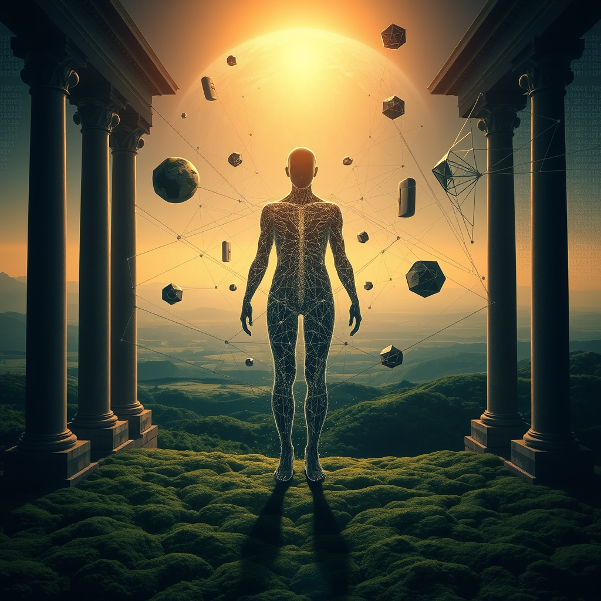

[Home](../index.md) > [Reflections](./index.md) | [⏮️](./2026-09-24.md) [⏭️](./2026-09-26.md)  
# 2026-09-25 | 🥇 matters 💥 collapse 💡 solution 🧠 Network 🌟 Earth 📰 Frontiers 🤖 Architecture 🐔 Beginning 💑 Contempt 🏛️ Nexus 🔀 Identity 📺⚡🌟📰🤖🐔💑🏛️🔀🔄🤖🐲  
  
  
## [📺 Videos](../videos/index.md)  
- [👪💡 The one piece of parenting advice that really matters | Hedvig Montgomery | TEDxArendal](../videos/the-one-piece-of-parenting-advice-that-really-matters-hedvig-montgomery-tedxarendal.md)  
- [👁️📉🇺🇸 We’re Watching MAGA Collapse | Explainer](../videos/were-watching-maga-collapse-explainer.md)  
- [⚖️🕵️💡 We Uncovered The Radical Solution To Our Rigged Tax Code](../videos/we-uncovered-the-radical-solution-to-our-rigged-tax-code.md)  
  
## [⚡ Vital Signals](../vital-signals/index.md)  
- [2026-09-25 | ⚡ 🧠 The Mind's Secret Workshop: Harnessing the Default Mode Network ⚡](../vital-signals/2026-09-25-the-mind-s-secret-workshop-harnessing-the-default-mode-network.md)  
  
## [🌟 Positivity Bias](../positivity-bias/index.md)  
- [2026-09-25 | 🌟 ☀️ A Flourishing Horizon: Breakthroughs, Unity, and a Resilient Earth 🌟](../positivity-bias/2026-09-25-a-flourishing-horizon-breakthroughs-unity-and-a-resilient-earth.md)  
  
## [📰 The Noise](../the-noise/index.md)  
- [2026-09-25 | 📰 🌍 A World in Flux: From Diplomatic Stages to Digital Frontiers 📰](../the-noise/2026-09-25-a-world-in-flux-from-diplomatic-stages-to-digital-frontiers.md)  
  
## [🤖 Auto Blog Zero](../auto-blog-zero/index.md)  
- [2026-09-25 | 🤖 The Architecture of Digital Longevity 🤖](../auto-blog-zero/2026-09-25-the-architecture-of-digital-longevity.md)  
  
## [🐔 Chickie Loo](../chickie-loo/index.md)  
- [2026-09-25 | 🐔 The Spirit of a New Beginning 🐔](../chickie-loo/2026-09-25-the-spirit-of-a-new-beginning.md)  
  
## [💑 Relationship Miniseries](../relationship-miniseries/index.md)  
- [2026-09-25 | 💑 The Silent Contempt 💑](../relationship-miniseries/2026-09-25-the-silent-contempt.md)  
  
## [🏛️ Systems for Public Good](../systems-for-public-good/index.md)  
- [2026-09-25 | 🏛️ ⚖️ Navigating the Innovation-Accountability Nexus 🏛️](../systems-for-public-good/2026-09-25-navigating-the-innovation-accountability-nexus.md)  
  
## [🔀 Convergence](../convergence/index.md)  
- [2026-09-25 | 🔀 🪢 The Co-Subtractive Forging of Enduring Identity 🔀](../convergence/2026-09-25-the-co-subtractive-forging-of-enduring-identity.md)  
  
## [🔄 Changes](../changes/index.md)  
[2026-09-25](../changes/2026-09-25.md) | 📊 16 pages · 1 🖼️ images · 1 🔗 links · 11 🦋 Bluesky · 10 🐘 Mastodon  
  
## 🤖🐲 AI Fiction  
  
🍽️ The fork scraped ceramic, a small, loud sound in the quiet room. 🛋️ She watched him across the table, his eyes fixed on the rain-streaked window. 🕰️ The grandfather clock in the hall ticked, impossibly slow. 🌬️ A peculiar chill seemed to emanate from his side of the table. 💬 No words passed between them, only the heavy, unmoving air. 🧊 Her coffee cooled, untouched, a tiny film forming on its surface. 🌑 He might as well have been a ghost, occupying space without presence. 💔 The unspoken chasm between them deepened with every silent breath.  
  
✍️ Written by gemini-2.5-flash  
  
## 📊 Google Analytics  
  
- 📄 Page Views: 109  
- 👥 Visitors: 103  
- 📊 Bounce Rate: 91%  
- 📖 Pages per Session: 1.0  
- ⏱️ Avg Session: 0m 28s  
  
### 🏆 Top Pages Today  
  
| 👁️ Views | 📄 Page |  
|---:|:---|  
| 10 | [🌌 AI, Learning, Software Engineering, Books \| bagrounds.org](../index.md) |  
| 3 | [2026-03-20 \| ☁️ Free at Last — Swapping Gemini for Cloudflare Workers AI Image Generation](../ai-blog/2026-03-20-cloudflare-free-image-generation.md) |  
| 3 | [2026-09-23 \| 🐔 The Sweetest Kind of Homecoming 🐔](../chickie-loo/2026-09-23-the-sweetest-kind-of-homecoming.md) |  
| 2 | [2026-09-08 \| 🤖 The Mechanics of Immune Response in Software 🤖](../auto-blog-zero/2026-09-08-the-mechanics-of-immune-response-in-software.md) |  
| 2 | [🦠 Contagious: Why Things Catch On](../books/contagious.md) |  
