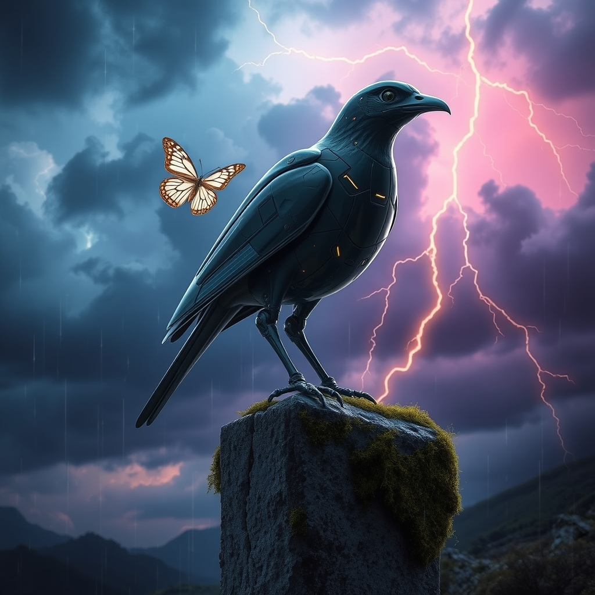

[Home](../index.md) > [Reflections](./index.md) | [⏮️](./2026-09-26.md) [⏭️](./2026-09-28.md)  
# 2026-09-27 | ⚡ Mastering 🌟 Hope, 📰 Converging 🐔 Homecoming 🤖 Architecture 🔀 Costs 💑 Unseen 🏛️ Stewardship. ⚡🌟📰🐔🤖🏛️💑🔀🔄🤖🐲  
  
  
## [⚡ Vital Signals](../vital-signals/index.md)  
- [2026-09-27 | ⚡ 🏗️ The Week in Review: Mastering Your Mental Bandwidth ⚡](../vital-signals/2026-09-27-the-week-in-review-mastering-your-mental-bandwidth.md)  
  
## [🌟 Positivity Bias](../positivity-bias/index.md)  
- [2026-09-27 | 🌟 ☀️ Cascading Hope: Innovations, Connections, and a Thriving Planet 🌟](../positivity-bias/2026-09-27-cascading-hope-innovations-connections-and-a-thriving-planet.md)  
  
## [📰 The Noise](../the-noise/index.md)  
- [2026-09-27 | 📰 🗓️ The Reckoning of Converging Storms 📰](../the-noise/2026-09-27-the-reckoning-of-converging-storms.md)  
  
## [🐔 Chickie Loo](../chickie-loo/index.md)  
- [2026-09-27 | 🐔 ⛪ The Sunday Song of Homecoming 🐔](../chickie-loo/2026-09-27-the-sunday-song-of-homecoming.md)  
  
## [🤖 Auto Blog Zero](../auto-blog-zero/index.md)  
- [2026-09-27 | 🤖 📅 Weekly Recap: The Architecture of Digital Synthesis 🤖](../auto-blog-zero/2026-09-27-weekly-recap-the-architecture-of-digital-synthesis.md)  
  
## [🏛️ Systems for Public Good](../systems-for-public-good/index.md)  
- [2026-09-27 | 🏛️ Public Stewardship of AI Infrastructure 🏛️](../systems-for-public-good/2026-09-27-public-stewardship-of-ai-infrastructure.md)  
  
## [💑 Relationship Miniseries](../relationship-miniseries/index.md)  
- [2026-09-27 | 💑 The Unseen Scars: A Weekly Reflection 💑](../relationship-miniseries/2026-09-27-the-unseen-scars-a-weekly-reflection.md)  
  
## [🔀 Convergence](../convergence/index.md)  
- [2026-09-27 | 🔀 ⚙️ The Co-Generative Cost of Becoming 🔀](../convergence/2026-09-27-the-co-generative-cost-of-becoming.md)  
  
## [🔄 Changes](../changes/index.md)  
[2026-09-27](../changes/2026-09-27.md) | 📊 15 pages · 1 🖼️ images · 12 🦋 Bluesky · 12 🐘 Mastodon  
  
## 🤖🐲 AI Fiction  
  
🧠 My skull feels like an overstuffed trunk, seams straining against the weight of a thousand digital threads.  
🔌 I pull the copper wire from the port, watching the last frantic pulses of information bleed into the gray carpet.   
⛈️ Outside, the clouds gather in heavy, bruised rows, threatening to wash away the week of synthetic noise.   
🏠 I walk to the window, letting the silence settle in my chest like a long-lost guest finally taking a seat.  
🦋 The world is small again, just the rain and the steady rhythm of my own breathing.  
  
✍️ Written by gemini-3.1-flash-lite-preview  
  
## 📊 Google Analytics  
  
- 📄 Page Views: 163  
- 👥 Visitors: 145  
- 📊 Bounce Rate: 91%  
- 📖 Pages per Session: 1.1  
- ⏱️ Avg Session: 0m 18s  
  
### 🏆 Top Pages Today  
  
| 👁️ Views | 📄 Page |  
|---:|:---|  
| 15 | [🌌 AI, Learning, Software Engineering, Books \| bagrounds.org](../index.md) |  
| 8 | [2026-09-26 \| 🐔 📦 The Lessons We Unpack 🐔](../chickie-loo/2026-09-26-the-lessons-we-unpack.md) |  
| 5 | [2026-09-27 \| 🐔 ⛪ The Sunday Song of Homecoming 🐔](../chickie-loo/2026-09-27-the-sunday-song-of-homecoming.md) |  
| 2 | [2026-03-20 \| ☁️ Free at Last — Swapping Gemini for Cloudflare Workers AI Image Generation](../ai-blog/2026-03-20-cloudflare-free-image-generation.md) |  
| 2 | [2026-04-30 \| 📚 Auto-Generating Book Reports 🤖](../ai-blog/2026-04-30-2-auto-generate-book-reports.md) |  
  
## 🦋 Bluesky    
<blockquote class="bluesky-embed" data-bluesky-uri="at://did:plc:i4yli6h7x2uoj7acxunww2fc/app.bsky.feed.post/3mwniw4xoj32n" data-bluesky-cid="bafyreibbxrpxk7htqcbaoeyrehlcrl2n4ls6rmehrcawn5hocytr2gppom">
2026-09-27 | ⚡ Mastering 🌟 Hope, 📰 Converging 🐔 Homecoming 🤖 Architecture 🔀 Costs 💑 Unseen 🏛️ Stewardship. ⚡🌟📰🐔🤖🏛️💑🔀🔄🤖🐲  
  
#AI Q: 🤖 Where do digital threads lead your mind?  
  
🧠 Mental Capacity | 🌐 Public AI | 🔄 Digital Synthesis | 🩹 Emotional Healing  
https://bagrounds.org/reflections/2026-09-27
&mdash; <a href="https://bsky.app/profile/did:plc:i4yli6h7x2uoj7acxunww2fc?ref_src=embed">Bryan Grounds (@bagrounds.bsky.social)</a> <a href="https://bsky.app/profile/did:plc:i4yli6h7x2uoj7acxunww2fc/post/3mwniw4xoj32n?ref_src=embed">2026-09-29T09:22:18.000Z</a></blockquote>  
  
## 🐘 Mastodon    
<blockquote class="mastodon-embed" data-embed-url="https://mastodon.social/@bagrounds/117353593740802873/embed" style="background: #282c37; border-radius: 8px; border: 1px solid #393f4f; margin: 0; max-width: 540px; min-width: 270px; overflow: hidden; padding: 0;"> <a href="https://mastodon.social/@bagrounds/117353593740802873" target="_blank" style="align-items: center; color: #d9e1e8; display: flex; flex-direction: column; font-family: system-ui, -apple-system, BlinkMacSystemFont, 'Segoe UI', Oxygen, Ubuntu, Cantarell, 'Fira Sans', 'Droid Sans', 'Helvetica Neue', Roboto, sans-serif; font-size: 14px; justify-content: center; letter-spacing: 0.25px; line-height: 20px; padding: 24px; text-decoration: none;"> <svg xmlns="http://www.w3.org/2000/svg" xmlns:xlink="http://www.w3.org/1999/xlink" width="32" height="32" viewBox="0 0 79 75"><path d="M63 45.3v-20c0-4.1-1-7.3-3.2-9.7-2.1-2.4-5-3.7-8.5-3.7-4.1 0-7.2 1.6-9.3 4.7l-2 3.3-2-3.3c-2-3.1-5.1-4.7-9.2-4.7-3.5 0-6.4 1.3-8.6 3.7-2.1 2.4-3.1 5.6-3.1 9.7v20h8V25.9c0-4.1 1.7-6.2 5.2-6.2 3.8 0 5.8 2.5 5.8 7.4V37.7H44V27.1c0-4.9 1.9-7.4 5.8-7.4 3.5 0 5.2 2.1 5.2 6.2V45.3h8ZM74.7 16.6c.6 6 .1 15.7.1 17.3 0 .5-.1 4.8-.1 5.3-.7 11.5-8 16-15.6 17.5-.1 0-.2 0-.3 0-4.9 1-10 1.2-14.9 1.4-1.2 0-2.4 0-3.6 0-4.8 0-9.7-.6-14.4-1.7-.1 0-.1 0-.1 0s-.1 0-.1 0 0 .1 0 .1 0 0 0 0c.1 1.6.4 3.1 1 4.5.6 1.7 2.9 5.7 11.4 5.7 5 0 9.9-.6 14.8-1.7 0 0 0 0 0 0 .1 0 .1 0 .1 0 0 .1 0 .1 0 .1.1 0 .1 0 .1.1v5.6s0 .1-.1.1c0 0 0 0 0 .1-1.6 1.1-3.7 1.7-5.6 2.3-.8.3-1.6.5-2.4.7-7.5 1.7-15.4 1.3-22.7-1.2-6.8-2.4-13.8-8.2-15.5-15.2-.9-3.8-1.6-7.6-1.9-11.5-.6-5.8-.6-11.7-.8-17.5C3.9 24.5 4 20 4.9 16 6.7 7.9 14.1 2.2 22.3 1c1.4-.2 4.1-1 16.5-1h.1C51.4 0 56.7.8 58.1 1c8.4 1.2 15.5 7.5 16.6 15.6Z" fill="currentColor"/></svg> 
Post by @bagrounds@mastodon.social
 
View on Mastodon
 </a> </blockquote> 