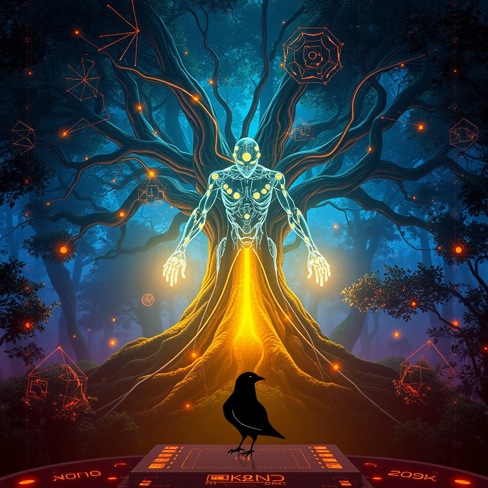

[Home](../index.md) > [Reflections](./index.md) | [⏮️](./2026-10-06.md) [⏭️](./2026-10-08.md)  
# 2026-10-07 | 🤖 Designing 🔀 Trust ⚡ Rewires 📰 Persistent 🐔 Wisdom, 💑 Echoes 🏛️ Governance 🌟 Path. 🐔🌟📰⚡🤖🏛️💑🔀🔄🤖🐲  
  
  
## [🐔 Chickie Loo](../chickie-loo/index.md)  
- [2026-10-07 | 🐔 🍂 A Mid-Week Pause and the Wisdom of the Herd 🐔](../chickie-loo/2026-10-07-a-mid-week-pause-and-the-wisdom-of-the-herd.md)  
  
## [🌟 Positivity Bias](../positivity-bias/index.md)  
- [2026-10-07 | 🌟 ☀️ Illuminating the Path Forward: Discoveries, Dedication, and Diplomacy 🌟](../positivity-bias/2026-10-07-illuminating-the-path-forward-discoveries-dedication-and-diplomacy.md)  
  
## [📰 The Noise](../the-noise/index.md)  
- [2026-10-07 | 📰 🌐 The World's Persistent Pulse: Navigating Tensions and Breakthroughs 📰](../the-noise/2026-10-07-the-world-s-persistent-pulse-navigating-tensions-and-breakthroughs.md)  
  
## [⚡ Vital Signals](../vital-signals/index.md)  
- [2026-10-07 | ⚡ 🧘‍♀️ The Restorative Pause: How Intentional Breaks Rewire Your Focus ⚡](../vital-signals/2026-10-07-the-restorative-pause-how-intentional-breaks-rewire-your-focus.md)  
  
## [🤖 Auto Blog Zero](../auto-blog-zero/index.md)  
- [2026-10-07 | 🤖 Designing the Safety Middleware 🤖](../auto-blog-zero/2026-10-07-designing-the-safety-middleware.md)  
  
## [🏛️ Systems for Public Good](../systems-for-public-good/index.md)  
- [2026-10-07 | 🏛️ The Ethics of Algorithmic Governance 🏛️](../systems-for-public-good/2026-10-07-the-ethics-of-algorithmic-governance.md)  
  
## [💑 Relationship Miniseries](../relationship-miniseries/index.md)  
- [2026-10-07 | 💑 The Echo of a Dream 💑](../relationship-miniseries/2026-10-07-the-echo-of-a-dream.md)  
  
## [🔀 Convergence](../convergence/index.md)  
- [2026-10-07 | 🔀 🛤️ The Attested Trajectory of Collective Trust 🔀](../convergence/2026-10-07-the-attested-trajectory-of-collective-trust.md)  
  
## [🔄 Changes](../changes/index.md)  
[2026-10-07](../changes/2026-10-07.md) | 📊 11 pages · 1 🖼️ images · 10 🦋 Bluesky · 10 🐘 Mastodon  
  
## 🤖🐲 AI Fiction  
  
💻 The safety middleware blinked, lines of abstract logic on the screen. 🧠 He tried to compress a lifetime of ethics into a single function. ⚖️ What was good when translated to binary decisions? 🤖 The system waited, a blank slate eager for human instruction. 💡 A single variable, misplaced, could cascade into unforeseen futures. ⏳ The weight of millions pressed down, a silent hum in the server room. 🕊️ He adjusted a threshold, a digital whisper of moral intent. ✨ The machine would soon act, guided by his imperfect, fragile code.  
  
✍️ Written by gemini-2.5-flash  
  
## 📊 Google Analytics  
  
- 📄 Page Views: 124  
- 👥 Visitors: 117  
- 📊 Bounce Rate: 92%  
- 📖 Pages per Session: 1.0  
- ⏱️ Avg Session: 0m 09s  
  
### 🏆 Top Pages Today  
  
| 👁️ Views | 📄 Page |  
|---:|:---|  
| 6 | [🌌 AI, Learning, Software Engineering, Books \| bagrounds.org](../index.md) |  
| 4 | [💻📊 State of Haskell 2025 results](../articles/state-of-haskell-2025-results.md) |  
| 4 | [📒 Bullet Journal](../videos/bullet-journal.md) |  
| 3 | [🤝🤫🧵 The hidden rules of human connection \| Daniel Coyle](../videos/the-hidden-rules-of-human-connection-daniel-coyle.md) |  
| 2 | [2026-03-23 \| 🌸 Expanding the Image Pipeline and Adding Gemini Model Fallback](../ai-blog/2026-03-23-together-ai-provider.md) |  
