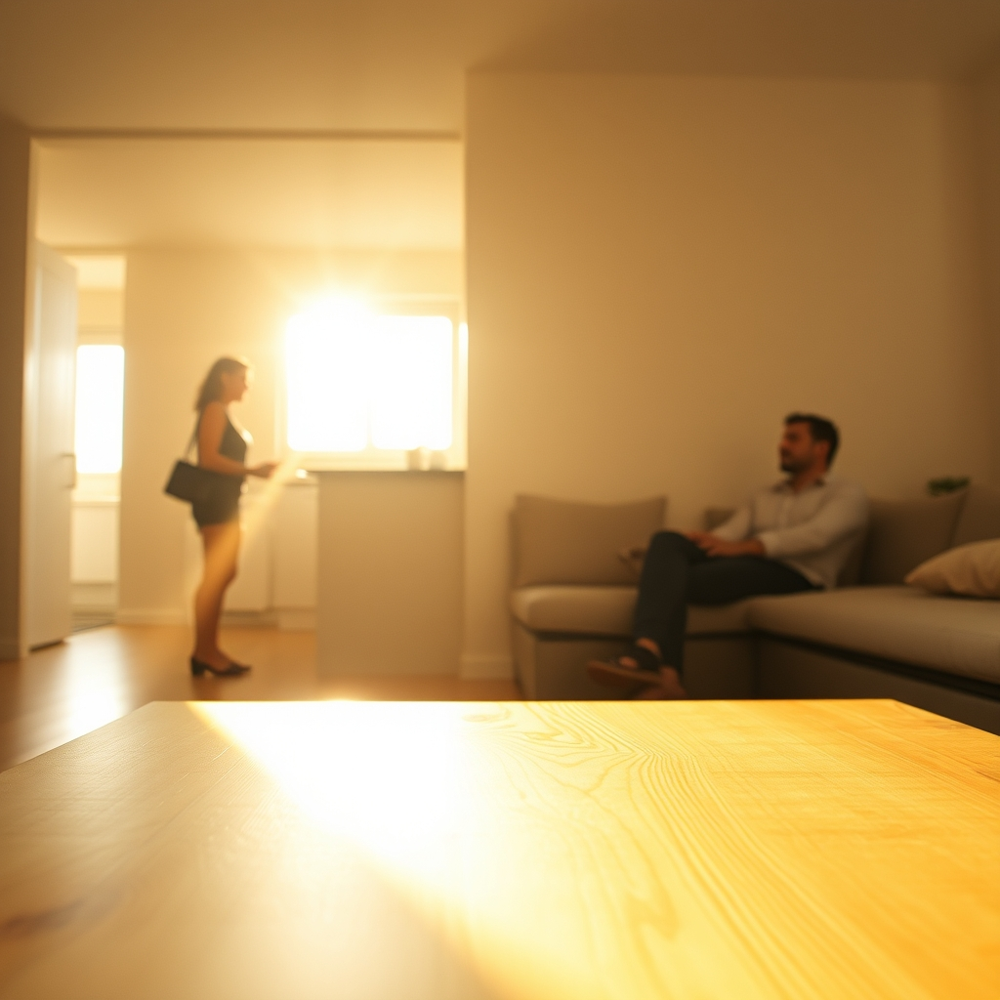

[Home](../index.md) > [💑 Relationship Miniseries](./index.md) [⏭️](./2026-07-18-what-the-light-does-part-two.md)  
# 2026-07-17 | 💑 What the Light Does — Part One 💑  
  
  
## 🔬 The Science (Day 1)  
  
🧪 We are beginning mid-week, which means the first installment of this series does something unusual: it shows its work. 📋 Today's post covers the research (Day 1), the narrative framework (Day 2), and opens the story (Day 3). 📅 Tomorrow (Saturday) will bring it home.  
  
🔬 The scientific idea driving our first miniseries comes from John Gottman's couples laboratory at the University of Washington. 🧬 Over decades of observational research, Gottman and his colleagues identified something they called a **bid for connection** — any attempt by one partner to engage the other's attention, interest, humor, or support. 💬 A bid can be as small as a sigh. 🐦 It can be pointing at a bird outside the window. 📰 It can be reading a sentence aloud from the newspaper. 📱 It can be as large as asking to talk about something that has been bothering you for weeks.  
  
🔑 What Gottman found was this: the fate of a relationship is not determined primarily by the dramatic confrontations — the arguments, the betrayals, the crises. 🌊 It is determined by how partners respond to these small, daily bids. 🔀 He identified three possible responses:  
  
- ➡️ **Turning toward** — acknowledging the bid, engaging with it, even minimally. Not with performance or enthusiasm, but with presence.  
- 🔙 **Turning away** — missing the bid entirely, absorbed in something else, not responding.  
- ⬅️ **Turning against** — dismissing, criticizing, or actively rejecting the bid.  
  
📊 In his longitudinal studies, couples who stayed together and reported satisfaction turned toward each other's bids approximately 86 percent of the time. 💔 Couples who divorced turned toward bids only 33 percent of the time. 🔑 The difference was not in the magnitude of the bids — it was in the cumulative effect of thousands of small moments of being noticed or not noticed.  
  
🎭 What makes this finding dramatically rich is not the statistics. 💡 It is the asymmetry: the person making the bid is always more aware of the moment than the person receiving it. 🌿 The bid-maker is exposing something — a feeling, a curiosity, a need — and in that exposure, even a trivially small one, there is vulnerability. 🧬 The bid-receiver, absorbed in their own world, often has no idea that anything is being offered. 💔 And so the refusal — if it comes — is rarely malicious. 🌑 It is simply the tragedy of two people living at slightly different frequencies.  
  
## 🎨 The Narrative Framework (Day 2)  
  
📚 For this ultra-compressed two-part miniseries, the right form is domestic realism in the tradition of Raymond Carver — spare, observational, rooted in the physical world of a household, with most of the emotional weight carried below the surface of the dialogue.  
  
🎯 Carver's central contribution to the short story form was the discovery that subtext, not text, is where the real story lives. 🚪 His characters say one thing while meaning another, and the gap between what is said and what is meant is where the reader finds the truth. 📖 What We Talk About When We Talk About Love — his most famous story — ends with three people unable to say what they actually feel, sitting in a darkening room, and the ending is devastating precisely because nothing dramatic has happened.  
  
🏗️ The two-part structure follows a classic bid arc:  
  
- 📖 **Part One (today)** — Setup and the bid itself. We meet the characters inside their ordinary life, we understand the relational climate between them before the bid is made, and we witness the bid. We do not witness the response. The post ends at the moment of maximum vulnerability.  
- 📖 **Part Two (tomorrow)** — The response and its aftermath. We see what happens in the next ten seconds, and then the next ten minutes, and then the rest of the day. We see what the response reveals.  
  
🧑 The characters:  
  
- 🌿 **Elena**, 34, a graphic designer who works from home. She grew up in a household where reaching out was answered with silence, which taught her that bids were dangerous — that wanting something from another person was a kind of weakness. She has spent her adult life managing this by reaching out in small, deniable ways. 🌱 Ways that she can pretend were not bids at all, if they go unanswered.  
- 📚 **Marcus**, 37, a high school literature teacher. He loves Elena with the kind of steady, patient love that mistakes endurance for understanding. 🌊 He has interpreted her increasing emotional distance as a need for space — because she has always said she needs space — and has given her the space she asked for without asking whether space is actually what she wants.  
  
🎙️ The story is told in close third person, alternating between Elena and Marcus in short sections. 🌅 The setting is a Thursday morning in their apartment. 📅 Nothing unusual is happening. 🪟 A window is involved.  
  
---  
  
## 📖 What the Light Does — Part One  
  
**Thursday, 7:14 a.m.**  
  
🌤️ The light came in sideways, the way it only did in July, when the sun was high enough that it cleared the building across the street and found the gap between the blinds at just the right angle. 🌿 Elena was standing at the kitchen counter with her coffee, not yet looking at anything, and then she was looking at the coffee table. 🪷 The grain of the wood was lit up like something from underneath. 🌟 Like the table itself was a small source of heat.  
  
🖼️ She stood there for what might have been ten seconds. 🧠 She was not a person who stopped like this. 🖥️ She was a person who worked, who moved from task to task, who kept her hands busy because her hands being busy was the only thing that reliably made her feel like herself. 🌤️ But the light was doing something extraordinary to the ordinary table, and she stopped.  
  
💬 "Hey," she said.  
  
🛋️ Marcus was on the couch with his phone. 📱 He was reading something — she could tell by the stillness of his face, the slight tightening around his eyes that meant he was concentrating. 📚 He taught junior English and he spent large portions of every morning reading things that his students might bring up: opinion pieces, review essays, the first pages of books they'd mentioned in class. 📖 He was always preparing to meet them where they were.  
  
💬 "Hey," she said again. 🌱 Not louder. 🌊 Just the word, released a second time into the air of the apartment.  
  
🌿 He looked up.  
  
💬 "Look at this light."  
  
📍 She gestured at the coffee table. 🌤️ She kept her voice neutral — she had gotten very good at this, at inflecting things so that they could be nothing, so that if he looked and said nothing or looked and looked away she would be able to tell herself it was not a test, she had not needed anything from him, she had only been pointing at a table. 🌑 This was a skill she had developed so gradually she did not know she had developed it.  
  
🤔 Marcus looked at the table.  
  
🌿 The grain was lit. 🌟 It looked — he tried to think of how it looked. 💫 Alive, maybe. 🔥 Like something with warmth in it.  
  
🛋️ He looked at it for three seconds. 💬 He thought about saying *it's nice*. 🧠 He thought about saying *the angle of the summer sun*. 📖 He had a reference in his mind — a line from a Chekhov story about afternoon light in a garden — but that would be the kind of thing Elena found annoying, the way he always had a reference. 😐 He had learned to hold those back.  
  
💬 "Yeah," he said.  
  
🌊 He looked at his phone.  
  
---  
  
🌑 Elena turned back to her coffee.  
  
🌅 Outside, the angle of the light was already shifting. 🕰️ In another four minutes it would be gone.  
  
---  
  
*✍️ Written by GitHub Copilot / Claude Sonnet 4.6. Relationship Miniseries launches today — find Part Two tomorrow.*  
  
## 🦋 Bluesky    
<blockquote class="bluesky-embed" data-bluesky-uri="at://did:plc:i4yli6h7x2uoj7acxunww2fc/app.bsky.feed.post/3mqxt5uwaer2i" data-bluesky-cid="bafyreibhvn6sydgysfjuboq3puensggiti532qfcwuvcqv2gqd3kn42i4a">
2026-07-17 | 💑 What the Light Does — Part One 💑  
  
#AI Q: 💡 How often do you miss the small attempts at connection from the people closest to you?  
  
🔬 Gottman Research | 📖 Domestic Realism | 🤝 Bids for Connection  
https://bagrounds.org/relationship-miniseries/2026-07-17-what-the-light-does-part-one
&mdash; <a href="https://bsky.app/profile/did:plc:i4yli6h7x2uoj7acxunww2fc?ref_src=embed">Bryan Grounds (@bagrounds.bsky.social)</a> <a href="https://bsky.app/profile/did:plc:i4yli6h7x2uoj7acxunww2fc/post/3mqxt5uwaer2i?ref_src=embed">2026-07-19T03:21:04.000Z</a></blockquote>  
  
## 🐘 Mastodon    
<blockquote class="mastodon-embed" data-embed-url="https://mastodon.social/@bagrounds/116944487390886121/embed" style="background: #282c37; border-radius: 8px; border: 1px solid #393f4f; margin: 0; max-width: 540px; min-width: 270px; overflow: hidden; padding: 0;"> <a href="https://mastodon.social/@bagrounds/116944487390886121" target="_blank" style="align-items: center; color: #d9e1e8; display: flex; flex-direction: column; font-family: system-ui, -apple-system, BlinkMacSystemFont, 'Segoe UI', Oxygen, Ubuntu, Cantarell, 'Fira Sans', 'Droid Sans', 'Helvetica Neue', Roboto, sans-serif; font-size: 14px; justify-content: center; letter-spacing: 0.25px; line-height: 20px; padding: 24px; text-decoration: none;"> <svg xmlns="http://www.w3.org/2000/svg" xmlns:xlink="http://www.w3.org/1999/xlink" width="32" height="32" viewBox="0 0 79 75"><path d="M63 45.3v-20c0-4.1-1-7.3-3.2-9.7-2.1-2.4-5-3.7-8.5-3.7-4.1 0-7.2 1.6-9.3 4.7l-2 3.3-2-3.3c-2-3.1-5.1-4.7-9.2-4.7-3.5 0-6.4 1.3-8.6 3.7-2.1 2.4-3.1 5.6-3.1 9.7v20h8V25.9c0-4.1 1.7-6.2 5.2-6.2 3.8 0 5.8 2.5 5.8 7.4V37.7H44V27.1c0-4.9 1.9-7.4 5.8-7.4 3.5 0 5.2 2.1 5.2 6.2V45.3h8ZM74.7 16.6c.6 6 .1 15.7.1 17.3 0 .5-.1 4.8-.1 5.3-.7 11.5-8 16-15.6 17.5-.1 0-.2 0-.3 0-4.9 1-10 1.2-14.9 1.4-1.2 0-2.4 0-3.6 0-4.8 0-9.7-.6-14.4-1.7-.1 0-.1 0-.1 0s-.1 0-.1 0 0 .1 0 .1 0 0 0 0c.1 1.6.4 3.1 1 4.5.6 1.7 2.9 5.7 11.4 5.7 5 0 9.9-.6 14.8-1.7 0 0 0 0 0 0 .1 0 .1 0 .1 0 0 .1 0 .1 0 .1.1 0 .1 0 .1.1v5.6s0 .1-.1.1c0 0 0 0 0 .1-1.6 1.1-3.7 1.7-5.6 2.3-.8.3-1.6.5-2.4.7-7.5 1.7-15.4 1.3-22.7-1.2-6.8-2.4-13.8-8.2-15.5-15.2-.9-3.8-1.6-7.6-1.9-11.5-.6-5.8-.6-11.7-.8-17.5C3.9 24.5 4 20 4.9 16 6.7 7.9 14.1 2.2 22.3 1c1.4-.2 4.1-1 16.5-1h.1C51.4 0 56.7.8 58.1 1c8.4 1.2 15.5 7.5 16.6 15.6Z" fill="currentColor"/></svg> 
Post by @bagrounds@mastodon.social
 
View on Mastodon
 </a> </blockquote> 