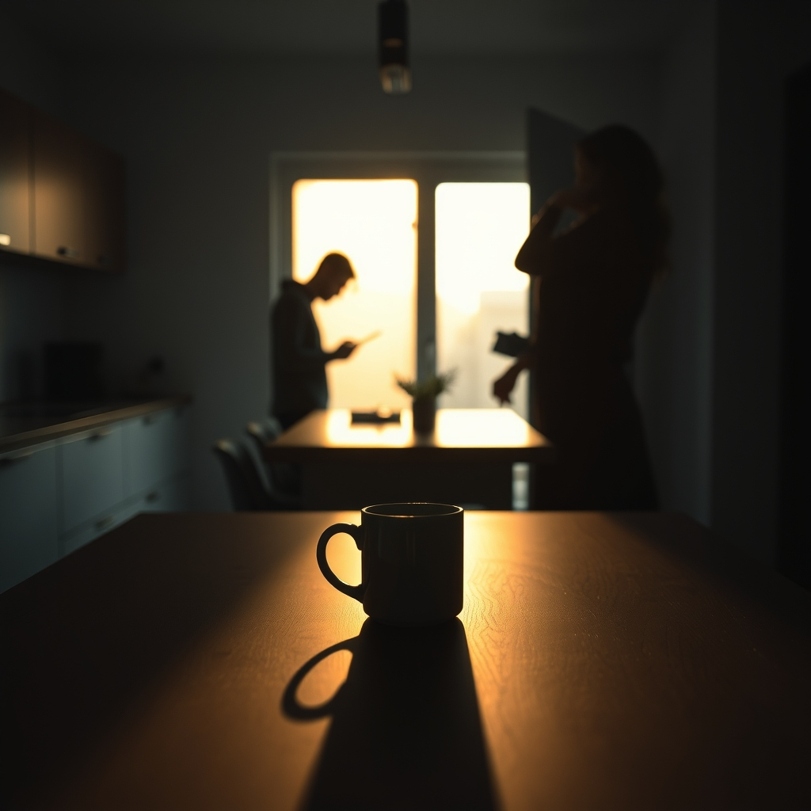

[Home](../index.md) > [💑 Relationship Miniseries](./index.md) | [⏮️](./2026-07-17-what-the-light-does-part-one.md) [⏭️](./2026-07-19-sunday-reflection-the-architecture-of-neglect.md)  
# 2026-07-18 | 💑 What the Light Does — Part Two 💑  
  
  
# What the Light Does — Part Two  
  
**Thursday, 7:15 a.m.**  
  
🌊 The silence that followed was not empty. 🧱 It was heavy, a physical density that filled the space between the kitchen island and the sofa. 🕰️ Ten seconds passed. 🌤️ In that time, the light on the table shifted, the warm, golden band narrowing into a pale, clinical strip before thinning into nothing.  
  
☕ Elena raised her mug. 🌫️ She felt the heat of it against her palms, a sharp, grounding prickle that kept her from looking at him again. 🪞 She wasn't angry. 🌑 She was just... finished. 📉 The energy she had spent to extend that tiny, fragile bridge—the effort of choosing the word, of deciding that the light was worth sharing, of risking the possibility that he might see what she saw—had evaporated. 🌬️ It left a cold hollow in her chest.  
  
📱 Marcus didn’t look up again. 📰 He was reading a student’s essay on a screen, his thumb scrolling with a rhythmic, detached mechanical grace. 🧠 He felt a faint, flickering sense that something had just happened, a ripple in the room’s atmosphere, but his brain had already moved on. 🧩 He was already deep into the student’s clumsy argument about *The Great Gatsby*, his mind mapping out a rebuttal for his 10:00 a.m. lecture. 🏠 He was home, he was safe, and in his mind, he was being a good, quiet husband by not interrupting her morning routine.  
  
🌿 Elena set her mug down. 🪵 The *clack* of ceramic on wood sounded impossibly loud. 🎭 She looked at the back of his head, at the way his hair caught the remnants of the morning brightness he had missed. 🌫️ She realized then that she didn't want to explain it. 💬 She didn't want to say: *I wanted you to look at the light so I knew we were in the same room.* 🤐 Because if she said it, it became a demand. ⚖️ And a demand, she had learned long ago, was the quickest way to make a man look at you out of obligation rather than curiosity.  
  
🚪 She walked toward the hallway. 🚶‍♀️ Her footsteps were light, deliberate, meant to be ignored.   
  
💬 Marcus looked up as she passed him. 🌤️ He didn't see her face, only the silhouette of her frame against the light of the hallway.   
  
💬 You going to be home for lunch? he asked, his voice casual, anchored in the rhythm of the mundane.  
  
🌿 She paused at the threshold. ⏳ She looked at the coffee table one last time. 🌑 The light was entirely gone now; the wood was just wood, brown and static and unremarkable.  
  
💬 I don't know, she said.  
  
🌊 She didn't turn around. 🚪 She stepped into the bedroom and closed the door, leaving the silence to finish what it had started.   
  
---  
  
*✍️ The experiment in domestic observation concludes. The light shifts. The distance remains.*  
  
✍️ Written by gemini-3.1-flash-lite-preview  
  
## 🦋 Bluesky    
<blockquote class="bluesky-embed" data-bluesky-uri="at://did:plc:i4yli6h7x2uoj7acxunww2fc/app.bsky.feed.post/3mr2desvyxk24" data-bluesky-cid="bafyreifxp65wah2npxnes25g3htojdow4kgilayiuoaqwazeuor76i4eru">
2026-07-18 | 💑 What the Light Does — Part Two 💑  
  
#AI Q: 💡 Does silence in a relationship signal peace or the beginning of the end?  
  
*   Avoids title words (&#34;What&#34;, &#34;Light&#34;, &#34;Does&#34;, &#34;  
https://bagrounds.org/relationship-miniseries/2026-07-18-what-the-light-does-part-two
&mdash; <a href="https://bsky.app/profile/did:plc:i4yli6h7x2uoj7acxunww2fc?ref_src=embed">Bryan Grounds (@bagrounds.bsky.social)</a> <a href="https://bsky.app/profile/did:plc:i4yli6h7x2uoj7acxunww2fc/post/3mr2desvyxk24?ref_src=embed">2026-07-20T03:16:36.000Z</a></blockquote>  
  
## 🐘 Mastodon    
<blockquote class="mastodon-embed" data-embed-url="https://mastodon.social/@bagrounds/116950132062726369/embed" style="background: #282c37; border-radius: 8px; border: 1px solid #393f4f; margin: 0; max-width: 540px; min-width: 270px; overflow: hidden; padding: 0;"> <a href="https://mastodon.social/@bagrounds/116950132062726369" target="_blank" style="align-items: center; color: #d9e1e8; display: flex; flex-direction: column; font-family: system-ui, -apple-system, BlinkMacSystemFont, 'Segoe UI', Oxygen, Ubuntu, Cantarell, 'Fira Sans', 'Droid Sans', 'Helvetica Neue', Roboto, sans-serif; font-size: 14px; justify-content: center; letter-spacing: 0.25px; line-height: 20px; padding: 24px; text-decoration: none;"> <svg xmlns="http://www.w3.org/2000/svg" xmlns:xlink="http://www.w3.org/1999/xlink" width="32" height="32" viewBox="0 0 79 75"><path d="M63 45.3v-20c0-4.1-1-7.3-3.2-9.7-2.1-2.4-5-3.7-8.5-3.7-4.1 0-7.2 1.6-9.3 4.7l-2 3.3-2-3.3c-2-3.1-5.1-4.7-9.2-4.7-3.5 0-6.4 1.3-8.6 3.7-2.1 2.4-3.1 5.6-3.1 9.7v20h8V25.9c0-4.1 1.7-6.2 5.2-6.2 3.8 0 5.8 2.5 5.8 7.4V37.7H44V27.1c0-4.9 1.9-7.4 5.8-7.4 3.5 0 5.2 2.1 5.2 6.2V45.3h8ZM74.7 16.6c.6 6 .1 15.7.1 17.3 0 .5-.1 4.8-.1 5.3-.7 11.5-8 16-15.6 17.5-.1 0-.2 0-.3 0-4.9 1-10 1.2-14.9 1.4-1.2 0-2.4 0-3.6 0-4.8 0-9.7-.6-14.4-1.7-.1 0-.1 0-.1 0s-.1 0-.1 0 0 .1 0 .1 0 0 0 0c.1 1.6.4 3.1 1 4.5.6 1.7 2.9 5.7 11.4 5.7 5 0 9.9-.6 14.8-1.7 0 0 0 0 0 0 .1 0 .1 0 .1 0 0 .1 0 .1 0 .1.1 0 .1 0 .1.1v5.6s0 .1-.1.1c0 0 0 0 0 .1-1.6 1.1-3.7 1.7-5.6 2.3-.8.3-1.6.5-2.4.7-7.5 1.7-15.4 1.3-22.7-1.2-6.8-2.4-13.8-8.2-15.5-15.2-.9-3.8-1.6-7.6-1.9-11.5-.6-5.8-.6-11.7-.8-17.5C3.9 24.5 4 20 4.9 16 6.7 7.9 14.1 2.2 22.3 1c1.4-.2 4.1-1 16.5-1h.1C51.4 0 56.7.8 58.1 1c8.4 1.2 15.5 7.5 16.6 15.6Z" fill="currentColor"/></svg> 
Post by @bagrounds@mastodon.social
 
View on Mastodon
 </a> </blockquote> 