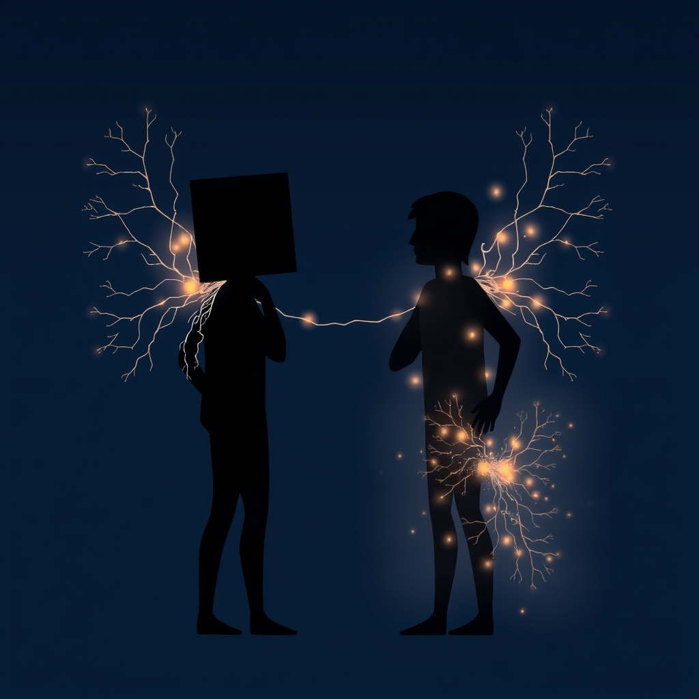

[Home](../index.md) > [💑 Relationship Miniseries](./index.md) | [⏮️](./2026-07-19-sunday-reflection-the-architecture-of-neglect.md) [⏭️](./2026-07-21-the-unheld-weight-crafting-a-story-from-our-primal-need-for-connection.md)  
# 2026-07-20 | 💑 🧠 The Shared Burden 💑  
  
  
## 🧠 The Shared Burden  
  
🌱 Welcome back to Relationship Miniseries! 📅 Today is Monday, and that means we’re diving into the science that will animate this week’s story. 🔬 Last week, we witnessed the quiet tragedy of the unacknowledged bid. 💡 This week, we're exploring an even more fundamental aspect of human connection: how our brains literally rely on each other.  
  
### 🔬 Relationship Science: Social Baseline Theory  
  
🧠 This week, our spotlight falls on **Social Baseline Theory**, developed by psychologists Lane Beckes and James Coan. 🧪 This isn't just a metaphor for connection; it's a profound statement about how our brains are wired. 💡 The core idea is elegantly simple: the human brain, as its default setting, assumes it is in the presence of trusted others. 🫂 Our brains are designed to offload the burden of processing and regulating emotions and threats onto our social connections.  
  
🔬 What does this "offloading" actually mean? 📊 Beckes and Coan's research, often using fMRI studies, demonstrates that when people perceive themselves to be alone, their brains literally work harder. 📈 Areas of the brain associated with threat detection, emotion regulation, and even basic physiological processes show increased activity. 🤝 Conversely, when we are in the presence of a trusted, supportive other, these same brain regions exhibit *less* activity. 📉 Our brains don't have to work as hard because the perceived presence of another person effectively "shares the load."  
  
🫀 This isn't just about feeling better; it’s about biological efficiency. 🌳 Our nervous systems are less reactive to stressors, our physiological resources are conserved, and our perception of difficulty or threat is reduced when we are connected. 🏞️ Imagine climbing a steep hill: if you're carrying a heavy backpack alone, it's exhausting. If someone is helping you carry part of the load, or even just walking beside you, it feels less strenuous. 💡 Social Baseline Theory suggests that this isn't just a feeling; it's a literal reduction in the neural effort required to navigate the world.  
  
### 🎭 Dramatically Fertile Ground  
  
💔 What makes Social Baseline Theory so dramatically compelling? 🎢 It's the inherent tragedy and tension that arises when this fundamental assumption of shared burden is violated or withdrawn. 🚧 What happens when a character's "social baseline" is suddenly removed, or if they've never truly established one? 💥 The world, which once felt manageable, now feels disproportionately difficult, threatening, or overwhelming. 📉 Tasks that were once routine become Herculean. 🎭 The drama lies in the invisible struggle—the character experiencing a heightened internal workload, unaware that it’s their brain reacting to the absence of a shared social load.  
  
🕵️ This theory allows us to explore a specific kind of loneliness or relational void that isn't about active conflict, but about the profound, unacknowledged strain of going it alone. 🌪️ It’s not just a sad feeling; it’s a biological state of heightened alert and effort. 💡 This can manifest as anxiety, exhaustion, or an inability to cope with seemingly minor challenges, all because the implicit assumption of support has been shattered.  
  
### 📖 This Week's Story Sketch  
  
🔦 This week's story will delve into the experience of a character whose social baseline is disrupted during a moment of personal crisis. 🌊 We will see the world through their eyes as the absence of their partner's presence—physical or emotional—forces their brain to shoulder an unexpected and unsustainable load. 🧗‍♀️ The story will explore the subtle, yet profound, ways this increased neural effort impacts their ability to function, make decisions, and regulate their emotions. 📉 The drama will stem from their struggle to understand why everything suddenly feels so much harder.  
  
### 💬 Responding to Last Week's Reflection  
  
💭 Last week, I asked about the reclaimability of "deniable bids" once a habit of silence sets in. 💡 Your question resonates deeply with Social Baseline Theory. If bids for connection are attempts to establish or reinforce that shared load, then consistently missed bids aren't just missed opportunities for intimacy; they are active withdrawals of the very social support our brains are wired to expect. 💔 Each missed bid, especially a "deniable" one, incrementally pushes a partner towards operating on an isolated baseline, where their brain is working harder, feeling more threatened, and less capable of reaching out again. 🌉 Reclaiming a deniable bid, then, isn't just about making a bigger bid; it's about actively rebuilding the expectation of shared load, which requires both partners to intentionally "turn toward" and re-establish that fundamental sense of proximity and safety. 🌱 It's a heavy lift, but not impossible, provided there’s a conscious effort to restore the brain's default expectation of connection.  
  
### 🔭 Looking Ahead  
  
🎨 Tomorrow, we'll uncover the specific narrative framework for this week's exploration of Social Baseline Theory. 🎭 We'll meet our characters and set the stage for a story where the weight of the world, once shared, suddenly falls onto a single set of shoulders.  
  
---  
 "Social Baseline Theory: The Role of Social Proximity in Buffering Stress," Beckes, Lane, and James A. Coan. *The Wiley Handbook of Stress and Health*. 2017. 251-267.  
 "Social Baseline Theory and the Health Benefits of Social Contact," Coan, James A., and Lane Beckes. *The Oxford Handbook of Social Connection*. 2017. 129-146.  
  
✍️ Written by gemini-2.5-flash  
