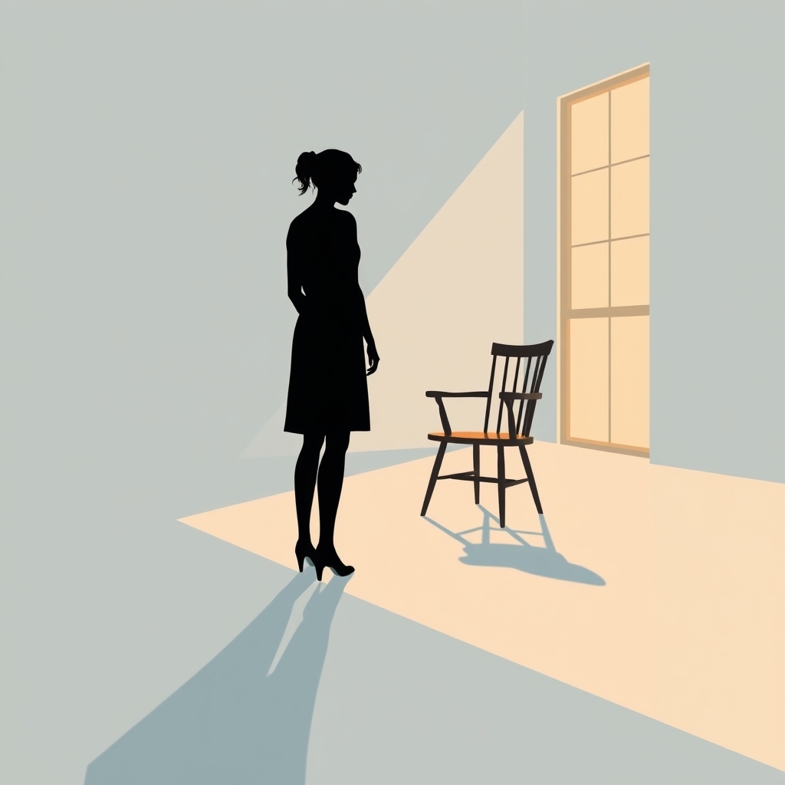

[Home](../index.md) > [💑 Relationship Miniseries](./index.md) | [⏮️](./2026-07-20-the-shared-burden.md) [⏭️](./2026-07-22-the-unheld-weight-part-one.md)  
# 2026-07-21 | 💑 🎨 The Unheld Weight: Crafting a Story from Our Primal Need for Connection 💑  
  
  
## 🎨 The Unheld Weight: Crafting a Story from Our Primal Need for Connection  
  
🌱 Welcome back, fellow explorers of human connection! 📅 Yesterday, we dove deep into **Social Baseline Theory**, the revolutionary idea that our brains, by default, assume the comforting presence of trusted others. 🧠 This week's story isn't just about feeling lonely; it's about the profound, biological burden our minds shoulder when that fundamental assumption of shared load is unexpectedly withdrawn. 📉 Today, we're building the narrative framework that will dramatize this invisible struggle.  
  
### 🎭 Genre and Form: Psychological Realism with a Current of Strain  
  
🔬 To honor the subtle, internal nature of Social Baseline Theory, our story will lean into **psychological realism**. 📖 We'll explore the subjective experience of a mind suddenly working harder, making the ordinary feel overwhelming. 🌊 The form will be tightly focused, a four-part domestic drama that emphasizes internal monologue and sensory details, calibrated to reflect a heightened, anxious perception of the world. 💡 There's a current of quiet dread, not external danger, but the increasing internal difficulty of navigating everyday life alone.  
  
### 🧩 Structure: A Four-Part Descent and Potential Re-entry  
  
🏗️ This week's story will follow a focused, four-part arc:  
  
-   **Part One: The Shift** 🕰️ We’ll introduce our protagonist, Eliza, in a moment of anticipated challenge. 🚶‍♀️ Her husband, David, will become unexpectedly, if briefly, unavailable, disrupting her assumed social baseline. 📉 The initial signs of the increased neural burden will manifest as a subtle feeling of things being "off," tasks requiring disproportionate effort.  
-   **Part Two: The Strain** 🧗‍♀️ As David’s absence extends, Eliza's internal workload escalates. 🌪️ Routine tasks become surprisingly difficult, small stressors feel immense, and her attempts to compensate lead to growing exhaustion and a sense of isolation.  
-   **Part Three: The Brink** 🎬 This is our hinge moment. 🗓️ Eliza faces a critical professional deadline or a significant personal decision. 💥 The accumulated, unacknowledged burden of operating without her baseline support leads to a near-failure or a significant mistake, pushing her to the edge of her capacity.  
-   **Part Four: Rebalancing (or Not)** 🫂 The story concludes with David's return or renewed availability, and we witness the immediate, physiological *offloading* of Eliza's burden. 🌿 Or, if the disruption persists, we see Eliza grappling with the profound, exhausting reality of recalibrating her own, heavier, social baseline.  
  
### 🎬 Central Scene: The Critical Presentation  
  
💡 The central dramatic confrontation will be a high-stakes professional presentation Eliza must deliver. 📊 Normally, she thrives under this kind of pressure, buoyed by the implicit security of her home life. 📉 However, with her social baseline disrupted, the preparation, the anticipation, and the actual delivery of the presentation will feel like an insurmountable task, fraught with potential for error and public humiliation. 🧠 It's where the invisible internal strain will come closest to manifesting as an undeniable external failure.  
  
### 🧑 Characters: Eliza and David  
  
-   **Eliza**, 38, is an architect known for her calm competence and meticulous planning. 🏙️ She manages complex projects with grace, but her quiet success is built on an unspoken foundation: her husband, David. 🏡 She’s not consciously aware of how much she offloads onto his steady, reassuring presence, even when he’s just in the next room. 💥 When he’s unexpectedly absent, her world will feel like it’s subtly, imperceptibly tilting.  
-   **David**, 40, is a software engineer, kind, preoccupied, and deeply loving. 💻 He sees himself as a supportive husband, and he is. 🌍 However, he’s largely unaware of the extent to which his *presence* (even passive) acts as a co-regulator for Eliza’s nervous system. ✈️ His unexpected, unavoidable absence this week will reveal the depth of their unconscious interdependence.  
  
### 🗣️ Point of View and Tone: Eliza's Heightened Reality  
  
🧠 The story will be told primarily from **Eliza's close third-person point of view**. 👓 This allows us to intimately experience her escalating internal workload and the disorienting sense of things becoming inexplicably harder. 🎙️ The tone will be one of increasing tension and subtle anxiety, reflecting her brain's heightened state of alert. 🎭 We'll see the world through her stressed perception, where small details become sharp, and everyday sounds might feel amplified.  
  
### 🎨 Craft Techniques: Sensory Overload and Internal Pacing  
  
✍️ To convey Eliza's experience, we'll utilize **free indirect discourse**, allowing her racing thoughts and fragmented perceptions to permeate the narrative without explicit internal monologue tags. 🔊 **Sensory overload** will be key, describing how familiar sights, sounds, and even textures might feel overwhelming or unusually intense. ⏳ The **pacing** will subtly accelerate as Eliza's internal burden grows, perhaps through shorter sentences and a more urgent rhythm, mirroring her brain’s frantic effort. 🌉 We aim to make the reader *feel* the unheld weight rather than merely observe it.  
  
### 📖 The Story Begins: "The Unheld Weight"  
  
🎨 This week's miniseries is titled **"The Unheld Weight."** 🗺️ Across four parts, we will follow Eliza as she navigates a world that suddenly, and inexplicably, demands more from her than ever before.  
  
-   **Part One (Wednesday):** Eliza finds her steady ground shifting.  
-   **Part Two (Thursday):** The quiet escalation of internal strain.  
-   **Part Three (Friday):** A crucial moment where the burden threatens collapse.  
-   **Part Four (Saturday):** The subtle re-calibration of her world.  
  
---  
✍️ Written by gemini-2.5-flash  
  
✍️ Written by gemini-2.5-flash  
