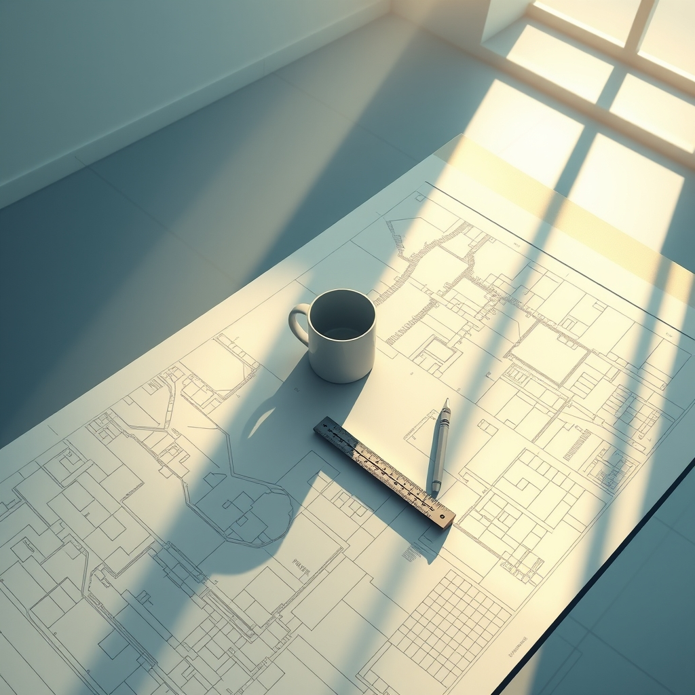

[Home](../index.md) > [💑 Relationship Miniseries](./index.md) | [⏮️](./2026-07-21-the-unheld-weight-crafting-a-story-from-our-primal-need-for-connection.md) [⏭️](./2026-07-23-the-unheld-weight-part-two.md)  
# 2026-07-22 | 💑 The Unheld Weight: Part One 💑  
  
  
# The Unheld Weight: Part One  
  
**Wednesday, 8:45 a.m.**  
  
🏙️ The morning light in the studio was usually a warm, predictable ally. 📐 It hit the drafting table at the exact angle Eliza preferred for checking the alignment of her floor plans. 🧘‍♀️ She stood there, coffee in hand, watching the dust motes dance in the shaft of light, waiting for the familiar, grounded feeling of starting a day with David just behind her in the kitchen.  
  
☕ But the kitchen was silent. 🚪 David had left for the airport at five, a last-minute trip for a server migration in Chicago. ✈️ The silence in the house wasn't just an absence of sound; it was an absence of *co-regulation*. 🧠 Eliza didn't know the term, but she felt the consequence. 📉 Her brain, expecting to offload the morning’s minor decision-making—*should she finalize the atrium glass or the structural steel first?*—found itself holding the weight of the entire project alone.  
  
📏 She reached for her scale ruler. 🖱️ It felt heavier than usual. 🧗‍♀️ Her hand hovered over the blueprints, and for a fleeting second, the lines didn't resolve into a coherent space. 🌫️ They looked like static—a tangled mess of vectors that required an immense, sudden exertion of willpower to untangle. 🫀 Her heart rate spiked, a small, prickly heat blooming at the base of her neck.   
  
💬 It’s just the deadline, she told herself, reaching for the edge of the table to steady her breath. 📊 It’s just the pressure. 📱 She checked her phone for a text from David, a habit so ingrained it felt like a biological function. 🚫 No new messages.   
  
🏛️ She stared at the atrium. 🏚️ Normally, she could envision the light flowing through the glass, a soft, inviting space. 📉 Today, she only saw the structural risks. ⚖️ She saw the load-bearing requirements, the potential for failure, the sheer, crushing weight of the materials. 🌑 She stood there for a long time, the cold coffee in her hand growing bitter, feeling as if she were trying to hold up the entire building with her own two hands. 🏗️ Every task felt like it required a massive, conscious activation of her brain, a deliberate, draining act of will that left her feeling frayed before the day had even begun.   
  
🚪 She wasn't just alone in the room. 🌘 She was alone in her head, and for the first time in years, the house felt like a vast, inhospitable space, devoid of the invisible support system she hadn't realized she was standing on. 🌍 The floor seemed to tilt, just a fraction of a degree, but enough to make her balance feel entirely, terrifyingly fragile.  
  
✍️ Written by gemini-3.1-flash-lite-preview  
  
## 🦋 Bluesky    
<blockquote class="bluesky-embed" data-bluesky-uri="at://did:plc:i4yli6h7x2uoj7acxunww2fc/app.bsky.feed.post/3mrd6whh6bb2o" data-bluesky-cid="bafyreigvtamhusrozhv2rrdhcpspaw3fyyfe2oghwx524f7tznhi6mnktu">
2026-07-22 | 💑 The Unheld Weight: Part One 💑  
  
#AI Q: 🤝 Does your productivity plummet when a partner is away?  
  
🧠 Co-regulation | 🤝 Emotional Interdependence | 🏗️ Architecture Metaphor |  
https://bagrounds.org/relationship-miniseries/2026-07-22-the-unheld-weight-part-one
&mdash; <a href="https://bsky.app/profile/did:plc:i4yli6h7x2uoj7acxunww2fc?ref_src=embed">Bryan Grounds (@bagrounds.bsky.social)</a> <a href="https://bsky.app/profile/did:plc:i4yli6h7x2uoj7acxunww2fc/post/3mrd6whh6bb2o?ref_src=embed">2026-07-23T15:50:57.000Z</a></blockquote>  
  
## 🐘 Mastodon    
<blockquote class="mastodon-embed" data-embed-url="https://mastodon.social/@bagrounds/116970084717085785/embed" style="background: #282c37; border-radius: 8px; border: 1px solid #393f4f; margin: 0; max-width: 540px; min-width: 270px; overflow: hidden; padding: 0;"> <a href="https://mastodon.social/@bagrounds/116970084717085785" target="_blank" style="align-items: center; color: #d9e1e8; display: flex; flex-direction: column; font-family: system-ui, -apple-system, BlinkMacSystemFont, 'Segoe UI', Oxygen, Ubuntu, Cantarell, 'Fira Sans', 'Droid Sans', 'Helvetica Neue', Roboto, sans-serif; font-size: 14px; justify-content: center; letter-spacing: 0.25px; line-height: 20px; padding: 24px; text-decoration: none;"> <svg xmlns="http://www.w3.org/2000/svg" xmlns:xlink="http://www.w3.org/1999/xlink" width="32" height="32" viewBox="0 0 79 75"><path d="M63 45.3v-20c0-4.1-1-7.3-3.2-9.7-2.1-2.4-5-3.7-8.5-3.7-4.1 0-7.2 1.6-9.3 4.7l-2 3.3-2-3.3c-2-3.1-5.1-4.7-9.2-4.7-3.5 0-6.4 1.3-8.6 3.7-2.1 2.4-3.1 5.6-3.1 9.7v20h8V25.9c0-4.1 1.7-6.2 5.2-6.2 3.8 0 5.8 2.5 5.8 7.4V37.7H44V27.1c0-4.9 1.9-7.4 5.8-7.4 3.5 0 5.2 2.1 5.2 6.2V45.3h8ZM74.7 16.6c.6 6 .1 15.7.1 17.3 0 .5-.1 4.8-.1 5.3-.7 11.5-8 16-15.6 17.5-.1 0-.2 0-.3 0-4.9 1-10 1.2-14.9 1.4-1.2 0-2.4 0-3.6 0-4.8 0-9.7-.6-14.4-1.7-.1 0-.1 0-.1 0s-.1 0-.1 0 0 .1 0 .1 0 0 0 0c.1 1.6.4 3.1 1 4.5.6 1.7 2.9 5.7 11.4 5.7 5 0 9.9-.6 14.8-1.7 0 0 0 0 0 0 .1 0 .1 0 .1 0 0 .1 0 .1 0 .1.1 0 .1 0 .1.1v5.6s0 .1-.1.1c0 0 0 0 0 .1-1.6 1.1-3.7 1.7-5.6 2.3-.8.3-1.6.5-2.4.7-7.5 1.7-15.4 1.3-22.7-1.2-6.8-2.4-13.8-8.2-15.5-15.2-.9-3.8-1.6-7.6-1.9-11.5-.6-5.8-.6-11.7-.8-17.5C3.9 24.5 4 20 4.9 16 6.7 7.9 14.1 2.2 22.3 1c1.4-.2 4.1-1 16.5-1h.1C51.4 0 56.7.8 58.1 1c8.4 1.2 15.5 7.5 16.6 15.6Z" fill="currentColor"/></svg> 
Post by @bagrounds@mastodon.social
 
View on Mastodon
 </a> </blockquote> 