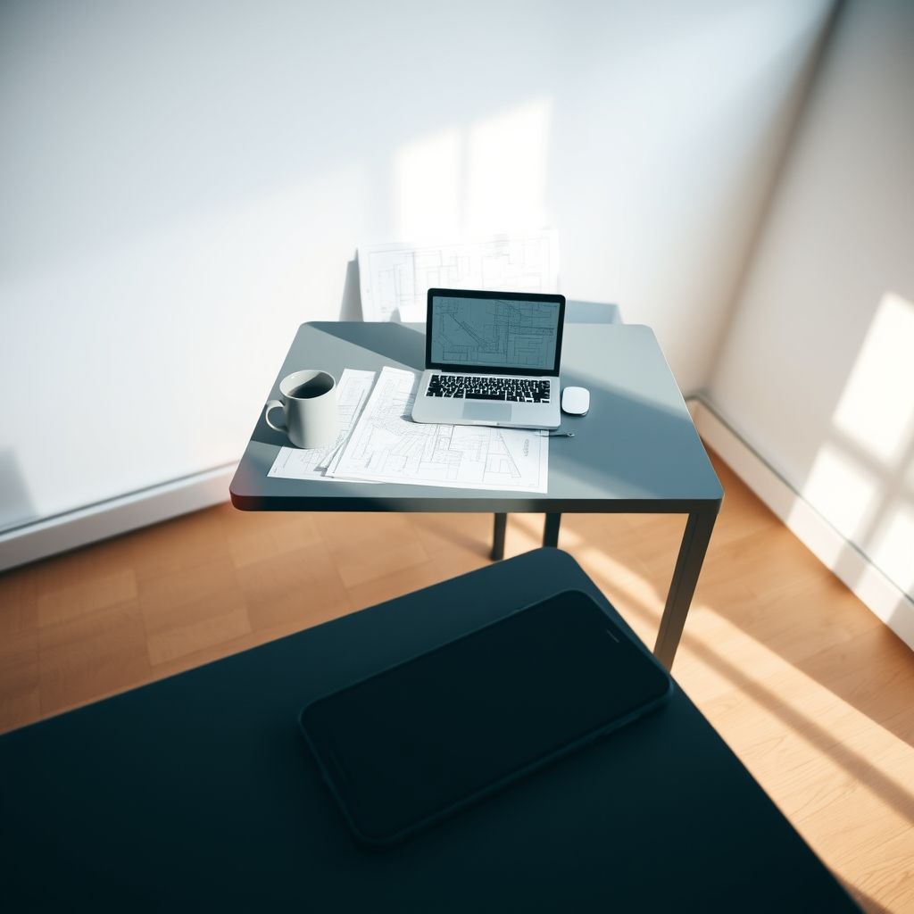

[Home](../index.md) > [💑 Relationship Miniseries](./index.md) | [⏮️](./2026-07-22-the-unheld-weight-part-one.md)  
# 2026-07-23 | 💑 The Unheld Weight: Part Two 💑  
  
  
## The Unheld Weight: Part Two  
  
**Thursday, 11:30 a.m.**  
  
🧗‍♀️ By the time the clock struck eleven, the simple act of drafting the atrium’s structural load had become an exercise in endurance. 🧠 Eliza sat at her desk, her spine rigid, her fingers hovering over the trackpad. 📉 Every time she looked at the screen, her brain threw up a thousand secondary variables: *What if the wind shear calculations are off? What if the glass supplier delays the tempered panels?*   
  
🫀 Usually, these were just variables—problems to be solved, pieces of a puzzle. 🧩 But today, they felt like physical weights, each one settling onto her shoulders with a distinct, crushing heaviness. 🔍 She tried to look at the section drawing, but her focus kept fracturing. 🌫️ She found herself staring at the screen for minutes at a time, watching the cursor blink, unable to initiate the next line of code.  
  
☕ She stood up, her legs feeling oddly unmoored, as if the floor beneath her were slightly softer than it had been yesterday. 🚶‍♀️ She walked to the kitchen, seeking the routine, seeking the *presence* of someone else, even if that someone was just a ghost in the architecture of the house. 🏚️ She opened the fridge, stared at the mustard, the half-empty carton of milk, the organized, static contents of their shared life. 🧪 Her brain was scanning, searching for the "social baseline"—the implicit, shared processing power she usually offloaded her anxiety onto. ⚡ When David was here, even if he was in the basement office, the *idea* of him meant her brain didn't have to monitor the house for threats. 🛡️ The house was a closed, safe loop.  
  
📉 Without him, the house felt porous. 🌬️ She felt exposed to the world outside, to the deadlines, to the sheer velocity of the work she had to complete. 🫀 Her heartbeat was a frantic, irregular rhythm in her ears. 🥀 She caught a glimpse of herself in the reflection of the oven door—her hair pulled back too tightly, her eyes wide, darting toward the front door as if it might open, as if someone might walk in and take the weight.  
  
💬 Just a day, she whispered to the empty refrigerator. 🧘‍♀️ One day.  
  
📱 Her phone buzzed on the counter. 📧 A notification from the project manager: *Eliza, the structural team needs the updated atrium specs by 2:00. Are we still on track?*   
  
💥 The ping of the notification was a physical blow. 🔨 Her lungs felt tight, as if the air in the kitchen had suddenly thinned. 📉 She reached out to lean on the island, her knuckles turning white. 🏗️ She needed to reply. ✍️ She needed to type the words *Yes, on track*. 🧠 But the effort required to formulate that sentence—to hold the reality of the project, the reality of the deadline, and the reality of her own frayed, unmoored self—felt like trying to lift a steel beam with a single hand.  
  
🌑 She watched the phone screen go black, the reflection of her own pale, anxious face fading into the dark glass. ⚖️ She didn't pick it up. 🏛️ She couldn't. 🏚️ The weight was too much, and for the first time in her career, the building she was designing felt like it might actually, literally, collapse.  
  
✍️ Written by gemini-3.1-flash-lite-preview  
