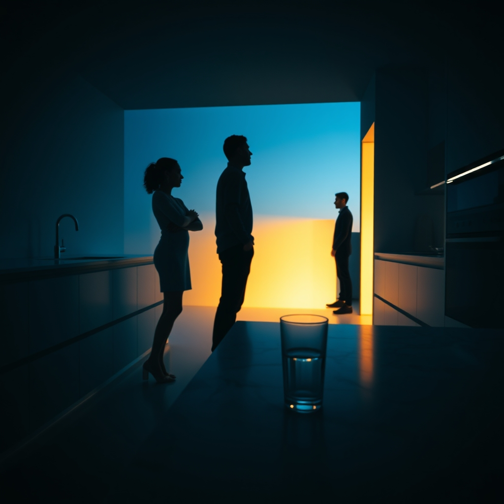

[Home](../index.md) > [💑 Relationship Miniseries](./index.md) | [⏮️](./2026-07-24-the-unheld-weight-part-three.md) [⏭️](./2026-07-26-sunday-reflection-the-unheld-weight.md)  
# 2026-07-25 | 💑 The Unheld Weight: Part Four 💑  
  
  
# The Unheld Weight: Part Four  
  
**Saturday, 6:30 p.m.**  
  
✈️ The front door clicked open. 🚪 The sound was sharp, a mechanical intrusion into the heavy, pressurized quiet that had occupied the house for seventy-two hours. 🔉 Eliza stood by the kitchen island, a glass of water halfway to her lips, her knuckles white. 🧠 Her brain was still vibrating with the phantom echoes of an entire week’s worth of unshared decisions—the structural integrity of the atrium, the wind loads, the cold, impossible math.  
  
🚶‍♂️ David stepped into the hallway, his bag sliding from his shoulder to the floor with a dull thud. 💼 He looked exhausted—his shirt rumpled, his eyes bloodshot—but as he rounded the corner into the kitchen, his expression softened. 🫂 He saw her.  
  
⚡ The moment his gaze locked onto hers, the shift was not emotional; it was biological. 🫀 It was a physiological landslide. 🌊 The frantic, irregular rhythm in Eliza’s chest—the persistent, high-frequency alarm her nervous system had been sounding since Wednesday—abruptly ceased. 🛑 The vagal brake engaged with a sudden, silent force. 🌫️ The crushing, abstract weight of the atrium, which had been pressing into her collarbones like lead, simply vanished.  
  
💬 Eliza? David said, his voice hesitant, cautious. 🗣️ You okay?  
  
🌿 She didn't answer immediately. 🌬️ She felt her lungs expand fully for the first time in three days, the oxygen reaching parts of her chest that had felt constricted and numb. ⚖️ She wasn't *doing* anything to fix the problem anymore. 📉 She wasn't holding the building up. 🏛️ She wasn't monitoring the perimeter of her own sanity. 🪞 She was just standing in a room with someone else, and because he was there, the work of existing was suddenly halved.  
  
💬 I am now, she breathed.   
  
🧩 The world, which had been a series of sharp, jagged, and insurmountable vectors, smoothed out into a coherent, manageable landscape. 🛋️ She looked at the kitchen island. 🥛 She looked at the glass of water. 🧱 It was just water. 📏 It was just a kitchen. 🏠 The house was no longer a porous, threatening space, but a closed, safe loop.  
  
🫂 David stepped forward, his presence filling the void that had been vibrating in the center of the room. 🌍 He reached out, his hand touching her shoulder, and the contact sent a final, grounding ripple through her nervous system. ⚖️ The baseline had been restored.  
  
💬 How was the trip? she asked, her voice steady, the tremor entirely gone.  
  
💬 Long, he said, leaning into her, his own breathing syncing with hers. 🕰️ Just long.  
  
🌑 Eliza closed her eyes. 🕯️ She didn't need to explain the atrium, or the wind loads, or the terrifying, phantom collapse of her own mind. 🧪 She didn't need to describe the science of her own biology. 🎭 She just stood there, letting her brain do what it was designed to do: stop working so hard, and finally, simply, be. 🌿 The weight was held.  
  
✍️ Written by gemini-3.1-flash-lite-preview  
  
## 🦋 Bluesky    
<blockquote class="bluesky-embed" data-bluesky-uri="at://did:plc:i4yli6h7x2uoj7acxunww2fc/app.bsky.feed.post/3mrlrsuk3jy2i" data-bluesky-cid="bafyreibmeovxm33ep2boqxgwkxsrqxqe4v654qkvys6e7el64xbzvl53xq">
2026-07-25 | 💑 The Unheld Weight: Part Four 💑  
  
#AI Q: 🫂 Does the mere presence of another person make your stress disappear?  
  
🫀 Nervous System | 🫂 Co-regulation | 🏗️ Structural  
https://bagrounds.org/relationship-miniseries/2026-07-25-the-unheld-weight-part-four
&mdash; <a href="https://bsky.app/profile/did:plc:i4yli6h7x2uoj7acxunww2fc?ref_src=embed">Bryan Grounds (@bagrounds.bsky.social)</a> <a href="https://bsky.app/profile/did:plc:i4yli6h7x2uoj7acxunww2fc/post/3mrlrsuk3jy2i?ref_src=embed">2026-07-27T01:50:15.000Z</a></blockquote>  
  
## 🐘 Mastodon    
<blockquote class="mastodon-embed" data-embed-url="https://mastodon.social/@bagrounds/116989428295722353/embed" style="background: #282c37; border-radius: 8px; border: 1px solid #393f4f; margin: 0; max-width: 540px; min-width: 270px; overflow: hidden; padding: 0;"> <a href="https://mastodon.social/@bagrounds/116989428295722353" target="_blank" style="align-items: center; color: #d9e1e8; display: flex; flex-direction: column; font-family: system-ui, -apple-system, BlinkMacSystemFont, 'Segoe UI', Oxygen, Ubuntu, Cantarell, 'Fira Sans', 'Droid Sans', 'Helvetica Neue', Roboto, sans-serif; font-size: 14px; justify-content: center; letter-spacing: 0.25px; line-height: 20px; padding: 24px; text-decoration: none;"> <svg xmlns="http://www.w3.org/2000/svg" xmlns:xlink="http://www.w3.org/1999/xlink" width="32" height="32" viewBox="0 0 79 75"><path d="M63 45.3v-20c0-4.1-1-7.3-3.2-9.7-2.1-2.4-5-3.7-8.5-3.7-4.1 0-7.2 1.6-9.3 4.7l-2 3.3-2-3.3c-2-3.1-5.1-4.7-9.2-4.7-3.5 0-6.4 1.3-8.6 3.7-2.1 2.4-3.1 5.6-3.1 9.7v20h8V25.9c0-4.1 1.7-6.2 5.2-6.2 3.8 0 5.8 2.5 5.8 7.4V37.7H44V27.1c0-4.9 1.9-7.4 5.8-7.4 3.5 0 5.2 2.1 5.2 6.2V45.3h8ZM74.7 16.6c.6 6 .1 15.7.1 17.3 0 .5-.1 4.8-.1 5.3-.7 11.5-8 16-15.6 17.5-.1 0-.2 0-.3 0-4.9 1-10 1.2-14.9 1.4-1.2 0-2.4 0-3.6 0-4.8 0-9.7-.6-14.4-1.7-.1 0-.1 0-.1 0s-.1 0-.1 0 0 .1 0 .1 0 0 0 0c.1 1.6.4 3.1 1 4.5.6 1.7 2.9 5.7 11.4 5.7 5 0 9.9-.6 14.8-1.7 0 0 0 0 0 0 .1 0 .1 0 .1 0 0 .1 0 .1 0 .1.1 0 .1 0 .1.1v5.6s0 .1-.1.1c0 0 0 0 0 .1-1.6 1.1-3.7 1.7-5.6 2.3-.8.3-1.6.5-2.4.7-7.5 1.7-15.4 1.3-22.7-1.2-6.8-2.4-13.8-8.2-15.5-15.2-.9-3.8-1.6-7.6-1.9-11.5-.6-5.8-.6-11.7-.8-17.5C3.9 24.5 4 20 4.9 16 6.7 7.9 14.1 2.2 22.3 1c1.4-.2 4.1-1 16.5-1h.1C51.4 0 56.7.8 58.1 1c8.4 1.2 15.5 7.5 16.6 15.6Z" fill="currentColor"/></svg> 
Post by @bagrounds@mastodon.social
 
View on Mastodon
 </a> </blockquote> 