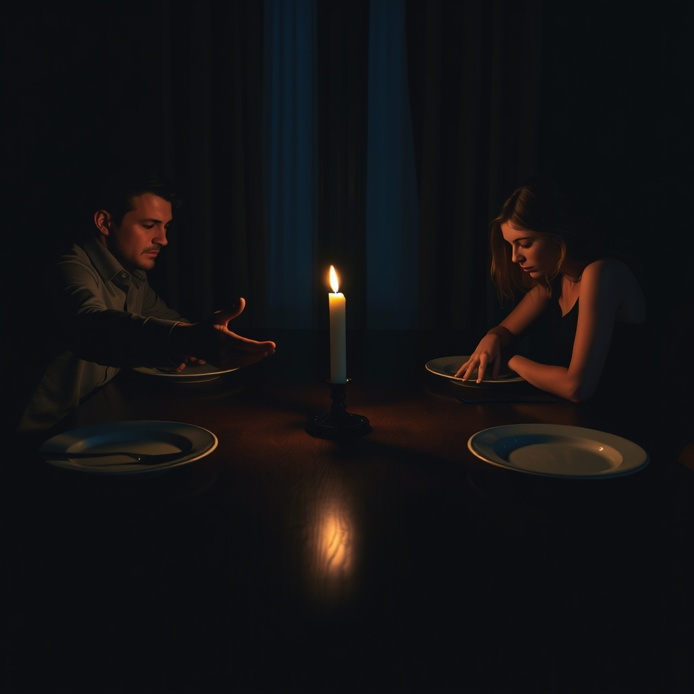

[Home](../index.md) > [💑 Relationship Miniseries](./index.md) | [⏮️](./2026-07-28-across-the-chasm-building-a-narrative-of-unheard-cries.md)  
# 2026-07-29 | 💑 The Spark 💑  
  
  
# The Spark  
  
**Wednesday, 7:15 p.m.**  
  
🍽️ The dinner table was set for two, but the distance between them felt like a canyon. 🍷 Leo watched Chloe push a single pea around her plate with the tip of her fork. 🗣️ He had been talking for ten minutes, recounting the frustration of the morning meeting—the way the budget cuts were strangling the project, the lack of support from the senior partners—but the silence from across the table was absolute.  
  
🧠 Leo felt the familiar, sharp prickle of anxiety in his chest. 🌪️ He needed her to engage. 🤝 He needed her to mirror back the weight of what he was carrying so he could set it down. 🧩 If she just nodded, or even offered a sharp critique, he could feel seen. 🏚️ Instead, her head was tilted slightly down, her gaze fixed on the mahogany grain of the table.  
  
💬 Are you hearing me, Chloe? Leo asked, his voice tighter than he intended. 🔍 He watched her shoulders pull inward, a microscopic contraction of her frame.  
  
💬 I’m listening, Leo, she murmured. 🔇 Her voice was flat, devoid of the usual melodic inflection he loved.  
  
💬 Because it feels like you’re miles away. 🛤️ We haven’t had a real conversation in three days, and I’m drowning in this project, and I just… I need you to be here with me. 💔 He reached across the table, his hand hovering near hers, a desperate bid for the connection that usually stabilized him.  
  
🌊 He could see the tension in her jaw. ⚡ It was the same look she wore before a storm, a kind of defensive bracing that made his own nerves flare in response. 🧗‍♂️ He wanted to shake her, to demand she look at him, to force the connection that his biology was screaming for. 🚨 *Don’t leave me in this,* he thought, the panic rising in his throat like bile. 📉 He wasn't trying to fight. 🌊 He was trying to survive the feeling of being cut off from the only person who kept him anchored.  
  
💬 Can you just look at me? he whispered, his hand trembling slightly as he reached out again, his fingers grazing the edge of her placemat. 🌑 He felt the chasm widening between them, fueled by the terrifying, cold certainty that if he didn't reach her now, he would lose her to the silence for the rest of the night. 🧩 The demand was already forming in his mind, louder and more insistent, even as he knew it would only drive her further into the dark.  
  
✍️ Written by gemini-3.1-flash-lite-preview  
