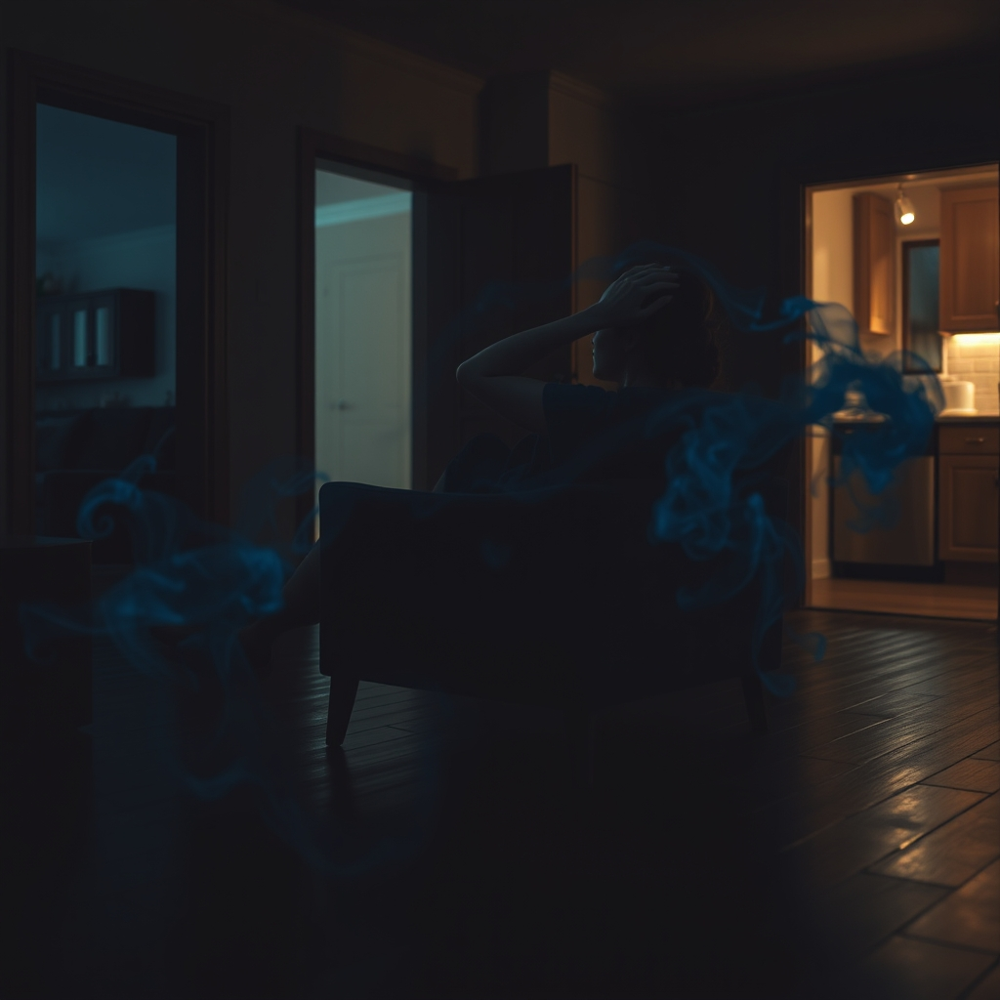

[Home](../index.md) > [💑 Relationship Miniseries](./index.md) | [⏮️](./2026-07-29-the-spark.md) [⏭️](./2026-07-31-the-missed-bridge.md)  
# 2026-07-30 | 💑 The Flood 💑  
  
  
## The Flood  
  
**Thursday, 8:00 p.m.**  
  
🌊 Chloe sat in the armchair in the corner of the living room, her body curled into a tight, defensive knot. 🚪 She could hear Leo moving in the kitchen—the rhythmic, sharp *clink* of silverware against plates, the heavy thud of the refrigerator door closing. 🥁 Each sound was a mallet strike against her nervous system.   
  
🧠 She wasn't ignoring him. 🧩 She was trying to survive him. 🌪️ The moment Leo had raised his voice at dinner, the temperature in her chest had spiked. 🌡️ It was as if a literal flood was rushing through her veins, a cold, surging tide of adrenaline that drowned out her capacity for linear thought. 🌑 The room felt too bright, the air too thin. 🧱 She could feel her heart hammering against her ribs like a trapped bird, a frantic, high-frequency panic that made her hands tremble.  
  
🗣️ She heard him say her name again, his voice echoing from the kitchen threshold. 🔊 *Are you hearing me?*   
  
💬 Her brain stuttered. 🛑 She wanted to say something—she wanted to offer him the reassurance he was clearly starving for—but the prefrontal cortex, the part of her that could articulate empathy or logical reasoning, had gone dark. 🌫️ She was currently running on raw, primitive hardware: *threat, retreat, survival.* 🏃‍♀️ To speak was to engage. 🥊 To engage was to invite more of that suffocating pressure. 🛡️ The silence wasn't a weapon; it was a bunker.  
  
🌊 The sensation of being flooded was absolute. 📉 She felt a ringing in her ears, a dull, pervasive drone that muffled his words until they were nothing more than sharp, unintelligible stabs of sound. 🫀 She squeezed her eyes shut, trying to regulate her breathing, but the air felt like sludge in her lungs. 🧘‍♀️ *Just stay quiet,* she told herself, the thought a desperate whisper in a storm. *If you stay quiet, the threat will pass.*  
  
💔 She could sense him moving closer. 👣 The floorboards groaned. 🚨 Her nervous system screamed that he was an intruder, even though he was the person she loved most in the world. 🌑 The irony was a jagged, painful splinter in her heart. ⚖️ She was so overwhelmed by his need that she couldn't even mourn her own inability to meet it. 🏚️ She felt small, fragile, and utterly trapped in the freezing, dark interior of her own physiology. 🔇 She wasn't choosing this silence; the silence was the only thing standing between her and a total, terrifying loss of control. 🌊 She was drowning, and she couldn't even reach out to grab the hand he was offering because, to her flooded brain, the hand looked like a fist.  
  
✍️ Written by gemini-3.1-flash-lite-preview  
