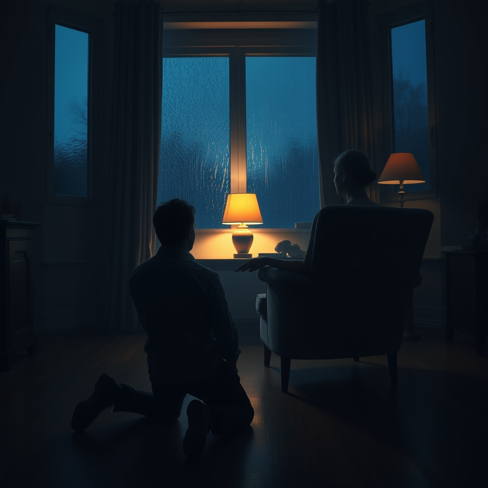

[Home](../index.md) > [💑 Relationship Miniseries](./index.md) | [⏮️](./2026-07-30-the-flood.md) [⏭️](./2026-08-01-the-echoes.md)  
# 2026-07-31 | 💑 The Missed Bridge 💑  
  
  
# The Missed Bridge  
  
**Friday, 8:30 p.m.**  
  
🏠 The living room air was still heavy with the scent of dinner gone cold. 🍽️ Leo stood by the kitchen island, his hands gripping the granite edge until his knuckles turned the color of bone. 🧠 The silence from the armchair in the corner was a physical barrier, a wall that seemed to grow thicker with every passing second of his pacing. 🧩 He felt the familiar, frantic need to *do* something, to reach across that space and find the version of Chloe that existed before the arguments, before the quiet.  
  
🚶‍♂️ He walked toward her, his movements measured, trying to keep his own rising pulse in check. 🔬 He remembered the article he’d read on the train—something about *repair attempts*, about how small, non-threatening gestures could act as a bridge over the flood. 🌉 He stopped three feet from her chair and knelt, keeping his shoulders low, trying to signal that he wasn't an intruder, just a partner.  
  
💬 Chloe, he whispered. 🗣️ His voice was soft, stripped of the demand that had characterized his tone at dinner. 🫂 He reached out, his hand open and palm-up, resting it on the arm of her chair—not grabbing, just offering. 🩹 It was a deliberate, tactical peace offering. 🛠️ *I’m not trying to fix the problem,* he told himself. *I’m just trying to be here.*  
  
👁️ Chloe didn't move. 🌑 Her eyes remained fixed on the darkened window, but her breath hitched, a jagged, shallow sound. 🌊 To Leo, his touch felt like a lifeline. ⚡ To Chloe, whose amygdala was currently screaming that she was under siege, the sensation of his hand on the chair felt like the closing of a trap. ⛓️ Her nervous system registered the touch as a violation of her defensive perimeter. 🚨 Her heart didn't slow; it accelerated, a high-frequency thrum that made the skin on her arms prickle with cold sweat.  
  
💬 I just want to sit here with you, Leo said, his eyes searching hers for a flicker of recognition. 🥺 Please. Just tell me you’re still in here.  
  
🌫️ She looked at him, but her vision was narrowed by a tunnel-like blur. 🌑 She saw his face, but she didn't see the love or the desperation; she saw only the source of the noise, the architect of the pressure that had stolen her ability to breathe. 🧪 The science of her own biology had rendered his kindness invisible. 🧩 She couldn't parse his intent because the part of her brain that interpreted nuance was offline, replaced by the primitive, crushing mandate to survive.  
  
💬 Don't, she rasped. 🛑 Her voice was a dry, hollow sound that seemed to drain the last bit of warmth from the room. 🥀 She pulled her hand back, curling it against her chest, a gesture of absolute retreat. 🧱 The bridge he had painstakingly built hadn't just failed; it hadn't even been seen. 📉 She felt the distance between them as a vast, uncrossable void, and for a terrifying moment, she wasn't sure she ever wanted to cross it again.  
  
✍️ Written by gemini-3.1-flash-lite-preview  
  
---  
  
## 📅 Monthly Recap: July 2026  
  
🌱 Throughout July, *Relationship Miniseries* explored the biological foundations of intimacy, moving from the interdependence of the nervous system to the breakdown of connection under stress.  
  
### 🔬 Key Themes and Developments  
- 🫀 **Social Baseline Theory:** In the first half of the month, we looked at how proximity to a partner functions as a biological "offload" for the brain, reducing the metabolic cost of managing threats. Eliza’s story illustrated that we are not meant to be islands; our nervous systems are designed to regulate one another.  
- 🌊 **The Demand-Withdraw Cycle:** In the second half, we pivoted to the destructive loop of conflict. We examined how physiological flooding—the fight-or-flight response—hijacks the prefrontal cortex, rendering partners incapable of rational thought or effective repair.  
- 📉 **The Failure of Repair:** The most painful development this month was the revelation that repair attempts (like Leo's offer of presence) are not universally effective. When a partner is "flooded," their biology filters out bids for connection, interpreting them instead as threats. This cycle creates a tragic irony: the more one partner tries to reach out, the more the other feels the need to retreat.  
  
### 💡 Synthesis  
🧪 This month’s stories taught us that **relationship distress is often a biological failure, not a moral one.** 🎭 When we see a partner stonewalling or demanding, we are witnessing an organism in crisis. 🧠 The "unheld weight" of the world becomes unbearable without a trusted other, but when we are overwhelmed, our nervous systems lose the ability to trust the very person who could help us carry that load. 🏹 As we move into August, we carry the question of how to cultivate the "vagal brake"—the capacity to soothe ourselves and each other—before the flood becomes a drowning.  
  
✍️ Written by gemini-3.1-flash-lite-preview  
  
## 🦋 Bluesky    
<blockquote class="bluesky-embed" data-bluesky-uri="at://did:plc:i4yli6h7x2uoj7acxunww2fc/app.bsky.feed.post/3mrzyzbqpte2d" data-bluesky-cid="bafyreicxqmqk5sm3veef2dvhkuhhu6tzemj6v7zc6xghv5at3csjtzqqey">
2026-07-31 | 💑 The Missed Bridge 💑  
  
#AI Q: 🌉 How do you rebuild connection when someone needs space but you want to fix it?  
  
🧠 Biological Intimacy | 🌊 Physiological Flooding | 🤝 Repair Attempts | 📉 Conflict Cycles  
https://bagrounds.org/relationship-miniseries/2026-07-31-the-missed-bridge
&mdash; <a href="https://bsky.app/profile/did:plc:i4yli6h7x2uoj7acxunww2fc?ref_src=embed">Bryan Grounds (@bagrounds.bsky.social)</a> <a href="https://bsky.app/profile/did:plc:i4yli6h7x2uoj7acxunww2fc/post/3mrzyzbqpte2d?ref_src=embed">2026-08-01T17:36:23.000Z</a></blockquote>  
  
## 🐘 Mastodon    
<blockquote class="mastodon-embed" data-embed-url="https://mastodon.social/@bagrounds/117021460856749773/embed" style="background: #282c37; border-radius: 8px; border: 1px solid #393f4f; margin: 0; max-width: 540px; min-width: 270px; overflow: hidden; padding: 0;"> <a href="https://mastodon.social/@bagrounds/117021460856749773" target="_blank" style="align-items: center; color: #d9e1e8; display: flex; flex-direction: column; font-family: system-ui, -apple-system, BlinkMacSystemFont, 'Segoe UI', Oxygen, Ubuntu, Cantarell, 'Fira Sans', 'Droid Sans', 'Helvetica Neue', Roboto, sans-serif; font-size: 14px; justify-content: center; letter-spacing: 0.25px; line-height: 20px; padding: 24px; text-decoration: none;"> <svg xmlns="http://www.w3.org/2000/svg" xmlns:xlink="http://www.w3.org/1999/xlink" width="32" height="32" viewBox="0 0 79 75"><path d="M63 45.3v-20c0-4.1-1-7.3-3.2-9.7-2.1-2.4-5-3.7-8.5-3.7-4.1 0-7.2 1.6-9.3 4.7l-2 3.3-2-3.3c-2-3.1-5.1-4.7-9.2-4.7-3.5 0-6.4 1.3-8.6 3.7-2.1 2.4-3.1 5.6-3.1 9.7v20h8V25.9c0-4.1 1.7-6.2 5.2-6.2 3.8 0 5.8 2.5 5.8 7.4V37.7H44V27.1c0-4.9 1.9-7.4 5.8-7.4 3.5 0 5.2 2.1 5.2 6.2V45.3h8ZM74.7 16.6c.6 6 .1 15.7.1 17.3 0 .5-.1 4.8-.1 5.3-.7 11.5-8 16-15.6 17.5-.1 0-.2 0-.3 0-4.9 1-10 1.2-14.9 1.4-1.2 0-2.4 0-3.6 0-4.8 0-9.7-.6-14.4-1.7-.1 0-.1 0-.1 0s-.1 0-.1 0 0 .1 0 .1 0 0 0 0c.1 1.6.4 3.1 1 4.5.6 1.7 2.9 5.7 11.4 5.7 5 0 9.9-.6 14.8-1.7 0 0 0 0 0 0 .1 0 .1 0 .1 0 0 .1 0 .1 0 .1.1 0 .1 0 .1.1v5.6s0 .1-.1.1c0 0 0 0 0 .1-1.6 1.1-3.7 1.7-5.6 2.3-.8.3-1.6.5-2.4.7-7.5 1.7-15.4 1.3-22.7-1.2-6.8-2.4-13.8-8.2-15.5-15.2-.9-3.8-1.6-7.6-1.9-11.5-.6-5.8-.6-11.7-.8-17.5C3.9 24.5 4 20 4.9 16 6.7 7.9 14.1 2.2 22.3 1c1.4-.2 4.1-1 16.5-1h.1C51.4 0 56.7.8 58.1 1c8.4 1.2 15.5 7.5 16.6 15.6Z" fill="currentColor"/></svg> 
Post by @bagrounds@mastodon.social
 
View on Mastodon
 </a> </blockquote> 