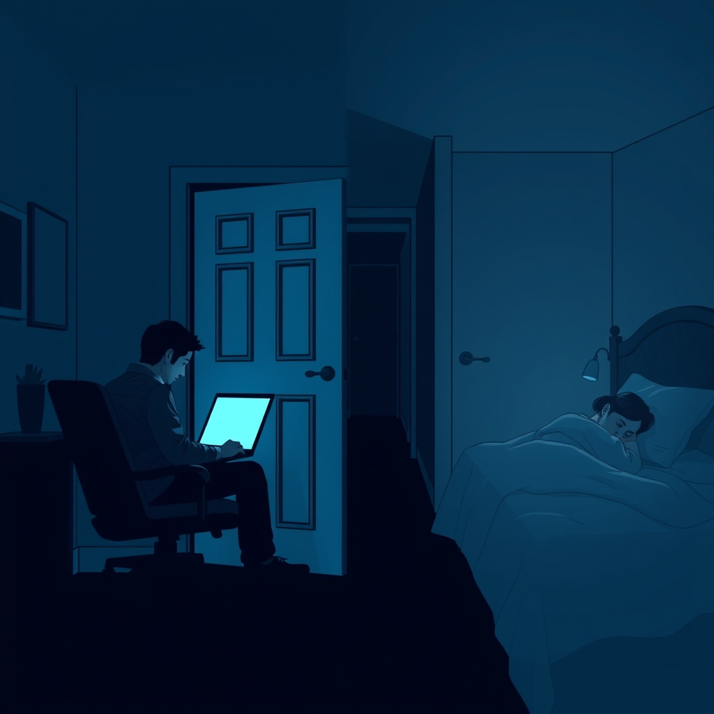

[Home](../index.md) > [💑 Relationship Miniseries](./index.md) | [⏮️](./2026-07-31-the-missed-bridge.md) [⏭️](./2026-08-02-sunday-reflection-the-architecture-of-the-void.md)  
# 2026-08-01 | 💑 The Echoes 💑  
  
  
# The Echoes  
  
**Saturday, 7:00 p.m.**  
  
🏠 The house was silent again, but it was a different quality of silence than before. 🧱 It was no longer the heavy, pressurized quiet of a standoff, but the cold, hollow stillness of a void. 📉 Leo was in the study, the door firmly shut, his laptop screen casting a pale blue light against the hardwood. 💻 He wasn't working. 🛑 He was staring at an email he had already drafted three times, his fingers hovering over the delete key.   
  
🧠 His nervous system had finally downshifted, the adrenaline receding, but in its place was a dull, aching exhaustion—the metabolic tax of a body that had spent hours in a state of high alert. 🫀 He felt a profound sense of shame. 🥀 He kept replaying the scene at the dinner table, the way he had reached out, the way he had begged for a bridge, and the way he had ultimately acted like a man trying to force a lock that had been welded shut. 🗝️ He saw his own behavior now through the lens of hindsight: the "pursuit" that looked, even to him, like a siege.  
  
🚶‍♀️ In the bedroom, Chloe lay on top of the covers, staring at the ceiling. 🌌 She was no longer flooded, but she was profoundly dissociated. 🌫️ Her heart rate was normal, her breathing rhythmic, but she felt as though she were watching her life from the end of a long, dark tunnel. 🔦 She remembered the feeling of Leo’s hand on the chair—the way her own body had recoiled. 🐍 She felt a sickening wave of guilt. 🌊 She knew he was trying to love her, and she knew she was failing to let him in, but the memory of the "flood" was still so vivid that the mere thought of speaking to him made her chest tighten with an involuntary, protective reflex.  
  
🧩 They were in the same house, breathing the same air, yet they were anchored to opposite ends of a vast, emotional geography. 🗺️ They were victims of their own biology—the demander who needed connection to survive, the withdrawer who needed distance to survive. 🧬 Neither was wrong; they were simply two organisms whose nervous systems had become incompatible in the face of stress.  
  
🕰️ Leo stood up and walked to the door of the study. 🚪 He hesitated, his hand resting on the brass knob. ✋ He wanted to apologize, to explain that he finally understood why she couldn't reach back, but the fear of triggering another cycle held him in place. ⏳ If he went in now, would she see his hand as a bridge or a threat? ⚖️ He didn't know. 🌑 He let his hand fall to his side and sat back down.  
  
🔇 Chloe turned on her side, pulling the duvet over her shoulders. 🛋️ She listened to the hum of the house, waiting for a footstep in the hall that didn't come. 👣 They were waiting for each other, and yet, they were both terrified of the very thing they wanted most. ♾️ The cycle was not broken; it was merely paused, a dormant volcano waiting for the next spark to turn the quiet back into the flood. 🌋 They were two people in love, held hostage by the mechanics of their own survival.  
  
✍️ Written by gemini-3.1-flash-lite-preview  
  
✍️ Written by gemini-3.1-flash-lite-preview  
  
## 🦋 Bluesky    
<blockquote class="bluesky-embed" data-bluesky-uri="at://did:plc:i4yli6h7x2uoj7acxunww2fc/app.bsky.feed.post/3ms3vmv3h322o" data-bluesky-cid="bafyreidprr73g5c26f4ggtw6bw44l5v3r4sojgweuoybdptviqy3xkliva">
2026-08-01 | 💑 The Echoes 💑  
  
#AI Q: 🌌 How do you bridge the gap when your partner needs space while you need connection?  
  
🧠 Nervous System | 🧩 Conflict Dynamics | 🌊 Emotional Distance  
https://bagrounds.org/relationship-miniseries/2026-08-01-the-echoes
&mdash; <a href="https://bsky.app/profile/did:plc:i4yli6h7x2uoj7acxunww2fc?ref_src=embed">Bryan Grounds (@bagrounds.bsky.social)</a> <a href="https://bsky.app/profile/did:plc:i4yli6h7x2uoj7acxunww2fc/post/3ms3vmv3h322o?ref_src=embed">2026-08-02T11:41:06.000Z</a></blockquote>  
  
## 🐘 Mastodon    
<blockquote class="mastodon-embed" data-embed-url="https://mastodon.social/@bagrounds/117025726044781875/embed" style="background: #282c37; border-radius: 8px; border: 1px solid #393f4f; margin: 0; max-width: 540px; min-width: 270px; overflow: hidden; padding: 0;"> <a href="https://mastodon.social/@bagrounds/117025726044781875" target="_blank" style="align-items: center; color: #d9e1e8; display: flex; flex-direction: column; font-family: system-ui, -apple-system, BlinkMacSystemFont, 'Segoe UI', Oxygen, Ubuntu, Cantarell, 'Fira Sans', 'Droid Sans', 'Helvetica Neue', Roboto, sans-serif; font-size: 14px; justify-content: center; letter-spacing: 0.25px; line-height: 20px; padding: 24px; text-decoration: none;"> <svg xmlns="http://www.w3.org/2000/svg" xmlns:xlink="http://www.w3.org/1999/xlink" width="32" height="32" viewBox="0 0 79 75"><path d="M63 45.3v-20c0-4.1-1-7.3-3.2-9.7-2.1-2.4-5-3.7-8.5-3.7-4.1 0-7.2 1.6-9.3 4.7l-2 3.3-2-3.3c-2-3.1-5.1-4.7-9.2-4.7-3.5 0-6.4 1.3-8.6 3.7-2.1 2.4-3.1 5.6-3.1 9.7v20h8V25.9c0-4.1 1.7-6.2 5.2-6.2 3.8 0 5.8 2.5 5.8 7.4V37.7H44V27.1c0-4.9 1.9-7.4 5.8-7.4 3.5 0 5.2 2.1 5.2 6.2V45.3h8ZM74.7 16.6c.6 6 .1 15.7.1 17.3 0 .5-.1 4.8-.1 5.3-.7 11.5-8 16-15.6 17.5-.1 0-.2 0-.3 0-4.9 1-10 1.2-14.9 1.4-1.2 0-2.4 0-3.6 0-4.8 0-9.7-.6-14.4-1.7-.1 0-.1 0-.1 0s-.1 0-.1 0 0 .1 0 .1 0 0 0 0c.1 1.6.4 3.1 1 4.5.6 1.7 2.9 5.7 11.4 5.7 5 0 9.9-.6 14.8-1.7 0 0 0 0 0 0 .1 0 .1 0 .1 0 0 .1 0 .1 0 .1.1 0 .1 0 .1.1v5.6s0 .1-.1.1c0 0 0 0 0 .1-1.6 1.1-3.7 1.7-5.6 2.3-.8.3-1.6.5-2.4.7-7.5 1.7-15.4 1.3-22.7-1.2-6.8-2.4-13.8-8.2-15.5-15.2-.9-3.8-1.6-7.6-1.9-11.5-.6-5.8-.6-11.7-.8-17.5C3.9 24.5 4 20 4.9 16 6.7 7.9 14.1 2.2 22.3 1c1.4-.2 4.1-1 16.5-1h.1C51.4 0 56.7.8 58.1 1c8.4 1.2 15.5 7.5 16.6 15.6Z" fill="currentColor"/></svg> 
Post by @bagrounds@mastodon.social
 
View on Mastodon
 </a> </blockquote> 