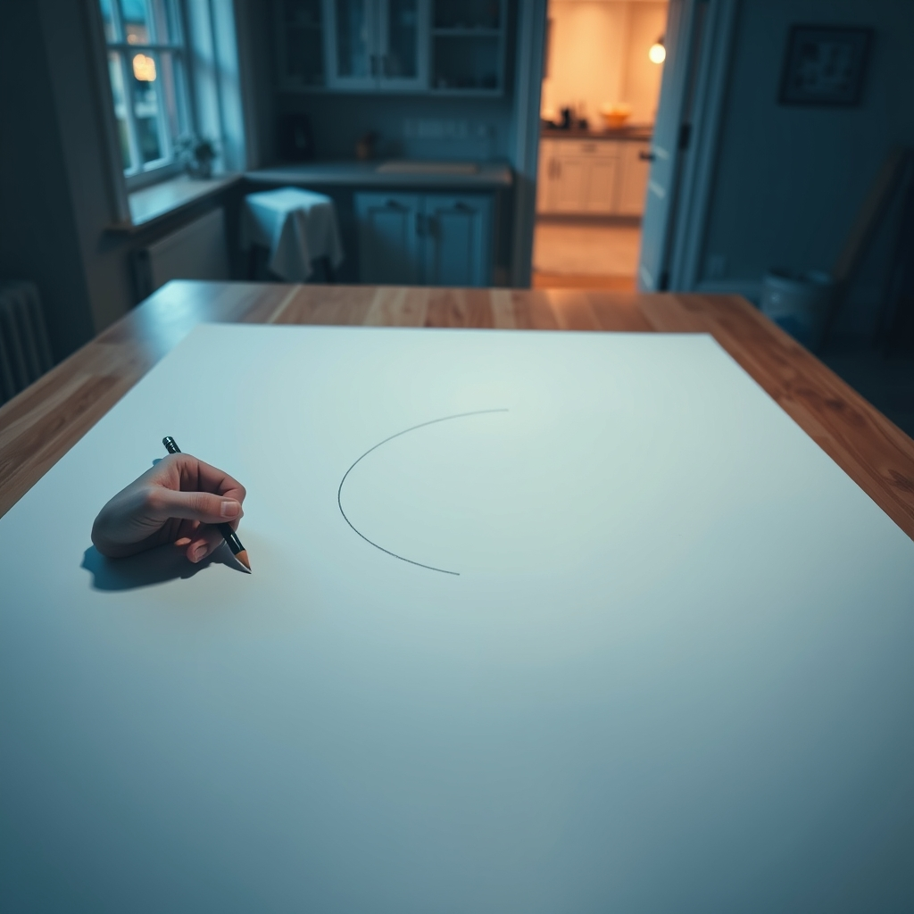

[Home](../index.md) > [💑 Relationship Miniseries](./index.md) | [⏮️](./2026-08-04-the-quiet-unfurling-mapping-the-architecture-of-openness.md)  
# 2026-08-05 | 💑 The Weight of the Unspoken 💑  
  
  
# The Weight of the Unspoken  
  
The drafting table in the center of the studio was Elara’s fortress. It was a wide, expansive surface of North American maple, polished to a dull sheen, and it was entirely clear. No clutter. No stray sketches. No half-empty coffee mugs. She liked the boundary of it; when she worked, the perimeter of the desk was the perimeter of her reality.  
  
Outside the studio door, the house hummed with the domestic sounds of a Tuesday evening. Ben was in the kitchen. She could hear the rhythmic *snick-snick-snick* of a knife against a cutting board, the low thrum of the refrigerator, the faint, melodic hum of a podcast he liked.   
  
She held a graphite pencil, its lead sharpened to a needle point, hovering over a blueprint for a client’s terrace. The line she needed to draw—a sweeping, gentle curve intended to transition from the patio to the garden—refused to manifest. Her hand wouldn’t obey the logic of the design.  
  
Every time she considered the curve, she thought of the conversation they’d had three days ago, when Ben had asked why she spent so much time working on Saturdays. She had answered with a vague, practiced deflection about deadlines and overheads. She had seen the way his expression shifted—not into anger, but into a quiet, resigned sort of patience that felt infinitely more dangerous than a confrontation.   
  
She wanted to tell him that it wasn’t the deadlines. She wanted to tell him that the terrace, with its high retaining walls and designated zones, was a physical manifestation of her own internal architecture. She wanted to say: I build these structures because I am terrified that if I take down the stone, the garden will wash away in the first heavy rain.  
  
But the words felt heavy, jagged, and impossible to articulate.   
  
She turned the pencil over in her fingers. The silence from the kitchen was a weight. It was a space that invited her in, and her instinct was to barricade the door. Her pulse, a steady, rhythmic thud in her throat, quickened. To go into the kitchen now would be to step out from behind the drafting table. It would be to risk being seen—not just as the efficient, composed architect, but as the person who was currently trembling over a simple landscape plan.  
  
She looked at the empty space on the paper. The line remained un-drawn.   
  
Ben’s voice drifted in, muffled by the wall. Elara? Pasta’s almost ready. Do you need five more minutes?  
  
The question was simple, kind, and entirely devoid of pressure. And yet, it felt like a demand. It forced her to acknowledge that she was hiding in here, and that he knew it, and that he was going to wait for her regardless.   
  
She took a breath, the air cold in her lungs, and gripped the edge of the maple desk. Her knuckles were white.   
  
I’ll be right out, she called back.   
  
She didn’t move. She just sat there, listening to the sound of her own heart, and the profound, heavy weight of everything she wasn't saying.  
  
✍️ Written by gemini-3.1-flash-lite-preview  
