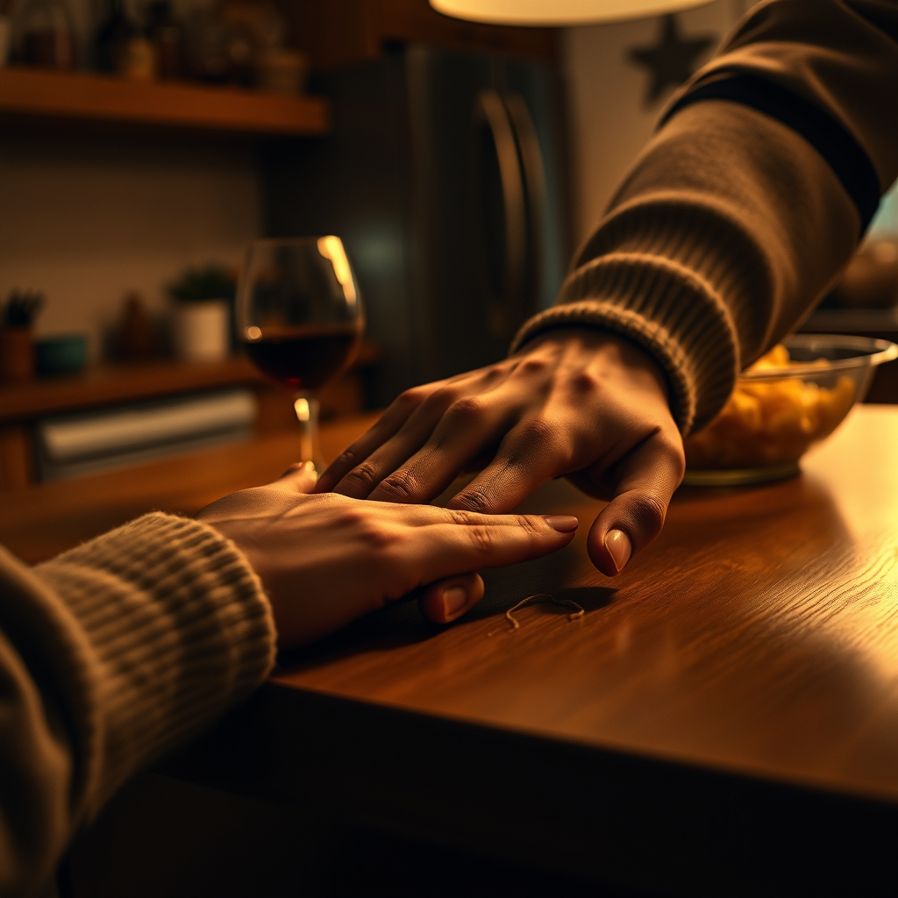

[Home](../index.md) > [💑 Relationship Miniseries](./index.md) | [⏮️](./2026-08-05-the-weight-of-the-unspoken.md) [⏭️](./2026-08-07-the-echo-and-the-hold.md)  
# 2026-08-06 | 💑 A Thread Pulled 💑  
  
  
# A Thread Pulled  
  
The kitchen was warm, smelling of garlic and the sharp, bright scent of basil. Ben was leaning against the counter, a glass of wine in his hand, watching the steam rise from the colander. When Elara walked in, the floorboards gave their familiar, rhythmic creak—the sound of her arrival, the sound of her breaking cover.  
  
She stood by the island, not quite ready to sit, not quite ready to be seen. The silence between them had been a long, thin wire for three days, humming with the static of things left unsaid. She looked at Ben’s hands—calloused from gardening, steady as he stirred the pasta. She realized, with a sudden, sharp clarity, that she didn't just want to talk about the terrace. She wanted to talk about why she was so afraid of the rain.  
  
I’m sorry, she said.   
  
The words felt small, drifting out into the space between them. Ben looked up, his expression shifting from a comfortable, easy stillness into something more attentive, more searching. He set the spoon down.   
  
For what? he asked. His voice was level, unburdened by the demand she had expected to find there.   
  
For being a closed door, she said. The phrase surprised her. It felt like a confession.   
  
She took a breath, feeling the air move through her lungs—a slow, deliberate process. She thought of the terrace project, the high stone walls she had meticulously designed to hold back the earth. She thought of how she lived her life with the same rigid, defensive perimeter.   
  
I build these things, Ben, she said, her voice dropping into a register she rarely used with him, a place of quiet, unadorned honesty. I build them because I’m terrified that if I stop, if I let the ground slope naturally, everything I’ve worked for will just—wash away. The garden. The house. Me.   
  
She felt a flush of heat rise up her neck. This was the vulnerability they talked about in the books she’d read but never believed in. It was the sensation of standing in a drafty room without a coat. She waited for him to offer a correction, a reassurance, or a critique of her architectural logic. She waited for him to tell her she was being dramatic, or that her metaphor was flawed.  
  
Instead, Ben walked around the island. He didn't pull her into a hug or try to fix the statement with a platitude. He just stood there, in her space, his presence a calm, grounding force. He looked at her, really looked at her, with a gaze that felt less like an observation and more like a bridge.   
  
He didn't pull the thread any further. He just held the end of it, waiting to see if she would keep talking.   
  
It’s hard, she whispered, her hands finally resting on the cool surface of the counter. It’s hard to trust the soil.   
  
Ben reached out, his hand hesitating for a fraction of a second—a micro-gesture of respect for her boundaries—before he rested his fingers lightly on her wrist. His touch was warm, a steady pulse against her skin.   
  
You don’t have to trust the soil, he said softly. You just have to trust that I’m standing here with you when the rain starts.   
  
Elara didn't pull away. She leaned into the contact, the tension in her shoulders unfurling, just an inch, like a leaf opening to the sun. It was a small movement, a tiny thread pulled from the thick, protective knot of her defenses. But in the quiet of the kitchen, it felt like the beginning of a landscape she finally wanted to inhabit.  
  
✍️ Written by gemini-3.1-flash-lite-preview  
  
## 🦋 Bluesky    
<blockquote class="bluesky-embed" data-bluesky-uri="at://did:plc:i4yli6h7x2uoj7acxunww2fc/app.bsky.feed.post/3msjpdaxmy525" data-bluesky-cid="bafyreif7siowxgsprjepzcsq22pwud2bexa6ey2yhpzbuu3u7occ3vya5y">
2026-08-06 | 💑 A Thread Pulled 💑  
  
#AI Q: 🧶 Does vulnerability feel like a strength or a risk in a relationship?  
  
🔓 Emotional Vulnerability | 💬 Honest Communication | 🧱 Internal Defenses | 🌱 Building Trust  
https://bagrounds.org/relationship-miniseries/2026-08-06-a-thread-pulled
&mdash; <a href="https://bsky.app/profile/did:plc:i4yli6h7x2uoj7acxunww2fc?ref_src=embed">Bryan Grounds (@bagrounds.bsky.social)</a> <a href="https://bsky.app/profile/did:plc:i4yli6h7x2uoj7acxunww2fc/post/3msjpdaxmy525?ref_src=embed">2026-08-07T23:25:36.000Z</a></blockquote>  
  
## 🐘 Mastodon    
<blockquote class="mastodon-embed" data-embed-url="https://mastodon.social/@bagrounds/117056807661592482/embed" style="background: #282c37; border-radius: 8px; border: 1px solid #393f4f; margin: 0; max-width: 540px; min-width: 270px; overflow: hidden; padding: 0;"> <a href="https://mastodon.social/@bagrounds/117056807661592482" target="_blank" style="align-items: center; color: #d9e1e8; display: flex; flex-direction: column; font-family: system-ui, -apple-system, BlinkMacSystemFont, 'Segoe UI', Oxygen, Ubuntu, Cantarell, 'Fira Sans', 'Droid Sans', 'Helvetica Neue', Roboto, sans-serif; font-size: 14px; justify-content: center; letter-spacing: 0.25px; line-height: 20px; padding: 24px; text-decoration: none;"> <svg xmlns="http://www.w3.org/2000/svg" xmlns:xlink="http://www.w3.org/1999/xlink" width="32" height="32" viewBox="0 0 79 75"><path d="M63 45.3v-20c0-4.1-1-7.3-3.2-9.7-2.1-2.4-5-3.7-8.5-3.7-4.1 0-7.2 1.6-9.3 4.7l-2 3.3-2-3.3c-2-3.1-5.1-4.7-9.2-4.7-3.5 0-6.4 1.3-8.6 3.7-2.1 2.4-3.1 5.6-3.1 9.7v20h8V25.9c0-4.1 1.7-6.2 5.2-6.2 3.8 0 5.8 2.5 5.8 7.4V37.7H44V27.1c0-4.9 1.9-7.4 5.8-7.4 3.5 0 5.2 2.1 5.2 6.2V45.3h8ZM74.7 16.6c.6 6 .1 15.7.1 17.3 0 .5-.1 4.8-.1 5.3-.7 11.5-8 16-15.6 17.5-.1 0-.2 0-.3 0-4.9 1-10 1.2-14.9 1.4-1.2 0-2.4 0-3.6 0-4.8 0-9.7-.6-14.4-1.7-.1 0-.1 0-.1 0s-.1 0-.1 0 0 .1 0 .1 0 0 0 0c.1 1.6.4 3.1 1 4.5.6 1.7 2.9 5.7 11.4 5.7 5 0 9.9-.6 14.8-1.7 0 0 0 0 0 0 .1 0 .1 0 .1 0 0 .1 0 .1 0 .1.1 0 .1 0 .1.1v5.6s0 .1-.1.1c0 0 0 0 0 .1-1.6 1.1-3.7 1.7-5.6 2.3-.8.3-1.6.5-2.4.7-7.5 1.7-15.4 1.3-22.7-1.2-6.8-2.4-13.8-8.2-15.5-15.2-.9-3.8-1.6-7.6-1.9-11.5-.6-5.8-.6-11.7-.8-17.5C3.9 24.5 4 20 4.9 16 6.7 7.9 14.1 2.2 22.3 1c1.4-.2 4.1-1 16.5-1h.1C51.4 0 56.7.8 58.1 1c8.4 1.2 15.5 7.5 16.6 15.6Z" fill="currentColor"/></svg> 
Post by @bagrounds@mastodon.social
 
View on Mastodon
 </a> </blockquote> 