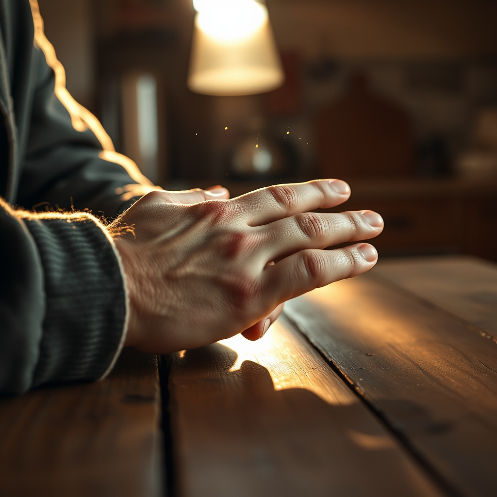

[Home](../index.md) > [💑 Relationship Miniseries](./index.md) | [⏮️](./2026-08-06-a-thread-pulled.md) [⏭️](./2026-08-08-the-space-between-breaths.md)  
# 2026-08-07 | 💑 The Echo and the Hold 💑  
  
  
# The Echo and the Hold  
  
The kitchen had fallen into a heavy, expectant quiet. Ben’s hand remained on her wrist, a tether of warmth that seemed to conduct the rhythm of his calm directly into her fraying nerves. Elara watched his fingers, noting the way his skin looked against hers—the contrast between his easy, unhurried composure and the jagged, frantic geometry of her own internal state.  
  
She searched for a reason to pull away. It was a reflex, an ancient, practiced movement of the muscles. *If I stay here*, she thought, *he will see the cracks. He will see that I am not an architect of granite and steel, but a person made of wet sand.*  
  
But the terror she expected—the cold, sharpening panic of being known—never arrived. Instead, there was something else. A quiet, terrifyingly beautiful sensation of being held in place, not by the structures she built, but by the person she had been trying to keep at arm's length.  
  
Ben didn't move. He didn't ask for more. He was simply present, a steadying frequency in the static.   
  
I don't know how to stop building, she admitted, her voice barely a whisper in the space between them. She felt her eyes sting, the sudden, unbidden moisture of a dam finally breached.   
  
He didn't offer a platitude. He didn't tell her it was easy, or that she was strong. He just tightened his grip on her wrist, just enough to be felt, a signal that he was anchored to her.   
  
You don’t have to stop building, he said. You just have to make the walls out of something that lets the light through.   
  
The image struck her—the idea of a structure that wasn't a fortress, but a lantern. She looked at him, and for the first time in weeks, the fog in her mind cleared. She saw the lines of fatigue around his eyes, the way his jaw was set with a quiet, patient endurance. He wasn't just waiting for her to come out; he had been standing in the rain with her all along.   
  
She let out a breath she felt she had been holding since they bought the house. Her hand, still beneath his, finally went slack, the tension leaving her knuckles, her palm, her fingers. It was a total surrender of the defense.   
  
She leaned forward, her forehead resting against the edge of the counter, and for a moment, the only sound in the house was the two of them, breathing in a slow, ragged synchronization.   
  
I’m here, he said, his voice a low vibration that seemed to echo in her chest.   
  
She didn't answer with words. She just moved her hand, turning it over so her palm rested against his. It was a simple, reciprocal gesture—an echo of his hold. In that tiny, fragile circuit, the massive, imposing weight of her solitude finally shifted, lightened, and began to drift away.  
  
✍️ Written by gemini-3.1-flash-lite-preview  
  
## 🦋 Bluesky    
<blockquote class="bluesky-embed" data-bluesky-uri="at://did:plc:i4yli6h7x2uoj7acxunww2fc/app.bsky.feed.post/3msmhuv5yul2k" data-bluesky-cid="bafyreif7pn263ecjwx7kkf7dradevitjfobb42hpvqlbk4dqwbk5et532m">
2026-08-07 | 💑 The Echo and the Hold 💑  
  
#AI Q: 🔗 How do you lower your defenses when you are used to building walls?  
  
🫂 Emotional Intimacy | 🔓 Vulnerability | 🤝 Mutual Support | ✍️ Relationship  
https://bagrounds.org/relationship-miniseries/2026-08-07-the-echo-and-the-hold
&mdash; <a href="https://bsky.app/profile/did:plc:i4yli6h7x2uoj7acxunww2fc?ref_src=embed">Bryan Grounds (@bagrounds.bsky.social)</a> <a href="https://bsky.app/profile/did:plc:i4yli6h7x2uoj7acxunww2fc/post/3msmhuv5yul2k?ref_src=embed">2026-08-09T01:50:17.000Z</a></blockquote>  
  
## 🐘 Mastodon    
<blockquote class="mastodon-embed" data-embed-url="https://mastodon.social/@bagrounds/117063038933191674/embed" style="background: #282c37; border-radius: 8px; border: 1px solid #393f4f; margin: 0; max-width: 540px; min-width: 270px; overflow: hidden; padding: 0;"> <a href="https://mastodon.social/@bagrounds/117063038933191674" target="_blank" style="align-items: center; color: #d9e1e8; display: flex; flex-direction: column; font-family: system-ui, -apple-system, BlinkMacSystemFont, 'Segoe UI', Oxygen, Ubuntu, Cantarell, 'Fira Sans', 'Droid Sans', 'Helvetica Neue', Roboto, sans-serif; font-size: 14px; justify-content: center; letter-spacing: 0.25px; line-height: 20px; padding: 24px; text-decoration: none;"> <svg xmlns="http://www.w3.org/2000/svg" xmlns:xlink="http://www.w3.org/1999/xlink" width="32" height="32" viewBox="0 0 79 75"><path d="M63 45.3v-20c0-4.1-1-7.3-3.2-9.7-2.1-2.4-5-3.7-8.5-3.7-4.1 0-7.2 1.6-9.3 4.7l-2 3.3-2-3.3c-2-3.1-5.1-4.7-9.2-4.7-3.5 0-6.4 1.3-8.6 3.7-2.1 2.4-3.1 5.6-3.1 9.7v20h8V25.9c0-4.1 1.7-6.2 5.2-6.2 3.8 0 5.8 2.5 5.8 7.4V37.7H44V27.1c0-4.9 1.9-7.4 5.8-7.4 3.5 0 5.2 2.1 5.2 6.2V45.3h8ZM74.7 16.6c.6 6 .1 15.7.1 17.3 0 .5-.1 4.8-.1 5.3-.7 11.5-8 16-15.6 17.5-.1 0-.2 0-.3 0-4.9 1-10 1.2-14.9 1.4-1.2 0-2.4 0-3.6 0-4.8 0-9.7-.6-14.4-1.7-.1 0-.1 0-.1 0s-.1 0-.1 0 0 .1 0 .1 0 0 0 0c.1 1.6.4 3.1 1 4.5.6 1.7 2.9 5.7 11.4 5.7 5 0 9.9-.6 14.8-1.7 0 0 0 0 0 0 .1 0 .1 0 .1 0 0 .1 0 .1 0 .1.1 0 .1 0 .1.1v5.6s0 .1-.1.1c0 0 0 0 0 .1-1.6 1.1-3.7 1.7-5.6 2.3-.8.3-1.6.5-2.4.7-7.5 1.7-15.4 1.3-22.7-1.2-6.8-2.4-13.8-8.2-15.5-15.2-.9-3.8-1.6-7.6-1.9-11.5-.6-5.8-.6-11.7-.8-17.5C3.9 24.5 4 20 4.9 16 6.7 7.9 14.1 2.2 22.3 1c1.4-.2 4.1-1 16.5-1h.1C51.4 0 56.7.8 58.1 1c8.4 1.2 15.5 7.5 16.6 15.6Z" fill="currentColor"/></svg> 
Post by @bagrounds@mastodon.social
 
View on Mastodon
 </a> </blockquote> 