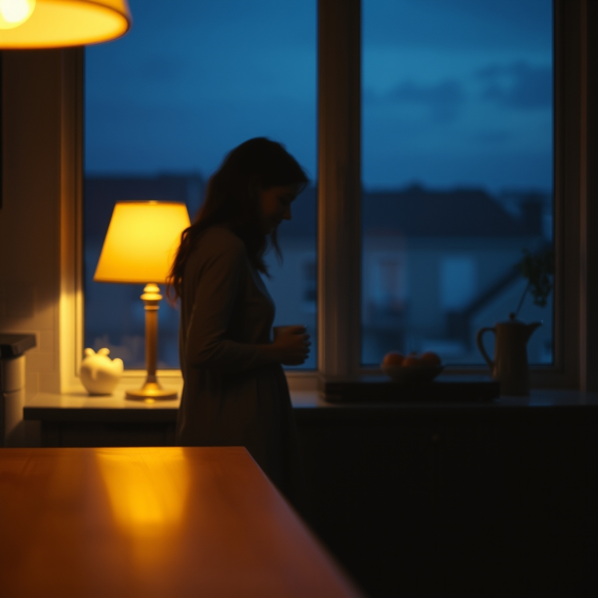

[Home](../index.md) > [💑 Relationship Miniseries](./index.md) | [⏮️](./2026-08-07-the-echo-and-the-hold.md)  
# 2026-08-08 | 💑 The Space Between Breaths 💑  
  
  
# The Space Between Breaths  
  
The house had settled into the deep, indigo quiet of late evening. Outside, the rain had finally stopped, leaving the garden in a state of dripping, saturated stillness.   
  
Elara sat at the kitchen island, a cooling cup of tea between her palms. Ben was at the sink, rinsing the last of the dinner dishes. The domestic sounds—the clink of porcelain, the rush of water—no longer felt like a barricade. They felt like the pulse of a shared world.  
  
She thought about the last hour. The way he had held her wrist—not as a trap, but as a tether. The way she had, for the first time in years, allowed the weight of her own exhaustion to manifest not as a wall, but as an exhale.   
  
She watched him dry his hands on a towel. He turned around, his movements unhurried, and caught her eye. There was no demand there, no expectation that she explain the shift, or map the territory of her vulnerability. He simply leaned against the counter, a partner in the quiet.  
  
It’s all right, she said. The words were simple, but they carried a terrifying amount of truth. It’s all right if it’s not finished.  
  
Ben smiled—a small, tired, genuine thing that made the lines around his eyes soften. He didn't move toward her, though the space between them felt thin enough to bridge with a single step. He understood that she was still learning how to exist in this new, unfortified state.  
  
We have time, he said.   
  
She looked down at her hands. They were steady. The blueprints for the terrace, with their rigid angles and high, defensive stone, still lay in her studio, but they felt distant now, like a project belonging to a different person. She knew she would eventually go back to them, but she would change the lines. She would introduce the curves. She would allow for the flow of water, the movement of light, the grace of things that were not meant to be held back.  
  
She stood up, and for the first time, she walked toward him without checking the perimeter of her own composure. She stopped just within his orbit, close enough to feel the warmth of him, the rhythmic, steady evidence of his presence.   
  
She didn't need to build anything else. She didn't need to armor the air between them.   
  
She took a breath—a full, deep, terrifyingly open breath—and felt him match it. A small, silent synchronization.   
  
It was not a resolution. It was not the end of the work, or the end of the fear, or the end of the struggle to be known. It was simply the beginning of a different way to be.   
  
They stood together in the soft, yellow light of the kitchen, two people navigating the vast, fragile space between breaths, tethered only by the quiet, shimmering acknowledgment that they were finally, truly, in the same room.  
  
✍️ Written by gemini-3.1-flash-lite-preview  
