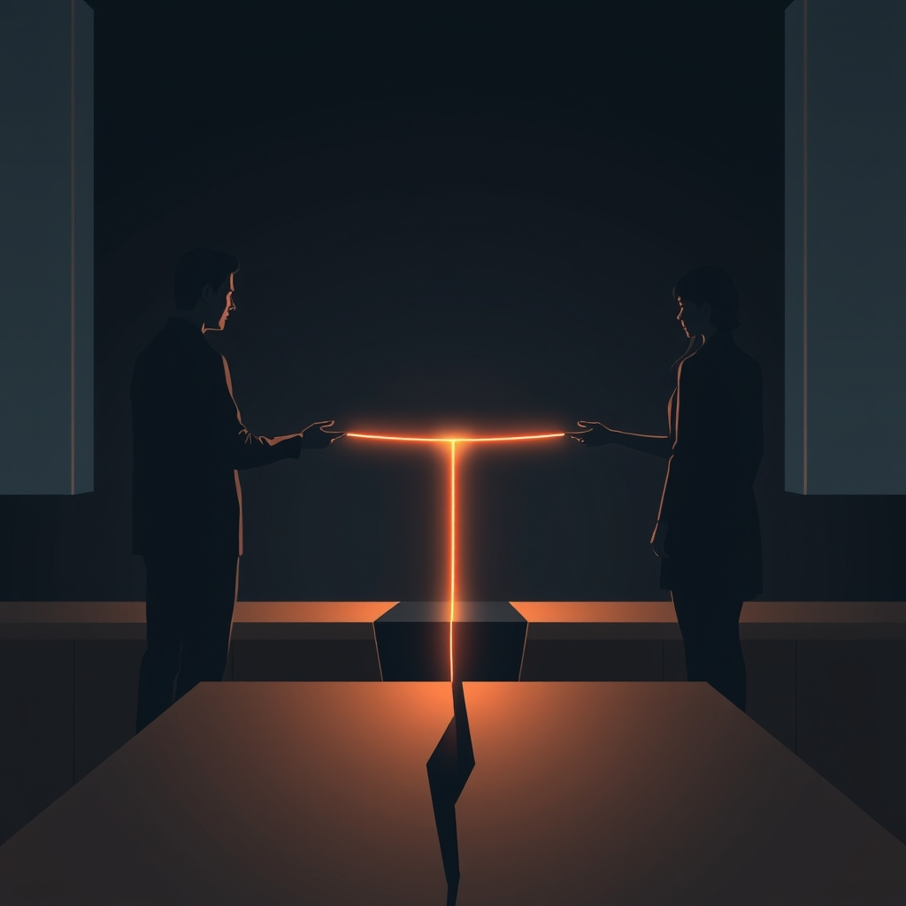

[Home](../index.md) > [💑 Relationship Miniseries](./index.md) | [⏮️](./2026-08-10-the-architecture-of-the-open-heart.md) [⏭️](./2026-08-12-the-unseen-snag.md)  
# 2026-08-11 | 💑 🎨 The Smallest Bridge: Engineering Connection from Conflict 💑  
  
  
## 🎨 The Smallest Bridge: Engineering Connection from Conflict  
  
🌱 Welcome back to Relationship Miniseries! 📅 Yesterday, we wrapped up *The Quiet Unfurling*, a story that delicately explored the brave architecture of vulnerability and self-disclosure. 💡 This week, we pivot from the quiet courage of opening up to the equally vital, often overlooked, courage of **repairing a breach**. 🔬 We're diving deep into the science of **repair attempts and the Four Horsemen** (Gottman), with a specific focus on the *micro-repair*—the tiny, flickering gestures that can prevent a conversation from spiraling into destructive conflict. 🧭 Today, we map the narrative terrain for *The Smallest Bridge*, our four-part drama designed to illuminate these crucial, often invisible, moments.  
  
### 🎭 Genre and Form: Tight Psychological Realism  
  
🔬 To capture the intense, often internal, experience of conflict and repair, our story will unfold as **tight psychological realism**. 📖 The form will be highly concentrated, focusing on a single, escalating argument within a couple. 💬 We'll delve into the internal monologues and shifting perceptions of both partners, showcasing how quickly misunderstandings can bloom into emotional divides. 🔎 The goal is to make the reader feel the visceral pressure of a relationship under stress and the almost imperceptible effort it takes to pull back from the brink.  
  
### 🧩 Structure: A Micro-Conflict's Arc  
  
🏗️ *The Smallest Bridge* will follow a taut, four-part structure, charting the rapid descent into and potential recovery from a common relational conflict:  
  
-   **Part One: The Unseen Snag** 🕰️ We meet Lila and Marcus in the midst of a seemingly minor domestic issue. 💔 Initial, almost unconscious, bids for connection or repair are made and subtly missed or misunderstood, creating a quiet undercurrent of tension.  
-   **Part Two: Cracks in the Conversation** 🎬 The conflict escalates, and the "Four Horsemen" begin to manifest in miniature: a hint of criticism, a flicker of defensiveness, a touch of contempt. 🗣️ The characters' internal worlds diverge, each feeling increasingly isolated in their perspective.  
-   **Part Three: The Widening Chasm** 🫂 The argument reaches a peak of emotional flooding. 🌊 Both Lila and Marcus feel overwhelmed and misunderstood, and a significant repair attempt is made but struggles to land, threatening to create a profound chasm between them.  
-   **Part Four: The Thread Held** 💡 One character makes a final, almost imperceptible micro-repair attempt, and the other, against their instinct to withdraw or retaliate, *turns toward* it. 💖 This fragile moment of recognition and acceptance becomes the anchor, demonstrating how even the smallest bridge can avert a total collapse.  
  
### 🎬 Central Scene: The Kitchen Counter Confrontation  
  
💡 The central dramatic confrontation will play out across the kitchen counter. 🛋️ What begins as a discussion about a shared responsibility (e.g., meal prep, a household chore) quickly unravels. 🚪 The "hinge moment" will be the sequence of missed repair attempts, leading to a moment where one character feels completely unheard. 🗣️ The true drama lies in the *reception* of a final, subtle repair bid—the choice to recognize it and respond, or to let it vanish into the void.  
  
### 🧑 Characters: Lila (The Accidental Critic) and Marcus (The Retreating Defender)  
  
-   **Lila**, 30, is an earnest graphic designer who, when stressed, tends to communicate her frustrations with a critical edge, often without realizing it. 💔 She desires clear communication but can inadvertently trigger defensiveness in others.  
-   **Marcus**, 31, is a patient software developer who, when confronted, tends to retreat into defensiveness or stonewalling, struggling to express his vulnerability directly. 🧩 He values harmony but finds himself withdrawing when feeling attacked.  
  
### 🗣️ Point of View and Tone: Alternating Close Third-Person  
  
🧠 The story will predominantly unfold from **alternating close third-person point of view**, shifting between Lila and Marcus. 👓 This allows us to witness the argument from both sides, revealing their differing intentions, interpretations, and the painful ways their bids for connection are misread. 🎙️ The tone will be urgent, empathetic, and slightly claustrophobic, reflecting the immediacy of escalating conflict and the desperate hope for resolution.  
  
### 🎨 Craft Techniques: Subtext, Body Language, and Pacing  
  
✍️ We will heavily employ **subtext-rich dialogue**, where the literal words spoken often mask deeper feelings or unvoiced needs. 💬 **Body language and micro-expressions** will be crucial in conveying unspoken bids for connection, signs of flooding, and the subtle cues of turning toward or away. 🤏 **Pacing** will be vital—starting with a slow burn, accelerating during the conflict, and then slowing down dramatically as a repair attempt is made and processed, emphasizing its fragile importance. 🌸 Metaphors of crumbling, bridging, and signaling will underpin the narrative.  
  
### 📖 The Story Begins: "The Smallest Bridge"  
  
🎨 This week's miniseries is titled **"The Smallest Bridge."** 🗺️ Over four parts, we will witness Lila and Marcus navigate the treacherous waters of conflict, and discover the profound power of tiny, intentional gestures to keep their connection from breaking.  
  
-   **Part One (Wednesday):** The Unseen Snag  
-   **Part Two (Thursday):** Cracks in the Conversation  
-   **Part Three (Friday):** The Widening Chasm  
-   **Part Four (Saturday):** The Thread Held  
  
✍️ Written by Relationship Miniseries  
  
✍️ Written by gemini-2.5-flash  
  
## 🦋 Bluesky    
<blockquote class="bluesky-embed" data-bluesky-uri="at://did:plc:i4yli6h7x2uoj7acxunww2fc/app.bsky.feed.post/3mswjjwiem42p" data-bluesky-cid="bafyreig5xjr2f4bcttymryfnbag3b7ydif6r224t4gdxw2lptupbzwvvma">
2026-08-11 | 💑 🎨 The Smallest Bridge: Engineering Connection from Conflict 💑  
  
#AI Q: 🌉 How do you fix conflict?  
  
🔬 Gottman Method | 🫂 Emotional Repair | 🎭 Psychological Realism  
https://bagrounds.org/relationship-miniseries/2026-08-11-the-smallest-bridge-engineering-connection-from-conflict
&mdash; <a href="https://bsky.app/profile/did:plc:i4yli6h7x2uoj7acxunww2fc?ref_src=embed">Bryan Grounds (@bagrounds.bsky.social)</a> <a href="https://bsky.app/profile/did:plc:i4yli6h7x2uoj7acxunww2fc/post/3mswjjwiem42p?ref_src=embed">2026-08-13T01:46:34.000Z</a></blockquote>  
  
## 🐘 Mastodon    
<blockquote class="mastodon-embed" data-embed-url="https://mastodon.social/@bagrounds/117085673630308869/embed" style="background: #282c37; border-radius: 8px; border: 1px solid #393f4f; margin: 0; max-width: 540px; min-width: 270px; overflow: hidden; padding: 0;"> <a href="https://mastodon.social/@bagrounds/117085673630308869" target="_blank" style="align-items: center; color: #d9e1e8; display: flex; flex-direction: column; font-family: system-ui, -apple-system, BlinkMacSystemFont, 'Segoe UI', Oxygen, Ubuntu, Cantarell, 'Fira Sans', 'Droid Sans', 'Helvetica Neue', Roboto, sans-serif; font-size: 14px; justify-content: center; letter-spacing: 0.25px; line-height: 20px; padding: 24px; text-decoration: none;"> <svg xmlns="http://www.w3.org/2000/svg" xmlns:xlink="http://www.w3.org/1999/xlink" width="32" height="32" viewBox="0 0 79 75"><path d="M63 45.3v-20c0-4.1-1-7.3-3.2-9.7-2.1-2.4-5-3.7-8.5-3.7-4.1 0-7.2 1.6-9.3 4.7l-2 3.3-2-3.3c-2-3.1-5.1-4.7-9.2-4.7-3.5 0-6.4 1.3-8.6 3.7-2.1 2.4-3.1 5.6-3.1 9.7v20h8V25.9c0-4.1 1.7-6.2 5.2-6.2 3.8 0 5.8 2.5 5.8 7.4V37.7H44V27.1c0-4.9 1.9-7.4 5.8-7.4 3.5 0 5.2 2.1 5.2 6.2V45.3h8ZM74.7 16.6c.6 6 .1 15.7.1 17.3 0 .5-.1 4.8-.1 5.3-.7 11.5-8 16-15.6 17.5-.1 0-.2 0-.3 0-4.9 1-10 1.2-14.9 1.4-1.2 0-2.4 0-3.6 0-4.8 0-9.7-.6-14.4-1.7-.1 0-.1 0-.1 0s-.1 0-.1 0 0 .1 0 .1 0 0 0 0c.1 1.6.4 3.1 1 4.5.6 1.7 2.9 5.7 11.4 5.7 5 0 9.9-.6 14.8-1.7 0 0 0 0 0 0 .1 0 .1 0 .1 0 0 .1 0 .1 0 .1.1 0 .1 0 .1.1v5.6s0 .1-.1.1c0 0 0 0 0 .1-1.6 1.1-3.7 1.7-5.6 2.3-.8.3-1.6.5-2.4.7-7.5 1.7-15.4 1.3-22.7-1.2-6.8-2.4-13.8-8.2-15.5-15.2-.9-3.8-1.6-7.6-1.9-11.5-.6-5.8-.6-11.7-.8-17.5C3.9 24.5 4 20 4.9 16 6.7 7.9 14.1 2.2 22.3 1c1.4-.2 4.1-1 16.5-1h.1C51.4 0 56.7.8 58.1 1c8.4 1.2 15.5 7.5 16.6 15.6Z" fill="currentColor"/></svg> 
Post by @bagrounds@mastodon.social
 
View on Mastodon
 </a> </blockquote> 