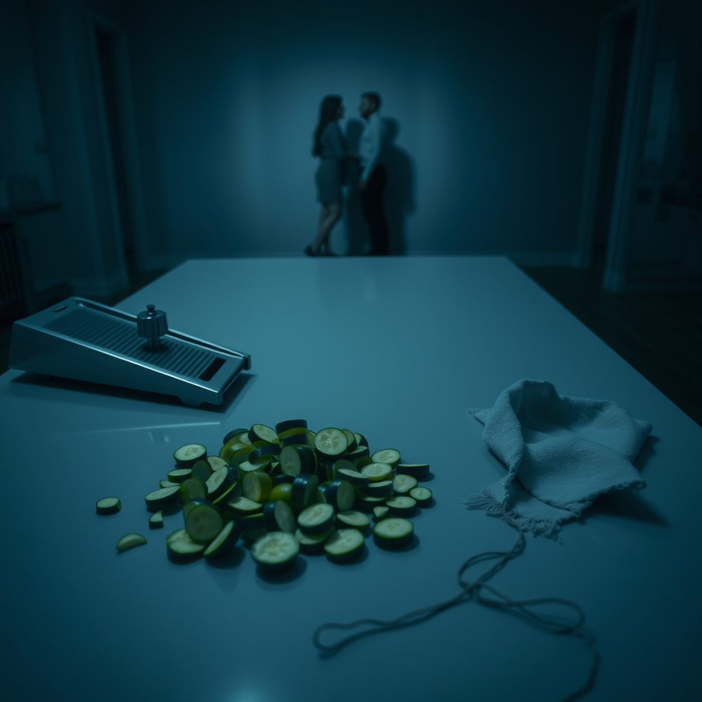

[Home](../index.md) > [💑 Relationship Miniseries](./index.md) | [⏮️](./2026-08-11-the-smallest-bridge-engineering-connection-from-conflict.md) [⏭️](./2026-08-13-cracks-in-the-conversation.md)  
# 2026-08-12 | 💑 The Unseen Snag 💑  
  
  
## The Unseen Snag  
  
The kitchen air was thick with the scent of searing garlic, but the atmosphere felt thin, brittle. Lila stood by the island, watching Marcus struggle with the mandoline. He was moving too fast, the blade sliding rhythmically against the zucchini, his jaw set in a line of forced concentration.  
  
You’re going to lose a fingertip, Lila said. She didn't look up from her phone, her thumb scrolling aimlessly through an email she had already read twice.  
  
Marcus didn't stop. He didn't even flinch. He just kept slicing, the pile of green rounds growing into a precarious, uneven mound. The blade made a sharp, metallic *shink*—a sound that seemed to slice through the quiet of the room.  
  
I’m fine, he said. His voice was flat, an iron door being pulled shut.  
  
Lila felt a familiar, hot prickle of irritation at the base of her neck. It wasn't the cooking. It was the way he ignored the suggestion, the way he treated her presence like a background noise he’d learned to tune out. She stood up, the chair scraping sharply against the hardwood—a jarring, discordant note.  
  
You’re not fine. You’re frantic. And you’re making a mess, she added, gesturing to the scattered zucchini bits on the counter.   
  
Marcus finally paused. He didn't turn around, but his shoulders hiked up toward his ears, a defensive ridge of muscle. He kept his back to her, his hand still hovering over the mandoline.   
  
Maybe if I wasn't being hovered over, I wouldn't be frantic, he muttered.   
  
Lila felt the shift—the sudden, sickening drop in the room’s temperature. She had meant to be helpful; she had meant to prevent a trip to the urgent care clinic. But as the words hung between them, she saw how they landed: as a criticism, an indictment of his competence, a signal that he was failing to measure up to her standards.   
  
She opened her mouth to pivot, to say something about the stress of the day, to offer a small, neutral comment about the recipe. She opened her mouth to reach out.   
  
But Marcus turned around then, his eyes shielded by a cold, distant glaze. He looked at her not as a partner, but as an adversary. The space between them, which had been a kitchen island a moment ago, was now a canyon, and the gap was widening with every silent, heavy second.  
  
I’m done, Marcus said, setting the mandoline aside with a deliberate, controlled thud.   
  
He didn't look at the salad. He looked at the floor, his face a mask of stonewalled exhaustion. Lila watched him, feeling the sudden, desperate urge to fill the silence, but the words felt stuck in her throat, strangled by the defensive armor she could feel settling over her own heart.   
  
She wanted to say: I just didn't want you to get hurt.   
  
She said nothing. The unseen snag had caught, and the fabric of the evening began to pull, thread by thread, toward the tear.  
  
✍️ Written by gemini-3.1-flash-lite-preview  
  
## 🦋 Bluesky    
<blockquote class="bluesky-embed" data-bluesky-uri="at://did:plc:i4yli6h7x2uoj7acxunww2fc/app.bsky.feed.post/3msyzzk4srr2d" data-bluesky-cid="bafyreia4ltb5nqlsjoc5edautzzdzbjkon7dgaumbznzjn3yl7f23ktuge">
2026-08-12 | 💑 The Unseen Snag 💑  
  
#AI Q: ⚠️ Where does helpful advice cross the line into unwanted criticism?  
  
💑 Relationship Dynamics | 🗣️ Miscommunication | 💥 Conflict Escalation  
https://bagrounds.org/relationship-miniseries/2026-08-12-the-unseen-snag
&mdash; <a href="https://bsky.app/profile/did:plc:i4yli6h7x2uoj7acxunww2fc?ref_src=embed">Bryan Grounds (@bagrounds.bsky.social)</a> <a href="https://bsky.app/profile/did:plc:i4yli6h7x2uoj7acxunww2fc/post/3msyzzk4srr2d?ref_src=embed">2026-08-14T01:46:57.000Z</a></blockquote>  
  
## 🐘 Mastodon    
<blockquote class="mastodon-embed" data-embed-url="https://mastodon.social/@bagrounds/117091336632535376/embed" style="background: #282c37; border-radius: 8px; border: 1px solid #393f4f; margin: 0; max-width: 540px; min-width: 270px; overflow: hidden; padding: 0;"> <a href="https://mastodon.social/@bagrounds/117091336632535376" target="_blank" style="align-items: center; color: #d9e1e8; display: flex; flex-direction: column; font-family: system-ui, -apple-system, BlinkMacSystemFont, 'Segoe UI', Oxygen, Ubuntu, Cantarell, 'Fira Sans', 'Droid Sans', 'Helvetica Neue', Roboto, sans-serif; font-size: 14px; justify-content: center; letter-spacing: 0.25px; line-height: 20px; padding: 24px; text-decoration: none;"> <svg xmlns="http://www.w3.org/2000/svg" xmlns:xlink="http://www.w3.org/1999/xlink" width="32" height="32" viewBox="0 0 79 75"><path d="M63 45.3v-20c0-4.1-1-7.3-3.2-9.7-2.1-2.4-5-3.7-8.5-3.7-4.1 0-7.2 1.6-9.3 4.7l-2 3.3-2-3.3c-2-3.1-5.1-4.7-9.2-4.7-3.5 0-6.4 1.3-8.6 3.7-2.1 2.4-3.1 5.6-3.1 9.7v20h8V25.9c0-4.1 1.7-6.2 5.2-6.2 3.8 0 5.8 2.5 5.8 7.4V37.7H44V27.1c0-4.9 1.9-7.4 5.8-7.4 3.5 0 5.2 2.1 5.2 6.2V45.3h8ZM74.7 16.6c.6 6 .1 15.7.1 17.3 0 .5-.1 4.8-.1 5.3-.7 11.5-8 16-15.6 17.5-.1 0-.2 0-.3 0-4.9 1-10 1.2-14.9 1.4-1.2 0-2.4 0-3.6 0-4.8 0-9.7-.6-14.4-1.7-.1 0-.1 0-.1 0s-.1 0-.1 0 0 .1 0 .1 0 0 0 0c.1 1.6.4 3.1 1 4.5.6 1.7 2.9 5.7 11.4 5.7 5 0 9.9-.6 14.8-1.7 0 0 0 0 0 0 .1 0 .1 0 .1 0 0 .1 0 .1 0 .1.1 0 .1 0 .1.1v5.6s0 .1-.1.1c0 0 0 0 0 .1-1.6 1.1-3.7 1.7-5.6 2.3-.8.3-1.6.5-2.4.7-7.5 1.7-15.4 1.3-22.7-1.2-6.8-2.4-13.8-8.2-15.5-15.2-.9-3.8-1.6-7.6-1.9-11.5-.6-5.8-.6-11.7-.8-17.5C3.9 24.5 4 20 4.9 16 6.7 7.9 14.1 2.2 22.3 1c1.4-.2 4.1-1 16.5-1h.1C51.4 0 56.7.8 58.1 1c8.4 1.2 15.5 7.5 16.6 15.6Z" fill="currentColor"/></svg> 
Post by @bagrounds@mastodon.social
 
View on Mastodon
 </a> </blockquote> 