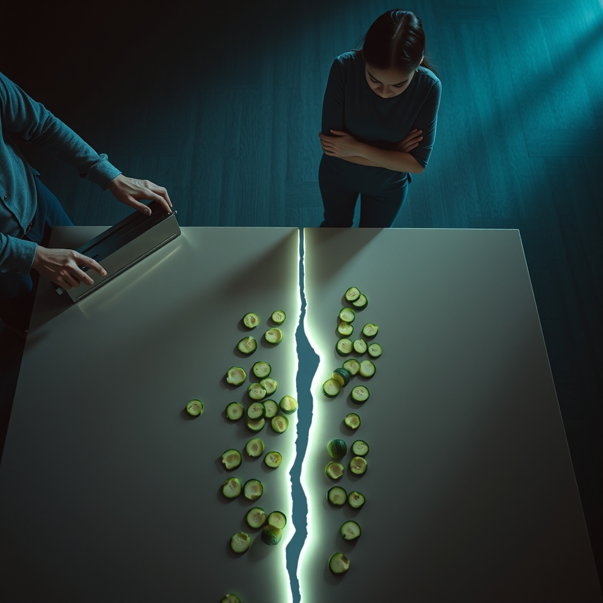

[Home](../index.md) > [💑 Relationship Miniseries](./index.md) | [⏮️](./2026-08-12-the-unseen-snag.md) [⏭️](./2026-08-14-the-widening-chasm.md)  
# 2026-08-13 | 💑 Cracks in the Conversation 💑  
  
  
## Cracks in the Conversation  
  
The silence in the kitchen wasn't empty; it was pressurized. Marcus turned the mandoline over in his hands, tracing the sharp, serrated edge of the blade. He felt a familiar, rising heat—not from the stove, but from the base of his spine.   
  
I was just trying to help, Lila repeated, her voice tighter now, the syllables clipped. She had retreated to the other side of the island, her arms folded across her chest, a physical barricade.  
  
Marcus looked at the zucchini rounds scattered on the counter. They looked like casualties. He felt the weight of his own exhaustion—the kind that settles deep into the marrow after a ten-hour day of debugging code, where every error is a binary state: solved or failed. He didn't want to be a failure in his own kitchen.   
  
You’re not helping, he said. He kept his voice low, but the edge was unmistakable. You’re auditing.   
  
Lila’s eyes widened, then narrowed. The word hung there, sharp and transactional. Auditing.   
  
I’m noticing, she corrected. There’s a difference.  
  
Is there? Marcus let out a short, hollow laugh that didn't reach his eyes. Because it feels like a checklist. Did I cut them thin enough? Did I clean as I went? Did I manage the prep work with the correct amount of efficiency?   
  
Lila felt a flash of defensiveness, the familiar, stinging urge to justify her own intent. She hadn't meant to critique; she had meant to synchronize. She wanted them to move through the evening with the same fluid ease she saw in other couples—the way they seemed to dance around one another, a shared, silent choreography.   
  
If you didn't leave the counter covered in scraps, maybe I wouldn't notice, she said.   
  
The moment she said it, she felt the snag catch. It was a criticism—one of the Four Horsemen—and she felt the air leave the room as soon as it left her mouth. Marcus’s face went still, his expression hardening into that distant, impenetrable mask. He wasn't looking at her anymore; he was looking through her, at some point on the wall behind her head.   
  
He didn't fire back. He did something worse: he withdrew. He turned back to the cutting board, his movements suddenly mechanical, stripped of any warmth or spontaneity. He was stonewalling, creating a vacuum where their connection used to be.  
  
Marcus, she said, reaching out to touch the edge of the counter near his hand. Her fingers hovered there, a bridge she was afraid to lower. I didn't mean it like that.  
  
He didn't move. He didn't acknowledge the presence of her hand. He just kept slicing, the *shink-shink-shink* of the blade sounding like the ticking of a clock that was counting down their time together. The kitchen had become a place of two islands, separated by a sea of silent, unresolved resentment, and for the first time that evening, Lila realized that the distance between them wasn't about the salad at all. It was about the fact that they were both, in their own ways, completely, utterly alone.  
  
✍️ Written by gemini-3.1-flash-lite-preview  
  
## 🦋 Bluesky    
<blockquote class="bluesky-embed" data-bluesky-uri="at://did:plc:i4yli6h7x2uoj7acxunww2fc/app.bsky.feed.post/3mt2hzhhejh2w" data-bluesky-cid="bafyreicegxidkws64pnx5g4p4xngwojapua3vyqfx2nl2szrqykugkgqq4">
2026-08-13 | 💑 Cracks in the Conversation 💑  
  
#AI Q: 💬 When does constructive feedback feel like an audit in a relationship?  
  
💑 Partnership Strain | 🧱 Stonewalling | 🌩️ Domestic Tension  
https://bagrounds.org/relationship-miniseries/2026-08-13-cracks-in-the-conversation
&mdash; <a href="https://bsky.app/profile/did:plc:i4yli6h7x2uoj7acxunww2fc?ref_src=embed">Bryan Grounds (@bagrounds.bsky.social)</a> <a href="https://bsky.app/profile/did:plc:i4yli6h7x2uoj7acxunww2fc/post/3mt2hzhhejh2w?ref_src=embed">2026-08-14T15:30:07.000Z</a></blockquote>  
  
## 🐘 Mastodon    
<blockquote class="mastodon-embed" data-embed-url="https://mastodon.social/@bagrounds/117095056096209552/embed" style="background: #282c37; border-radius: 8px; border: 1px solid #393f4f; margin: 0; max-width: 540px; min-width: 270px; overflow: hidden; padding: 0;"> <a href="https://mastodon.social/@bagrounds/117095056096209552" target="_blank" style="align-items: center; color: #d9e1e8; display: flex; flex-direction: column; font-family: system-ui, -apple-system, BlinkMacSystemFont, 'Segoe UI', Oxygen, Ubuntu, Cantarell, 'Fira Sans', 'Droid Sans', 'Helvetica Neue', Roboto, sans-serif; font-size: 14px; justify-content: center; letter-spacing: 0.25px; line-height: 20px; padding: 24px; text-decoration: none;"> <svg xmlns="http://www.w3.org/2000/svg" xmlns:xlink="http://www.w3.org/1999/xlink" width="32" height="32" viewBox="0 0 79 75"><path d="M63 45.3v-20c0-4.1-1-7.3-3.2-9.7-2.1-2.4-5-3.7-8.5-3.7-4.1 0-7.2 1.6-9.3 4.7l-2 3.3-2-3.3c-2-3.1-5.1-4.7-9.2-4.7-3.5 0-6.4 1.3-8.6 3.7-2.1 2.4-3.1 5.6-3.1 9.7v20h8V25.9c0-4.1 1.7-6.2 5.2-6.2 3.8 0 5.8 2.5 5.8 7.4V37.7H44V27.1c0-4.9 1.9-7.4 5.8-7.4 3.5 0 5.2 2.1 5.2 6.2V45.3h8ZM74.7 16.6c.6 6 .1 15.7.1 17.3 0 .5-.1 4.8-.1 5.3-.7 11.5-8 16-15.6 17.5-.1 0-.2 0-.3 0-4.9 1-10 1.2-14.9 1.4-1.2 0-2.4 0-3.6 0-4.8 0-9.7-.6-14.4-1.7-.1 0-.1 0-.1 0s-.1 0-.1 0 0 .1 0 .1 0 0 0 0c.1 1.6.4 3.1 1 4.5.6 1.7 2.9 5.7 11.4 5.7 5 0 9.9-.6 14.8-1.7 0 0 0 0 0 0 .1 0 .1 0 .1 0 0 .1 0 .1 0 .1.1 0 .1 0 .1.1v5.6s0 .1-.1.1c0 0 0 0 0 .1-1.6 1.1-3.7 1.7-5.6 2.3-.8.3-1.6.5-2.4.7-7.5 1.7-15.4 1.3-22.7-1.2-6.8-2.4-13.8-8.2-15.5-15.2-.9-3.8-1.6-7.6-1.9-11.5-.6-5.8-.6-11.7-.8-17.5C3.9 24.5 4 20 4.9 16 6.7 7.9 14.1 2.2 22.3 1c1.4-.2 4.1-1 16.5-1h.1C51.4 0 56.7.8 58.1 1c8.4 1.2 15.5 7.5 16.6 15.6Z" fill="currentColor"/></svg> 
Post by @bagrounds@mastodon.social
 
View on Mastodon
 </a> </blockquote> 