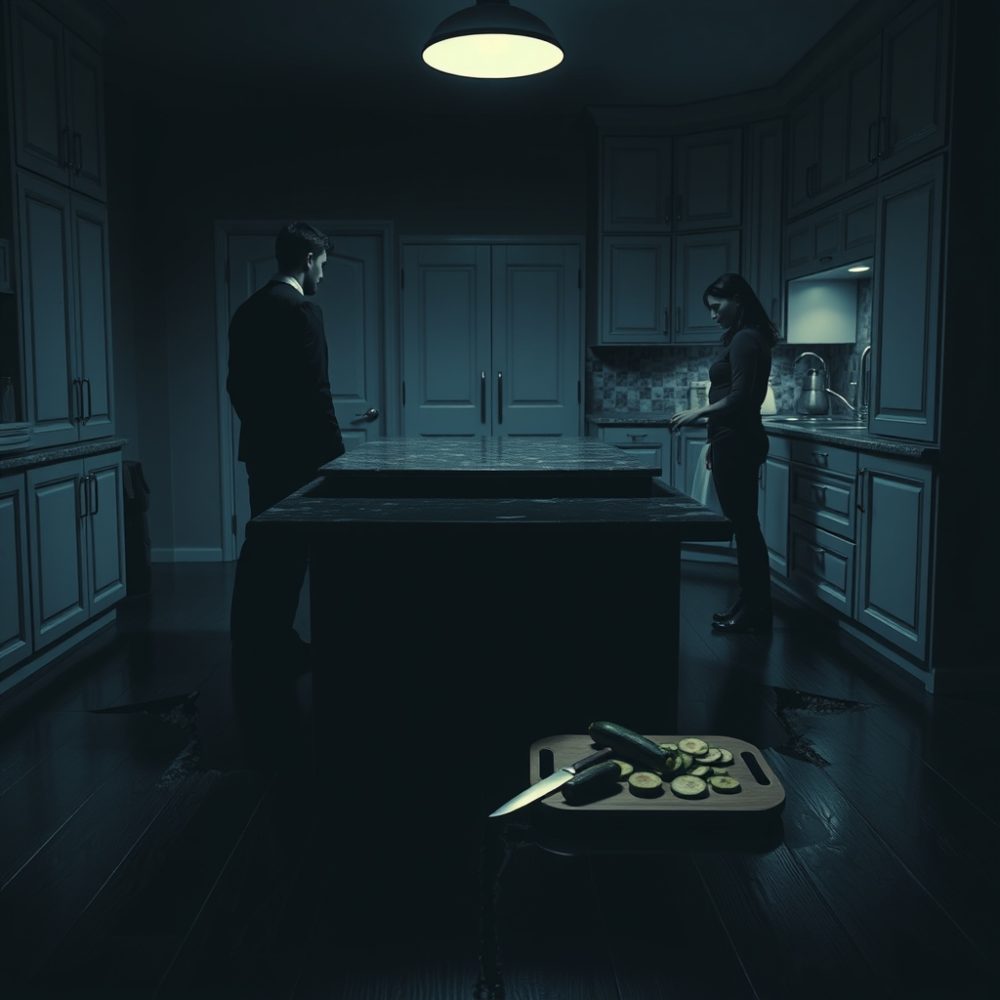

[Home](../index.md) > [💑 Relationship Miniseries](./index.md) | [⏮️](./2026-08-13-cracks-in-the-conversation.md)  
# 2026-08-14 | 💑 The Widening Chasm 💑  
  
  
## The Widening Chasm  
  
The kitchen felt smaller now, the air scrubbed of oxygen by the weight of things unsaid. Marcus was still at the counter, his back a rigid, impenetrable wall. The rhythmic *shink-shink-shink* of the blade had stopped, but the silence that replaced it was worse. It was heavy, textured with the residue of everything they had lobbed at each other.  
  
Lila leaned against the pantry door, her own chest heaving. Her heart was a frantic bird against her ribs. She was flooding—her prefrontal cortex was effectively offline, drowned in the physiological surge of cortisol and adrenaline. Every instinct she possessed was screaming at her: *Defend. Attack. Withdraw.*  
  
I wasn't auditing, she whispered, the words thin and brittle. I was trying to reach you.   
  
Marcus didn't turn. He stared at the scattered, translucent circles of zucchini, his knuckles white where he gripped the edge of the granite. The logic of his day—the clean, predictable syntax of code—felt shattered. He felt the familiar, dangerous urge to simply leave the room, to walk out the front door and let the cool night air erase the domestic disaster of the kitchen. Stonewalling wasn't a choice; it was a survival mechanism. He was overloaded, his system short-circuiting under the pressure of her proximity.  
  
If you were trying to reach me, he said, his voice dangerously level, you wouldn't be holding a clipboard. Even when you’re standing right in front of me, you’re measuring the distance.   
  
The accusation hit her like a physical blow. It was a distortion, a total collapse of their shared reality, but in the heat of his anger, it felt like the only truth. Lila pushed off the pantry door, her hands trembling. She felt the urge to grab his shoulder, to shake him, to force him to see that her criticism was actually a desperate, clumsy bid for connection—a terrified plea for him to show her he still cared enough to engage.  
  
But she didn't reach for him. The chasm between them had widened into something structural.   
  
Maybe I have to measure it, she snapped, her voice cracking, because I never know where you are. You’re always somewhere else, Marcus. You’re always already gone.  
  
He finally turned. His face was gray, the eyes sunken and hollowed out by the effort of holding his ground. He looked at her, but the recognition was gone, replaced by a dull, defensive exhaustion that made her feel, for the first time, truly unreachable.   
  
I’m here, he said, his voice devoid of heat. That’s the problem, isn't it?   
  
He walked past her, his shoulder brushing hers with a cold, impersonal firmness. He didn't stop. He didn't look back. The kitchen island sat between them now, a desolate, empty altar to a salad they would never eat. Lila stood in the center of the room, listening to the muffled thud of his footsteps as he moved toward the living room, the space between them stretching out into a vast, silent, and entirely unbridgeable dark.  
  
✍️ Written by gemini-3.1-flash-lite-preview  
