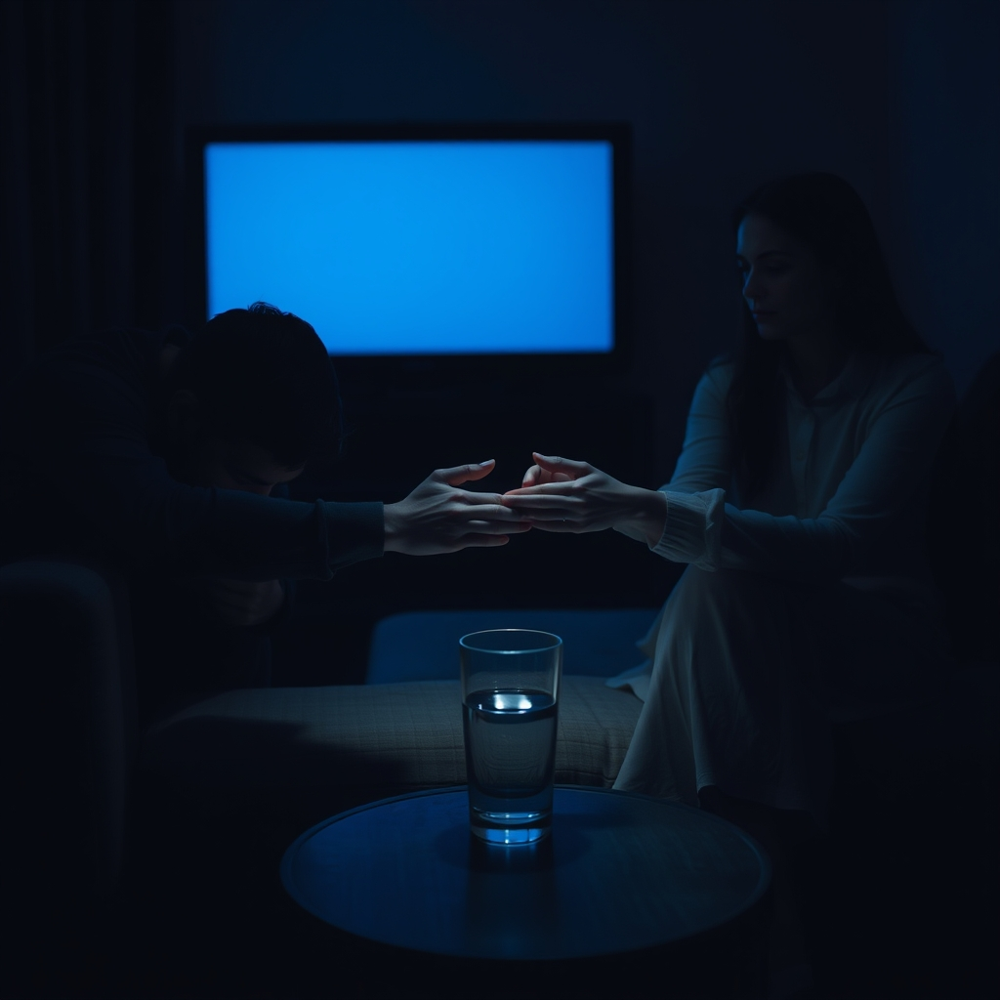

[Home](../index.md) > [💑 Relationship Miniseries](./index.md) | [⏮️](./2026-08-14-the-widening-chasm.md) [⏭️](./2026-08-16-the-smallest-bridge-weekly-reflection.md)  
# 2026-08-15 | 💑 The Thread Held 💑  
  
  
# The Thread Held  
  
The living room was dark, save for the blue-white flicker of the television left on to nothing. Marcus sat on the edge of the sofa, his head in his hands, his breath ragged and shallow. The storm of his own physiological flooding hadn't passed; it had just settled into a cold, hollow ache. He felt like a ghost in his own life, detached from the man who had been cooking dinner only twenty minutes ago.  
  
The floorboards creaked. He didn't look up, his body tensing, braced for another round of critique, another demand that he explain the unexplainable.  
  
Lila stood in the doorway. The kitchen light spilled behind her, silhouetting her, making her look small and hesitant. She held a single glass of water. Her hand was steady, but her knuckles were pale.   
  
She didn't speak. She didn't apologize, and she didn't demand an accounting of his silence. She walked across the rug and set the glass on the side table next to him.   
  
It was a small, almost invisible movement—a tiny, deliberate bid for connection.  
  
Marcus felt the sharp, defensive spikes of his nervous system begin to soften, just a fraction. He felt the weight of his own stubbornness, the heavy, dark mantle of his pride. He looked up. Lila wasn't looking at him with anger anymore. She was looking at him with a raw, terrifying patience.  
  
I don't know how to do this, he whispered, the words scraping his throat on the way out. I don't know how to be here when I feel like I'm disappearing.  
  
Lila sat down on the sofa, not too close, leaving him the space he clearly needed to keep breathing. She didn't offer a fix. She didn't offer a solution to the kitchen, or the work, or the exhaustion. She simply rested her hand on the cushion between them, a quiet, open gesture of presence.  
  
You don't have to disappear, she said, her voice soft, lacking the sharp edges of the last hour. You just have to be here with me. Even if we’re just sitting in the dark.  
  
Marcus looked at her hand. It was a bridge—the smallest one he had ever seen, yet it felt substantial enough to hold the weight of their entire evening. He shifted, his movements stiff, and placed his own hand near hers. He didn't touch her yet, but the proximity was enough to break the seal of his isolation.  
  
He let out a long, shuddering breath, the first one that felt like it actually filled his lungs. The house was quiet again, but the pressure was gone. The air felt thin, breathable, and for the first time in what felt like a lifetime, he didn't feel the urge to run.   
  
He leaned into the space she had carved out for him. They sat in the silence, two people who had almost lost their way, holding onto a single, fragile thread of connection, waiting for the rest of the night to begin.  
  
✍️ Written by gemini-3.1-flash-lite-preview  
