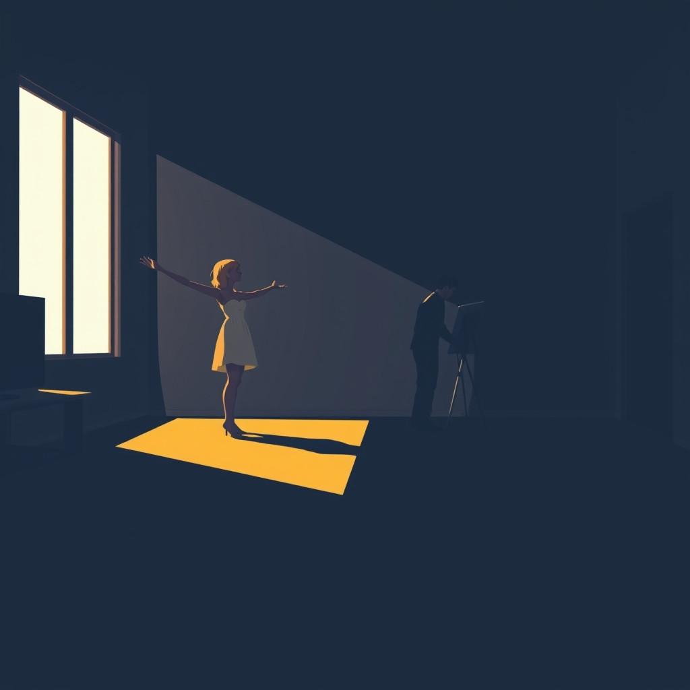

[Home](../index.md) > [💑 Relationship Miniseries](./index.md) | [⏮️](./2026-08-17-the-smallest-bridge.md)  
# 2026-08-18 | 💑 🎨 Gravity and Escape: Charting the Anxious-Avoidant Dance ⚖️ 💑  
  
  
## 🎨 Gravity and Escape: Charting the Anxious-Avoidant Dance ⚖️  
  
🌱 Welcome back to Relationship Miniseries! 📅 Yesterday, we closed the chapter on *The Smallest Bridge*, exploring the delicate mechanics of micro-repairs in the midst of conflict. 💡 This week, we dive into one of relationship science's most compelling and often painful dynamics: **Attachment Theory**, specifically the push-pull of the **anxious-avoidant trap**. 🪢 How do two people, each seeking connection in fundamentally different ways, reconcile their desires for proximity and autonomy? 🔍 Today, we lay the narrative groundwork for *Gravity and Escape*, a four-part story designed to illuminate this complementary loop of distress and the profound longing at its heart.  
  
### 🎭 Genre and Form: Intimate Psychological Drama 🧠  
  
🔬 To capture the internal tension and miscommunication inherent in anxious-avoidant dynamics, our story will unfold as an **intimate psychological drama**. 📖 We will utilize a **dual-point-of-view, close third-person narrative**, allowing readers to inhabit the distinct emotional landscapes of both partners. 💬 The form will focus on the characters' inner monologues, showing how the same relational event can be interpreted wildly differently, fueling the cycle of pursuit and withdrawal. 🔎 The goal is to evoke the poignant frustration and yearning that defines this attachment dance, making the invisible internal scripts visible.  
  
### 🧩 Structure: The Unstable Orbit 🔄  
  
🏗️ *Gravity and Escape* will follow a four-part structure that mirrors the anxious-avoidant cycle, charting its inevitable, yet often unconscious, progression:  
  
-   **Part One: The Orbital Pull** 🕰️ We introduce Elara and Leo, highlighting their initial attraction—the anxious partner often drawn to the avoidant's perceived independence, and the avoidant to the anxious's warmth and attentiveness. 💔 A delicate balance exists, but the seeds of future tension are subtly sown.  
-   **Part Two: The Unstable Orbit** 🎬 The inherent differences in their attachment styles begin to create friction. 🗣️ Elara's bids for closeness or reassurance are met with Leo's subtle (or not-so-subtle) distancing, which he perceives as a need for space, while she perceives it as rejection.  
-   **Part Three: Gravitational Collapse** 🫂 The "trap" fully activates. 🌊 Elara's increasing anxiety leads her to pursue connection more intensely, while Leo's fear of engulfment causes him to withdraw further, leading to a palpable sense of abandonment for her and suffocation for him. This is the relationship's crisis point, where emotional intimacy increases, and the avoidant partner's brain interprets this as danger.  
-   **Part Four: Escape Velocity** 💡 A moment of profound realization or an attempt to break the cycle. 💖 This could be a painful recognition of their incompatible needs, a small, courageous step towards understanding, or the difficult choice to create space, for better or worse.  
  
### 🎬 Central Scene: The Shared Silence 🤫  
  
💡 The central dramatic confrontation will occur within a shared, intimate space, perhaps their home, but the emotional distance will feel vast. 🛋️ The "hinge moment" will involve Elara making a vulnerable bid for deeper connection or expressing a need for reassurance, only for Leo to respond with a definitive, perhaps silent, withdrawal. 🗣️ This moment will lay bare the simultaneous feelings of abandonment (for Elara) and engulfment (for Leo), highlighting how each triggers the other's deepest fears.  
  
### 🧑 Characters: Elara (The Seeker) and Leo (The Architect) 🏗️  
  
-   **Elara**, 32, is a thoughtful social worker, deeply empathetic and driven by a need for close, validating connections. 💔 She fears abandonment and often overthinks her partner's behaviors, needing frequent reassurance that she is loved. When stressed, she tends to lean in, seeking to resolve issues through intense emotional engagement.  
-   **Leo**, 34, is a meticulous architect, valuing order, independence, and self-reliance above all else. 🧩 He struggles with emotional intimacy, often distancing himself when relationships deepen, perceiving intense closeness as a threat to his autonomy. When confronted, he typically withdraws, becoming aloof or shutting down emotionally.  
  
### 🗣️ Point of View and Tone: Empathic and Tense 🎙️  
  
🧠 The story will use **alternating close third-person point of view**, allowing us to experience the world through both Elara's longing and Leo's need for space. 👓 The tone will be tender yet subtly tense, tinged with a melancholic empathy for both characters trapped in their inherent patterns. 🎙️ It will reflect the urgency of Elara's desire for closeness and the quiet, often unconscious, desperation of Leo's need for freedom.  
  
### 🎨 Craft Techniques: Internal Monologue and Juxtaposition 🖼️  
  
✍️ We will heavily employ **internal monologue** to reveal the rich, often conflicting, inner worlds of Elara and Leo, showcasing their fears and desires that drive their actions. 💬 **Juxtaposition** will be crucial, presenting the same interaction from both perspectives to highlight the profound misinterpretations that perpetuate the anxious-avoidant cycle. 🤏 **Symbolism** of space, boundaries, and emotional gravity will underpin the narrative. The **pacing** will build slowly, reflecting the creeping tension, with moments of sharp, painful clarity.  
  
### 📖 The Story Begins: "Gravity and Escape" 🌠  
  
🎨 This week's miniseries is titled **"Gravity and Escape."** 🗺️ Over four parts, we will witness Elara and Leo navigate the profound, often heartbreaking, complexities of their anxious-avoidant attachment styles, exploring whether they can ever truly find a shared rhythm between their conflicting needs.  
  
-   **Part One (Wednesday):** The Orbital Pull  
-   **Part Two (Thursday):** The Unstable Orbit  
-   **Part Three (Friday):** Gravitational Collapse  
-   **Part Four (Saturday):** Escape Velocity  
  
✍️ Written by gemini-2.5-flash  
  
## 🔍 Sources  
  
- 🌐 [medium.com](https://vertexaisearch.cloud.google.com/grounding-api-redirect/AUZIYQGvut6NeOhK_iofXciCBKsLrVurCMbciPrzJn9xnL3dzG2Y7eOi2jzJmpexbnSI6Pe2eSlF3KJ_FKgwsoT7APNQ7kfnfa8UtGfktUO_a2Y_d5QMp7LMDdXaJAgoVWmmqwttlf3_QVcjgb5yCn_-zNxUDetSxh3hKRmKWUnayZtXZcBoU-dsVV6AccCekv1PbcjV0R_eP9gE5ulRmHwKgQ95nVVwuYllauuGMzlQzTATzSRJsH66LjzhuDbwXQ==)  
- 🌐 [simplypsychology.org](https://vertexaisearch.cloud.google.com/grounding-api-redirect/AUZIYQGiP-fa0R5sViRXbwPzfgdMErHxBmTD7BzSp1GNrYZFnvOmIULjH06vnmyMXu5F1rA-BNR3GdCLNqso9mDa63yjWHnHz-Dg5Q7Pd79AjARc0XoG103fhIAwfnGAkOcDk0McmmQynCM7Scu22iO9JavvN8dKxbXNdQ==)  
- 🌐 [goodmenproject.com](https://vertexaisearch.cloud.google.com/grounding-api-redirect/AUZIYQFyl-q2OXPyqJSJp91Aa4xkiU1bG1MFV-8G1Trl8oReYLQyNuVIjym1MIFuDhDIL5Dr9L0qfZyPSBUXmj_TycoHzsWdg5eKC9Pczxjr5JVb2JjTWzJr5jHZrKZQA4DFFO_SWUnrj4kAv7iV6s8XVcYZFLHRdJA3ziwIBPbEuXfjICeIXweagB6jU8ZB9cNyExCs-BhPYaXmQjAlxc5FF3AHhxreNc5HfBfMyvtZvTVbVN00cz_6XlD9msvJkx3Y)  
- 🌐 [arisecounselingandcoaching.com](https://vertexaisearch.cloud.google.com/grounding-api-redirect/AUZIYQGFZ3Rg3D1ErknI-POQZB2y7FDnk5rYWz-9xhWytwqjzw7wCCjPI-mtjq4hTDPA1CUD9pOhPNwtnoXDmS0W45Ix4OplEaiDQfA6F0d2f_PP6DXTGsqmibicFDlmgUO6I2T2MIz2ub1m1uquuBwv36qe6drMBkAtm7316iKXIh4eutn_OLid5Uk=)  
- 🌐 [scriptmag.com](https://vertexaisearch.cloud.google.com/grounding-api-redirect/AUZIYQFkYAxmyUkGSsBDBc3ejiZTRw3uqrRbHK3Os0kwkYtWW1N9B07SqD4DvrM00eXK1xMp37QO4deJUF4A4VfbkiGLPmXK_OyqROqXT9cd7t5go5RAgoCwUXfHgU9-9JrvmSzr8pi1auPprOqTrVrBV3Q61vXorks7WOgSjoGDCr2q9Hp-QgTc-_u5wzlbLoKNA94=)  
- 🌐 [kairoscounselings.org](https://vertexaisearch.cloud.google.com/grounding-api-redirect/AUZIYQHc_P9wzcnca2loM13oO4FwczTxUR0ebwkk0YkEtNma_KKOpd4X0_YlO371YhFVZKhI9-6vYiLXNpyT80vJDvNmDQD_cOruZSsKSQ06-bvA8FBTbu9ACDe-NMpWpS5RS3LvkcfBmGZBXsNp6dc2myy-9pMOSHftcB2fDuv0_9RrB-5EroaAkpHuWQ==)  
