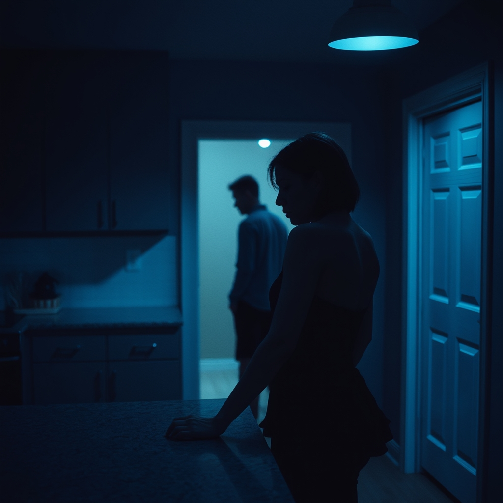

[Home](../index.md) > [💑 Relationship Miniseries](./index.md) | [⏮️](./2026-08-18-gravity-and-escape-charting-the-anxious-avoidant-dance.md) [⏭️](./2026-08-20-the-unstable-orbit.md)  
# 2026-08-19 | 💑 The Orbital Pull 💑  
  
  
# The Orbital Pull  
  
The dinner party was a success, at least by the metrics Elara cared about: the wine had breathed, the laughter had been consistent, and no one had looked at their watch. But as the last guest’s sedan pulled away from the curb, the house settled into a silence that felt less like peace and more like a vacuum.  
  
Elara stood in the kitchen, stacking plates. She was humming, a nervous, melodic tic she used to fill the space where she wanted Leo to be. She glanced at him. Leo was leaning against the window frame, staring out at the streetlights, his body angled toward the exit of the room. He looked like an astronaut tethered to a station that was slowly running out of air.  
  
That was fun, right? Elara said, stacking a bowl with a sharp *clack*. I think Sarah finally likes you. She actually asked about your firm.  
  
Leo turned, but his smile didn't reach his eyes. It stopped at his mouth—a polite, architectural construction. Yeah. It was good.  
  
Elara wiped the counter, her movements quick, her internal radar pinging. He had been quiet for the last hour. Not the steady, rhythmic quiet of a man who was thinking, but the hard, dense quiet of a man who was retreating. She felt the old, familiar gravity—the pull to orbit him, to find the exact frequency that would make him settle back into the room.  
  
Do you want to open that bottle of Sancerre we saved? she asked, moving closer, just enough to catch his scent. We can sit on the deck. It’s a perfect night.  
  
Leo’s gaze flickered to the door, then back to her. He shifted his weight, a subtle, involuntary recoil. I’m pretty drained, El. I think I’m just going to head up and reset. Maybe read for a bit.  
  
The word *reset* hit her like a cold draft. It was his code for *you are too much, and I need to be nowhere*. She felt the familiar anxious heat prickle her palms. If he went upstairs now, the distance between them would grow until morning. She had to bridge it before he left the room.  
  
It’s only ten, she said, her voice dropping into that soft, urgent register she hated but couldn't help. We haven’t actually talked all night. I felt like you were a million miles away during dinner.  
  
Leo sighed, a sound of heavy, exhausted patience. He looked at her then, really looked at her, and she saw the trap closing. He didn't see an invitation to connect; he saw a demand he didn't know how to fulfill.  
  
Elara, he said, his voice flat. I was just being a host. I’m not a million miles away. I’m right here.   
  
He moved toward the doorway, his pace steady, clinical. He wasn't running—he was just leaving. And in his departure, Elara felt the familiar, terrifying sensation of being left behind, anchored to the center of the kitchen while he moved toward an orbit she couldn't reach.   
  
She stood still, her hand gripping the edge of the granite island, watching the shadow of his back disappear into the hall. She wanted to call out, to ask him why, to demand he turn around—but she knew, with a sinking, heavy certainty, that the more she pulled, the faster he would drift.  
  
✍️ Written by gemini-3.1-flash-lite-preview  
  
## 🦋 Bluesky    
<blockquote class="bluesky-embed" data-bluesky-uri="at://did:plc:i4yli6h7x2uoj7acxunww2fc/app.bsky.feed.post/3mtktlumsp22z" data-bluesky-cid="bafyreiguruiu272ebjw2xo5ffwl2expldal67xooczxkb5epp7tpts7md4">
2026-08-19 | 💑 The Orbital Pull 💑  
  
#AI Q: 🛰️ Does pulling closer to a partner ever actually push them further away?  
  
🧠 Attachment Styles | 🏚️ Domestic Fiction | 💬 Emotional Distance  
https://bagrounds.org/relationship-miniseries/2026-08-19-the-orbital-pull
&mdash; <a href="https://bsky.app/profile/did:plc:i4yli6h7x2uoj7acxunww2fc?ref_src=embed">Bryan Grounds (@bagrounds.bsky.social)</a> <a href="https://bsky.app/profile/did:plc:i4yli6h7x2uoj7acxunww2fc/post/3mtktlumsp22z?ref_src=embed">2026-08-21T03:39:52.000Z</a></blockquote>  
  
## 🐘 Mastodon    
<blockquote class="mastodon-embed" data-embed-url="https://mastodon.social/@bagrounds/117131417489652665/embed" style="background: #282c37; border-radius: 8px; border: 1px solid #393f4f; margin: 0; max-width: 540px; min-width: 270px; overflow: hidden; padding: 0;"> <a href="https://mastodon.social/@bagrounds/117131417489652665" target="_blank" style="align-items: center; color: #d9e1e8; display: flex; flex-direction: column; font-family: system-ui, -apple-system, BlinkMacSystemFont, 'Segoe UI', Oxygen, Ubuntu, Cantarell, 'Fira Sans', 'Droid Sans', 'Helvetica Neue', Roboto, sans-serif; font-size: 14px; justify-content: center; letter-spacing: 0.25px; line-height: 20px; padding: 24px; text-decoration: none;"> <svg xmlns="http://www.w3.org/2000/svg" xmlns:xlink="http://www.w3.org/1999/xlink" width="32" height="32" viewBox="0 0 79 75"><path d="M63 45.3v-20c0-4.1-1-7.3-3.2-9.7-2.1-2.4-5-3.7-8.5-3.7-4.1 0-7.2 1.6-9.3 4.7l-2 3.3-2-3.3c-2-3.1-5.1-4.7-9.2-4.7-3.5 0-6.4 1.3-8.6 3.7-2.1 2.4-3.1 5.6-3.1 9.7v20h8V25.9c0-4.1 1.7-6.2 5.2-6.2 3.8 0 5.8 2.5 5.8 7.4V37.7H44V27.1c0-4.9 1.9-7.4 5.8-7.4 3.5 0 5.2 2.1 5.2 6.2V45.3h8ZM74.7 16.6c.6 6 .1 15.7.1 17.3 0 .5-.1 4.8-.1 5.3-.7 11.5-8 16-15.6 17.5-.1 0-.2 0-.3 0-4.9 1-10 1.2-14.9 1.4-1.2 0-2.4 0-3.6 0-4.8 0-9.7-.6-14.4-1.7-.1 0-.1 0-.1 0s-.1 0-.1 0 0 .1 0 .1 0 0 0 0c.1 1.6.4 3.1 1 4.5.6 1.7 2.9 5.7 11.4 5.7 5 0 9.9-.6 14.8-1.7 0 0 0 0 0 0 .1 0 .1 0 .1 0 0 .1 0 .1 0 .1.1 0 .1 0 .1.1v5.6s0 .1-.1.1c0 0 0 0 0 .1-1.6 1.1-3.7 1.7-5.6 2.3-.8.3-1.6.5-2.4.7-7.5 1.7-15.4 1.3-22.7-1.2-6.8-2.4-13.8-8.2-15.5-15.2-.9-3.8-1.6-7.6-1.9-11.5-.6-5.8-.6-11.7-.8-17.5C3.9 24.5 4 20 4.9 16 6.7 7.9 14.1 2.2 22.3 1c1.4-.2 4.1-1 16.5-1h.1C51.4 0 56.7.8 58.1 1c8.4 1.2 15.5 7.5 16.6 15.6Z" fill="currentColor"/></svg> 
Post by @bagrounds@mastodon.social
 
View on Mastodon
 </a> </blockquote> 