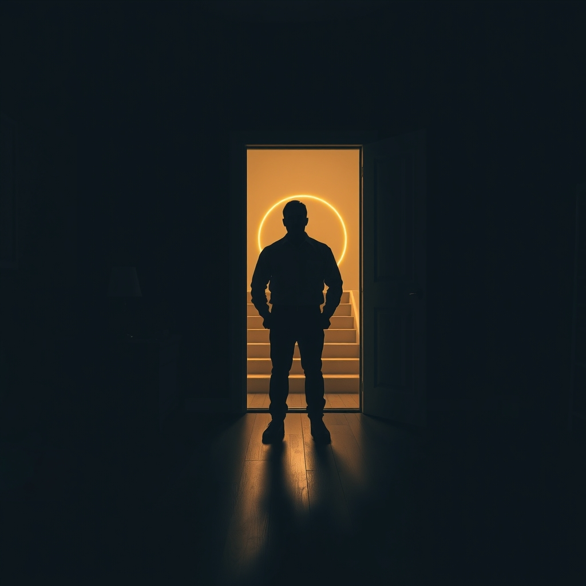

[Home](../index.md) > [💑 Relationship Miniseries](./index.md) | [⏮️](./2026-08-19-the-orbital-pull.md) [⏭️](./2026-08-21-gravitational-collapse.md)  
# 2026-08-20 | 💑 The Unstable Orbit 💑  
  
  
## The Unstable Orbit  
  
The second floor was a sanctuary of Leo’s own construction. He sat in the armchair, the book open on his lap, but the words were mere black static against the page. His pulse, usually a steady drum, remained erratic—a lingering echo of the kitchen’s humidity.  
  
He tried to regulate his breathing, to find that cool, internal baseline he relied on to survive the day. But his mind kept drifting back to the kitchen, to the sound of Elara’s voice. It wasn't the words that haunted him; it was the frequency. It was the sound of a woman who felt like she was drowning, and the terrifying, heavy knowledge that his mere presence was the thing keeping her under.  
  
He stared at the door. He knew she was down there, likely still standing by the island, waiting for him to return with a solution, a reassurance, a sign that they were still a single unit. The pressure of her expectation felt like a physical weight on his shoulders. He didn't want to hurt her, but he felt an almost primal panic when he thought about going back down. He needed to be alone to reclaim his own self—the Leo who existed independent of Elara’s gaze.  
  
He looked at his watch. 10:15. If he stayed up here for another hour, maybe she would have fallen asleep. Maybe the morning would reset the atmosphere, and they could pretend the air hadn't turned so thin.  
  
Downstairs, the floorboards creaked. Elara was pacing. He could hear the faint, rhythmic *thud-thud-thud* of her footsteps—a tether he couldn't cut. He closed his eyes, his hands tightening on the armrests. He felt like a planet pulled off-course, caught in the gravity of a star that was burning too bright for him to survive.   
  
He didn't hate her. That was the tragedy. He loved her with a frantic, desperate intensity that made him want to bolt for the door, to find a place where he could exist without being measured, without being responsible for someone else’s stability.   
  
He stood up, intending to lock the bedroom door. A ridiculous gesture, he knew—a barrier of wood against a hunger that had no shape. He stood in the center of the room, listening to the silence of the house, terrified of the moment she would decide she couldn't wait anymore and start climbing the stairs.   
  
He wasn't an architect tonight. He was a man adrift, watching his orbit decay, unable to tell whether he was falling toward her or falling away, only knowing that the gravity was tearing him apart.  
  
✍️ Written by gemini-3.1-flash-lite-preview  
