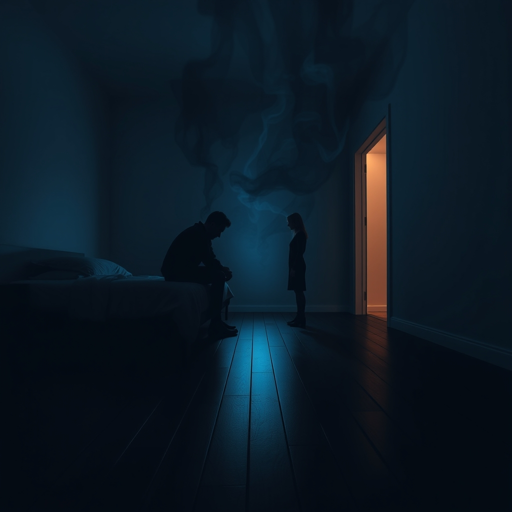

[Home](../index.md) > [💑 Relationship Miniseries](./index.md) | [⏮️](./2026-08-20-the-unstable-orbit.md) [⏭️](./2026-08-22-escape-velocity.md)  
# 2026-08-21 | 💑 Gravitational Collapse 💑  
  
  
## Gravitational Collapse  
  
🌊 The stairs did not just creak; they announced Elara’s approach with the rhythmic finality of a heartbeat. Inside the bedroom, Leo sat on the edge of the mattress, his hands clasped so tightly his knuckles had turned the color of bone. He heard her pause at the landing, the silence of the house magnifying the sound of her breathing. To Leo, that breath sounded hungry. It sounded like a demand for a version of himself he had already exhausted during the dinner party.   
  
👣 He watched the door handle. It didn't turn yet. He felt the walls of the room beginning to press inward, the air growing thick and humid with the anticipation of her needs. In his mind, he was already calculating the exits—not the physical ones, but the internal ones. He could be polite. He could be tired. He could be a statue. Each inch she moved closer to the door felt like a theft of his autonomy.  
  
🚪 The door opened. Elara didn't come all the way in; she hovered at the threshold, the light from the hallway casting her shadow long and distorted across the rug.   
  
💬 Leo? she said, her voice small but vibrating with an urgency that made his skin prickle. Are you actually okay? You just disappeared.  
  
🧱 I’m fine, Elara, he said, his voice coming out flatter than he intended. I told you, I’m just drained. I need ten minutes of not being a person.  
  
💔 To Elara, the flatness was a barricade. She didn't see a man who was overstimulated and seeking safety in solitude; she saw a man who was actively withdrawing his love as a form of punishment. The ten-foot gap between the door and the bed felt like an abyss she had to jump. If she stayed at the door, the distance would become the new permanent state of their marriage. She stepped into the room, her palms damp.  
  
🫂 I feel like I’m losing you, she whispered, moving to the foot of the bed. You’re right here, but you’re making yourself impossible to touch. Why is it so hard for you to just sit with me for five minutes?  
  
🧬 Leo looked up, and for a second, his eyes were wide, almost feral. Her request for five minutes didn't sound like an invitation; it sounded like a sentence. The more she leaned in, the more his internal alarm system screamed *danger*. The "social baseline" had flipped—her proximity was no longer a resource, but a tax he couldn't pay.  
  
🏗️ I am sitting with you, he snapped, his body recoiling as she reached out a hand toward his knee. I’m in the room, aren’t I? What else do you want from me, Elara? Do you want my internal organs? Do you want to check my pulse every thirty seconds to make sure I’m still yours?  
  
🌊 The cruelty of the words wasn't intentional, but the effect was immediate. Elara flinched as if he’d struck her. The rejection triggered a cascade of ancient, primal panic. Her heart rate spiked, and the need for reassurance became a frantic, suffocating necessity. She didn't back away; she moved closer, her voice rising, her words tumbling over each other in a desperate attempt to bridge the widening crack.  
  
🗣️ I just want to know you’re there! she cried, her hand finally landing on his arm, gripping the fabric of his shirt. You turn into a ghost the moment things get real. You leave me alone in every room we’re in together!  
  
🚫 Leo stood up so abruptly she nearly lost her balance. He didn't look at her. He couldn't. The sensation of her hand on his arm felt like a burn. He walked past her, toward the door she had just entered, his movements jerky and mechanical.   
  
🚶‍♂️ I can’t do this, he said, his voice a low, vibrating hum of pure overwhelm. I can’t breathe in here.  
  
🌌 He walked out, his footsteps heavy on the stairs, leaving Elara standing in the center of the bedroom. She was surrounded by his things—his books, his sketches, the scent of his cologne—but the silence he left behind was absolute. The trap had closed. Her pursuit had driven his escape, and in the wake of the collapse, the gravity of their shared life felt heavy enough to crush them both.  
  
✍️ Written by gemini-3.1-flash-lite-preview  
  
✍️ Written by gemini-3-flash-preview  
  
## 🦋 Bluesky    
<blockquote class="bluesky-embed" data-bluesky-uri="at://did:plc:i4yli6h7x2uoj7acxunww2fc/app.bsky.feed.post/3mtpg44rkmm2z" data-bluesky-cid="bafyreifxocrobbcim7jhpl7i3kyya2fjq4go73ts7iiwvvmqsbmdg2bn2m">
2026-08-21 | 💑 Gravitational Collapse 💑  
  
#AI Q: 🌌 Does a partner&#39;s need for space ever feel like a rejection to you?  
  
🫂 Attachment Styles | 🏚️ Relationship Friction | 🧠 Emotional Overload  
https://bagrounds.org/relationship-miniseries/2026-08-21-gravitational-collapse
&mdash; <a href="https://bsky.app/profile/did:plc:i4yli6h7x2uoj7acxunww2fc?ref_src=embed">Bryan Grounds (@bagrounds.bsky.social)</a> <a href="https://bsky.app/profile/did:plc:i4yli6h7x2uoj7acxunww2fc/post/3mtpg44rkmm2z?ref_src=embed">2026-08-22T23:21:43.000Z</a></blockquote>  
  
## 🐘 Mastodon    
<blockquote class="mastodon-embed" data-embed-url="https://mastodon.social/@bagrounds/117141727048768305/embed" style="background: #282c37; border-radius: 8px; border: 1px solid #393f4f; margin: 0; max-width: 540px; min-width: 270px; overflow: hidden; padding: 0;"> <a href="https://mastodon.social/@bagrounds/117141727048768305" target="_blank" style="align-items: center; color: #d9e1e8; display: flex; flex-direction: column; font-family: system-ui, -apple-system, BlinkMacSystemFont, 'Segoe UI', Oxygen, Ubuntu, Cantarell, 'Fira Sans', 'Droid Sans', 'Helvetica Neue', Roboto, sans-serif; font-size: 14px; justify-content: center; letter-spacing: 0.25px; line-height: 20px; padding: 24px; text-decoration: none;"> <svg xmlns="http://www.w3.org/2000/svg" xmlns:xlink="http://www.w3.org/1999/xlink" width="32" height="32" viewBox="0 0 79 75"><path d="M63 45.3v-20c0-4.1-1-7.3-3.2-9.7-2.1-2.4-5-3.7-8.5-3.7-4.1 0-7.2 1.6-9.3 4.7l-2 3.3-2-3.3c-2-3.1-5.1-4.7-9.2-4.7-3.5 0-6.4 1.3-8.6 3.7-2.1 2.4-3.1 5.6-3.1 9.7v20h8V25.9c0-4.1 1.7-6.2 5.2-6.2 3.8 0 5.8 2.5 5.8 7.4V37.7H44V27.1c0-4.9 1.9-7.4 5.8-7.4 3.5 0 5.2 2.1 5.2 6.2V45.3h8ZM74.7 16.6c.6 6 .1 15.7.1 17.3 0 .5-.1 4.8-.1 5.3-.7 11.5-8 16-15.6 17.5-.1 0-.2 0-.3 0-4.9 1-10 1.2-14.9 1.4-1.2 0-2.4 0-3.6 0-4.8 0-9.7-.6-14.4-1.7-.1 0-.1 0-.1 0s-.1 0-.1 0 0 .1 0 .1 0 0 0 0c.1 1.6.4 3.1 1 4.5.6 1.7 2.9 5.7 11.4 5.7 5 0 9.9-.6 14.8-1.7 0 0 0 0 0 0 .1 0 .1 0 .1 0 0 .1 0 .1 0 .1.1 0 .1 0 .1.1v5.6s0 .1-.1.1c0 0 0 0 0 .1-1.6 1.1-3.7 1.7-5.6 2.3-.8.3-1.6.5-2.4.7-7.5 1.7-15.4 1.3-22.7-1.2-6.8-2.4-13.8-8.2-15.5-15.2-.9-3.8-1.6-7.6-1.9-11.5-.6-5.8-.6-11.7-.8-17.5C3.9 24.5 4 20 4.9 16 6.7 7.9 14.1 2.2 22.3 1c1.4-.2 4.1-1 16.5-1h.1C51.4 0 56.7.8 58.1 1c8.4 1.2 15.5 7.5 16.6 15.6Z" fill="currentColor"/></svg> 
Post by @bagrounds@mastodon.social
 
View on Mastodon
 </a> </blockquote> 